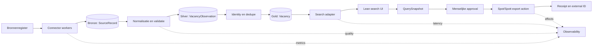

# Catapulze Job Intelligence — bouwbrief

Status: discovery-consolidatie, architectuurstatus herijkt op `main@2049008` op 5 september 2026 
Eigenaren: Robbie (product/toegang), Ryan (architectuur/uitvoering)

Deze brief maakt drie statussen apart zichtbaar:

- **Besloten:** RJC-418 kiest een dedicated Postgres-resource on-box in Coolify als productie-SoR. Open PR [#149](https://github.com/RyanLisse/catapulze-job-intelligence/pull/149) legt dit vast in ADR-0011 en werkt de bestaande hosting-ADRs bij.
- **Geïmplementeerd op `main`:** Postgres/Drizzle is de bron van waarheid in de applicatiecode; Manticore is de afgeleide zoekindex achter `SearchAdapter`. [ADR-0007](adr/ADR-0007-search-platform-state-2026-09-01.md) beschrijft die zoekarchitectuur.
- **Nog niet als productie bewezen:** de RJC-418-cutover, firewall-allowlist, dump/restore, R2-restoretest, `/readyz`, projector-drain en Trigger.dev-productierun zijn nog open. Deze brief claimt geen uitgevoerde cutover of actuele productieconfiguratie.

## 1. Uitkomst

Bouw eerst één dunne verticale slice:

> Verzamel vacatures uit een beperkte maar uitbreidbare bronset, bewaar de oorsprong, normaliseer en dedupliceer ze, maak ze aantoonbaar snel doorzoekbaar met Boolean-logica, laat een mens een vaste resultatensnapshot goedkeuren en exporteer uitsluitend nieuwe vacatures idempotent naar Spot/Spott.

Dit levert onmiddellijk sourcingwaarde en legt tegelijk de juiste basis voor meer bronnen, Candidate Intelligence en het latere Company OS. De levering blijft slice-first: bouw het hele dataplatform en de agentruntime niet vooruit. De gedeelde capabilitygrens hoort wel vanaf dag één bij de slice, zodat UI, REST en MCP hetzelfde domeingedrag kunnen gebruiken.

## 2. Ideal State Criteria

De eerste slice is geslaagd wanneer:

1. een recruiter actuele vacatures uit alle **voor de slice geaccepteerde** bronnen in één scherm kan vinden;
2. `AND`, `OR`, `NOT`, haakjes en phrases een vastgelegde, reproduceerbare betekenis hebben;
3. zoeken over ten minste 200.000 representatieve records binnen de afgesproken p95-SLO blijft;
4. ieder resultaat terug te leiden is naar bron, bronrecord, ingest-run en normalisatieversie;
5. een herhaalde ingest, goedkeuring of Spot/Spott-export geen duplicaten of dubbele effecten veroorzaakt;
6. Spot/Spott alleen schrijft na een menselijk besluit dat aan een onveranderlijke query- en resultatensnapshot is gebonden;
7. bronstilte, parserfouten, datakwaliteitsverlies en exportfouten zichtbaar zijn zonder dagelijkse dure AI/vision-controle;
8. bestaande Neon-data behouden blijft en gecontroleerd kan worden ingelezen;
9. opslag, search en Spot/Spott-koppeling achter vervangbare interfaces staan;
10. geheimen, kandidaatdata en brede agentbevoegdheden niet in deze slice terechtkomen.

## 3. Wat de call bevestigt

### Productprioriteiten

- Snelheid is de belangrijkste producteis; de bestaande Motion/Lovable-flow is te traag na groei. `[01:17–01:26] [12:55–13:21] [30:37–30:57] [55:33–55:47]`
- Alle afgesproken vacaturebronnen moeten continu kunnen worden ingelezen. `[01:26–01:34]`
- De zoekfunctie moet minimaal titel en volledige omschrijving met Boolean-logica doorzoeken. `[01:34–02:07] [05:51–06:25]`
- Resultaten moeten uiteindelijk na goedkeuring automatisch en zonder duplicaten naar Spot/Spott. De exacte productnaam is door ASR vervormd en moet worden bevestigd. `[49:39–50:03]`
- De UI mag lean en read-oriented zijn; scraperbeheer hoeft de zoekervaring niet zwaar te maken. `[04:13–04:37] [27:18–28:18]`
- Job Intelligence komt vóór Candidate Intelligence en Company OS. `[18:50–21:38]`

### Datavelden

Minimaal genoemd: titel, volledige job description, locatie, contracttype `PERM`/`CONTRACT`, een tarief-/prijsveld, bron en bronspecifieke extra data. Door transcriptvervorming is de precieze commerciële betekenis en periode van het prijsveld niet bevestigd. Skills moeten uit de echte tekst worden afgeleid; het prototype miste bijvoorbeeld relevante Azure-termen. `[05:02–05:45]`

### Schaal en operatie

- Het bestaande systeem bereikte circa 200.000 records in drie à vier maanden. `[30:45–30:57]`
- Websites, API’s, authenticatie en anti-botmaatregelen veranderen; scraperonderhoud is structureel productwerk. `[22:00–26:09]`
- Geen nieuwe output kan een storing zijn, ook wanneer een scraper technisch “groen” lijkt. `[23:25–24:55]`
- Bestaande Neon-data mag niet worden weggegooid; een nieuwe schone database is wel als optie genoemd. `[55:01–55:49]`

### Wat het huidige Lovable/Neon-prototype al bewijst

Read-only waarneming op 27 augustus 2026:

- 241.981 vacatures, waarvan 217.191 open, 13.616 bedrijven en zeven zichtbare platformen;
- zoekresultaten, paginering, sortering en facetten voor platform, status, contracttype, work arrangement, provincie, skills, uurprijs, uren en datumbereik;
- detailweergave met gestructureerde velden, skills, volledige description en een link naar de originele posting;
- de zoekterm `Azure` gaf 152 resultaten met facetten;
- zichtbare datacompleetheid is laag voor onder meer provincie (12,2%), uurprijs (16,7%), work arrangement (6,8%), startdatum (7,0%) en deadline (11,2%).

Dit bewijst productvorm en werkelijk volume, maar nog niet de gevraagde Boolean/full-text-correctheid, deduplicatie of latency-SLO. De waargenomen modus “Title & company (fast)” mag niet als description-search worden aangenomen.

## 4. Aanbevolen systeemgrens

De scheiding is bewust:

- scrapers kunnen falen of schalen zonder de UI mee te trekken;
- Postgres blijft de bron van waarheid;
- een search-engine is een afgeleide index en nooit de enige opslag;
- Spot/Spott is een downstream effect, geen datalaag;
- approvals en receipts maken externe effecten controleerbaar.

## 5. Technische keuzes

### Actuele keuze en status

| Onderdeel | Voorgestelde default | Reden |
|---|---|---|
| System of record | Dedicated Postgres on-box in Coolify (RJC-418; ADR-0011 in open PR #149) | Besluit genomen; uitvoering en productie-evidence blijven open onder RJC-418 |
| Bestaande data | Motian-Neon uitsluitend als read-only import/backfillbron met herkomst | Niets weggooien, geen nieuwe Catapulze-writes naar v1 en migratierisico beperken |
| Raw data | Onveranderlijke JSON-payload per bronwaarneming | Replay, debugging en nieuwe normalisatie mogelijk maken |
| Search read path | `SearchAdapter` met Manticore als afgeleide, herbouwbare index ([ADR-0007](adr/ADR-0007-search-platform-state-2026-09-01.md)) | Dit is de geïmplementeerde architectuur op `main`; Postgres blijft het system of record |
| Search-evolutie | Manticore 29 hybrid blijft een meetbare kandidaat ([ADR-0009](adr/ADR-0009-manticore-29-hybrid.md), Proposed) | Eerst het 200k-profiel en de acceptatie-uitkomst bewijzen; geen productieclaim op basis van de kleinere meetronde |
| Semantic/vector | Niet in P0 | De call noemt het als optie, niet als geaccepteerde MVP-eis |
| Connectorstrategie | API/feed/structured endpoint eerst; browser pas daarna | Minder breekbaar en goedkoper |
| AI/vision bij scrapers | Alleen exception-based diagnose | Dagelijkse visuele vergelijking is onnodig duur |
| Spot/Spott-write | Smalle `export_approved_jobs`-actie | Geen generieke CRUD/SQL en duidelijk effectcontract |
| Deployment | Kleine losse services/workers, remote uitgevoerd | Isolatie en schaalbaarheid zonder persoonlijke laptop als runtime |

### RJC-418-productiegates

Het on-box-besluit accepteert databasebeheer als expliciete operationele verantwoordelijkheid. ADR-0011 en de operationele wijzigingen blijven eigendom van open PR #149; deze brief neemt die scope niet over. Productie is pas klaar wanneer RJC-418 onder meer het volgende bewijst:

1. de Coolify Postgres-resource duurzaam op de Hetzner-box draait, met least-privilege-rollen en R2-back-ups;
2. `5432` alleen bereikbaar is vanaf het interne Coolify-netwerk en de vastgelegde Trigger.dev-egress-IP's;
3. de Neon-dump gecontroleerd on-box is hersteld en migratiejournalen overeenkomen;
4. `/readyz` groen is, de projectorachterstand nul is en een echte Trigger.dev-`poll-bron` slaagt;
5. een restore uit de R2-back-up naar een lege geïsoleerde database aantoonbaar slaagt;
6. de volledige Motian-kopie en hybrid-rollout pas na deze gates starten.

Deze criteria zijn acceptatiegates. Open PR #149 levert documentatie en lokale/CI-evidence, maar voert de productiecutover niet uit.

### Pas kiezen na bewijs

- OpenSearch/Elasticsearch/Algolia: de eerdere OpenSearch-default is vervangen door de Manticore-architectuur uit ADR-0007. Heroverweeg een ander platform alleen via een nieuw besluit met gemeten tekortkomingen.
- Databricks/Snowflake/Fabric: niet nodig voor de eerste verticale slice; heroverweeg bij analytische workload of volumegroei.
- Glean/Bedrock/agentplatform/Grok Bot: los architectuurspoor; niet blokkeren op Job Intelligence.
- Candidate matching, enrichment en campagnegedrag: pas na aparte risico-, privacy- en human-oversight-ontwerpen.

## 6. Kernmodel

### Operationele entiteiten

- `Source`: bron, methode, planning, authenticatietype, eigenaar en status.
- `ScrapeRun`: start/einde, connectorversie, aantallen, foutcategorie, kosten en heartbeat.
- `SourceRecord`: onveranderlijke bronpayload, external ID/URL, contenthash, `fetched_at` en run-ID.
- `VacancyObservation`: genormaliseerde waarneming met veldniveau-herkomst, validatiestatus en normalisatieversie.
- `Vacancy`: canonieke vacature-identiteit en lifecycle (`active|stale|closed|unknown`).
- `VacancySourceLink`: omkeerbare koppeling tussen canonieke vacature en bronwaarnemingen.
- `SavedSearch`: bronquery plus parser-/schemaversie, filters en planning.
- `QuerySnapshot`: onveranderlijke query, tijdstip, resultaat-ID’s en indexversie.
- `ApprovalRecord`: actor, exacte snapshot, besluit, motivatie en tijdstip.
- `ExportAttempt`: idempotency key, doel, inputsnapshot, status, fout en retry-informatie.
- `ExternalReceipt`: Spot/Spott-ID, responsehash en bevestigde effecten.
- `AuditEvent`: append-only tijdlijn van beslissingen en effecten.

### Minimale vacaturevelden

`id`, `title`, `description`, `organization`, `location`, `country`, `contract_type`, `rate_amount`, `rate_currency`, `rate_period`, `skills`, `source_ids`, `source_urls`, `first_seen_at`, `last_seen_at`, `published_at`, `status`, `raw_availability`, `search_document`.

Onbekende data is expliciet `unknown`; ontbrekende data wordt niet geraden. Bronspecifieke velden blijven in `SourceRecord` en kunnen via typed extensions worden ontsloten.

### Drie verschillende dedupe-problemen

1. **Ingest-idempotentie:** dezelfde bronpayload maakt niet twee `SourceRecord`s.
2. **Cross-source identity:** meerdere bronrecords mogen conservatief aan één `Vacancy` worden gekoppeld; onzekere links blijven reviewbaar en omkeerbaar.
3. **Effect-idempotentie:** de beoogde sleutel `target + canonical_vacancy_id + action_type` blijft stabiel over querysnapshots heen. De huidige `commit_export` slaat een create alleen over wanneer al een afgeronde remote crosswalk bestaat. De effectkey wordt nog niet duurzaam vóór de provider-POST gereserveerd; een confirmation failure kan daardoor bij retry een tweede POST veroorzaken. RJC-435 bezit de vereiste reservering en reconciliatie. Een latere update vereist een afzonderlijke, expliciet goedgekeurde update-actie.

## 7. Searchcontract

P0 ondersteunt:

- velden: titel en volledige description; filters op bron, contracttype, locatie, prijs en freshness;
- operators: `AND`, `OR`, `NOT`, haakjes en quoted phrases;
- expliciete precedence en syntaxfouten met begrijpelijke feedback;
- opgeslagen queries, handmatig draaien en optioneel plannen;
- stabiele paginering en een zichtbare result count;
- een `QuerySnapshot` vóór approval/export.

[ADR-0003](adr/ADR-0003-performance-budgets-and-regression-policy.md) houdt de `SearchAdapter`-doelwaarde op p95 ≤ 100 ms voor het versioned 200k-profiel, maar maakt die nog niet tot een algemene harde gate. De uitgevoerde Manticore-meting gebruikte 20k documenten en bleef binnen de doelwaarde op die schaal; ze bewijst geen 200k- of productieprestatie. De verhouding tot de eerdere end-to-end-voorstellen van p95 ≤ 750 ms en p99 ≤ 1.500 ms blijft een open besluit met vaste queryset, concurrency, cache-state en meetgrens.

## 8. Scrapercontract en observability

Iedere connector:

1. declareert bron, methode, interval, rate limits en verwachte outputbandbreedte;
2. schrijft raw records vóór normalisatie;
3. is idempotent en herstartbaar met checkpoint/cursor;
4. rapporteert gevonden, nieuw, gewijzigd, afgekeurd en fout;
5. beïnvloedt andere bronnen niet bij uitval;
6. gebruikt retries met jitter/backoff en een bounded retry-budget;
7. escaleert via: retry → alternatieve structured route → gerichte diagnose → menselijke review;
8. wijzigt selectors/parsers alleen versioned en rollbackbaar.

Alerts zijn anomaly-based: runfout, onverwachte nul-output, sterke volumedaling, stijgende reject-rate, verouderde data, auth-fout of budgetoverschrijding. Screenshots/LLM-diagnose starten pas na zo’n signaal.

## 9. Control-plane vóór effecten

Het geplakte red-team-oordeel corrigeert terecht de agentvisie:

- MCP is transport, niet de autorisatiegrens;
- geef smalle capabilities, geen generieke database-, browser- of ATS-write;
- bind approval aan exacte input, evidence, ontvanger en verwacht effect;
- maak elke poging idempotent en bewaar een receipt;
- behoud `human-only` acties in de capability-map;
- gebruik één intern ID plus externe-ID-crosswalks;
- agents stellen voor; het Company OS commit.

De ongemergde conceptbeslissing voor RJC-441 selecteert uitsluitend first-party, door de operator beheerde MCP-clients met een signed Better Auth-sessie van een bestaande Catapulze-gebruiker. Generieke externe clients blijven daarin niet ondersteund; de OAuth-criteria zijn daarom niet van toepassing binnen het geselecteerde conceptmodel. `main@2049008` valideert al Better Auth-gebruikerssessies per call, inclusief signed bearer, maar de formele clientgrens en bijbehorende hardening uit RJC-441 zijn nog niet gemergd of geleverd.

Voor P0 betekent dit een minimale control slice rondom Spot/Spott-export. Candidate matching/ranking is een later high-risk decision-supportspoor: geen auto-reject, verborgen top-N of automatische kandidaatstatuswijziging. AVG en toepasselijke AI-regels zijn geen “later in te bouwen feature”.

## 10. Fasering

### Slice A — Job Intelligence read path

Bronnenregister, twee representatieve connectors plus Indeed, raw ingest, normalisatie, dedupe, lifecycle, Boolean search, lean UI, metrics en import van bestaande Neon-data.

### Slice B — Gecontroleerde Spot/Spott-export

API/MCP-spike, querysnapshot, approval, exportdedupe, idempotency, retries en receipts. REST-spike (RJC-336 / JI-020): zie [`docs/spott-slice-b-spike.md`](spott-slice-b-spike.md) — unieke externe ID = Spott vacancy `id`; minimale write = `POST /vacancies`; geen standing MCP voor export. Een schedule mag in deze slice alleen een nieuwe zoekrun en een pending voorstel maken; iedere nieuwe resultatensnapshot vereist opnieuw menselijke approval. Een latere standing approval policy is alleen toegestaan als queryversie, doel, limieten, geldigheidsduur en stopcondities expliciet zijn vastgelegd. Dit is pas onderdeel van de donderdagdemo als de juiste leverancier en Spot/Spott-toegang tijdig zijn bevestigd en de scope expliciet geaccepteerd is.

### Slice C — Bronuitbreiding en hardening

Alle geaccepteerde bronnen, anomaly-detectie, alerting, parserversies, replay, kostenbudgetten, backfill en loadtests.

### Later — Candidate Intelligence

Eerst provider/register, DPIA/grondslag, provenance, field-level assertions, correctie/bezwaar, fairness-evals en betekenisvolle menselijke review. Daarna pas enrichment, matching en score-output.

### Later — Company OS

Deterministische policy-, decision- en evidence-spine met typed action catalog, identity, doelbinding, budgets, audit, model/prompt/skillversies en gecontroleerde agent-runtimes.

## 11. Tijd en realisme

In de call is genoemd:

- start bouw: maandag 31 augustus 2026;
- review: woensdag 2 september na 17:00 of asynchrone video;
- gewenste eerste laag: donderdag 3 september, mits geen grote issues;
- Volgens de call heeft Ryan het deep-dive-document al. Robbie stuurt daarnaast een fonetisch onduidelijk genoemd “Exact Datapod”-artefact, vult ontbrekende broninformatie aan en regelt waar nodig bron- en Spot/Spott-toegang.

Een volledige productieklare implementatie van “alle bronnen” is niet betrouwbaar te plannen zolang de bronmatrix ontbreekt. De datum is wel haalbaar als prototype-doel voor één verticale slice met een beperkte, expliciet geaccepteerde bronset en zichtbaar bewijs per acceptance criterion.

## 12. Besluiten en resterende blockers

De besluitvolgorde is inmiddels verder gegaan dan de discoveryversie van deze brief:

1. DEC-005 / RJC-321 koos oorspronkelijk een dedicated PostgreSQL 16 on-box.
2. [ADR-0006](adr/ADR-0006-neon-as-system-of-record.md) verving dat productiedeel tijdelijk door een eigen Catapulze-Neon-instance. Die tekst is historische besluitcontext, niet de huidige keuze.
3. RJC-418 kiest sinds 4 september 2026 opnieuw Postgres on-box in Coolify, nu met Trigger.dev static egress-IP-allowlisting. Open PR [#149](https://github.com/RyanLisse/catapulze-job-intelligence/pull/149) legt dit vast als ADR-0011 en markeert ADR-0006 als vervangen.

Het huidige besluit is daarmee helder, maar de uitvoering is nog open. De productie-SoR is pas omgezet na het dump/restorepad, de firewall- en rolconfiguratie, de R2-restoretest, een groene `/readyz`, projectorachterstand nul en een geslaagde Trigger.dev-productierun. De Motian/Lovable-Neon-database blijft uitsluitend een read-only migratiebron.

1. Definitieve bronmatrix: URLs, landen, prioriteit, methode, auth, rate limits en eigenaar.
2. Donderdagscope: alleen read path of ook Spot/Spott-export.
3. Search-SLO en representatieve benchmarkqueries.
4. Exacte Boolean-syntax en velden.
5. Canoniek schema, betekenis/periode van het tarief- of prijsveld en verplichte/optionele velden.
6. Dedupebeleid binnen en tussen bronnen.
7. Spot/Spott-contract: correcte productnaam en URL, API/MCP, write scopes, unieke ID en sandbox.
8. Scrapefrequentie/freshness-SLA per bron en alert-eigenaar.
9. Kostenplafond per maand en per bron/run.
10. Demo-, staging- en productieomgeving, inclusief eigenaar en ritme voor backup-/restore-tests.
11. Juridische grondslag en risicoklasse vóór Candidate Intelligence.

## 13. Bronbetrouwbaarheid

- **Hoog:** expliciete actiepunten en herhaalde eisen uit de call.
- **Middel:** Fireflies-samenvatting en automatisch transcript; productnamen zijn soms fonetisch vervormd.
- **Voorstel:** technische defaults en SLO’s in dit document; deze moeten worden geaccepteerd of vervangen.
- **Niet beschikbaar in de call:** de aangeklikte deep-dive-bronlijst zelf. “Alle bronnen” is daarom nog geen gesloten scope.
- **Vluchtig:** prototypeaantallen en externe leverancierstekst zijn live waarnemingen. Zie het bronnenregister voor ophaalmoment en reproduceerbaarheidsgrens.

## 14. Scraperopties voor een gecontroleerde spike

De Fantastic.jobs-vergelijking is leverancier-/marketingmateriaal, laatst bijgewerkt in april 2026. Claims over prijs, uptime en dekking moeten bij de primaire leverancier worden geverifieerd.

| Optie | Waarvoor evalueren | Belangrijkste grens |
|---|---|---|
| Fantastic ATS/careersite-scraper | Uniforme ingest uit twaalf genoemde ATS’en | Minimale velden zijn onvoldoende zonder eigen provenance, normalisatie en enrichment |
| Apify Actors | Snelle experimenten voor onder meer Indeed, LinkedIn, Glassdoor en Google Jobs | Community Actors kunnen breken; ToS, kosten en rate limits per bron vastleggen |
| SerpAPI Google Jobs | Discovery/aggregatie | Geen source of truth; quota en Google-dekking beperken volledigheid |
| Bright Data | Proxies/unblock/CAPTCHA als dit aantoonbaar de bottleneck is | Hogere kosten, leveranciersafhankelijkheid en dataverwerking |
| JobSpy | Goedkope code-first prototype-spike | Onderhoud, proxies, blokkades en observability blijven Catapulze-verantwoordelijkheid |
| Managed Job Posting API | Internationale ATS-dekking en frequente verversing | Minder broncontrole; raw provenance en voorwaarden blijven verplicht |

De selectievolgorde blijft: officiële API/feed → publiek structured endpoint → beheerde scraper → eigen browserconnector. Anti-bot-bypass is geen standaardstrategie.

## 15. Geraadpleegde bronnen

- [Fireflies-call](https://app.fireflies.ai/view/-VIDEO-CALL-Ryan-Robbie::01M0YZCR6ZGV01GP6DYJD6BHHH), 27 augustus 2026, 628 captions.
- [Gedeelde ChatGPT-analyse](https://chatgpt.com/share/6a904fb1-4a64-83eb-902b-7d6e6324d882), publiek read-only geraadpleegd.
- Geplakt v1.2-oordeel: slice-first, control-plane vóór effecten, evidence-by-default.
- [Fantastic.jobs — best job scrapers](https://fantastic.jobs/article/best-job-scrapers), leverancierstekst, april 2026.
- [Lovable/Neon Job Intelligence-prototype](https://neon-data-whisperer.lovable.app/), read-only momentopname van 27 augustus 2026.
- [ADR-0003 — Performancebudgets en regressiebeleid](adr/ADR-0003-performance-budgets-and-regression-policy.md), geaccepteerde meet- en gategrens voor search.
- [ADR-0007 — Zoekplatform-staat 2026-09-01](adr/ADR-0007-search-platform-state-2026-09-01.md), actuele code-backed searcharchitectuur op de herijkte `main`-basis.
- [ADR-0009 — Manticore 29 hybrid search candidate](adr/ADR-0009-manticore-29-hybrid.md), Proposed; geen bewijs van productieacceptatie.
- [RJC-418 / PR #149](https://github.com/RyanLisse/catapulze-job-intelligence/pull/149), geaccepteerd hostingbesluit en nog open uitvoerings-/evidencegrens.
