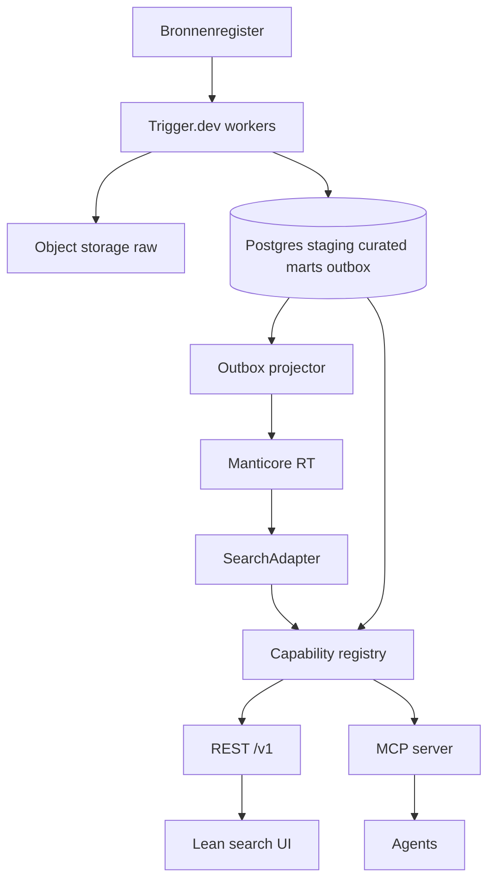
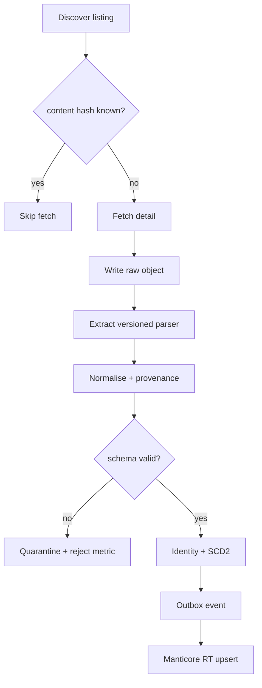
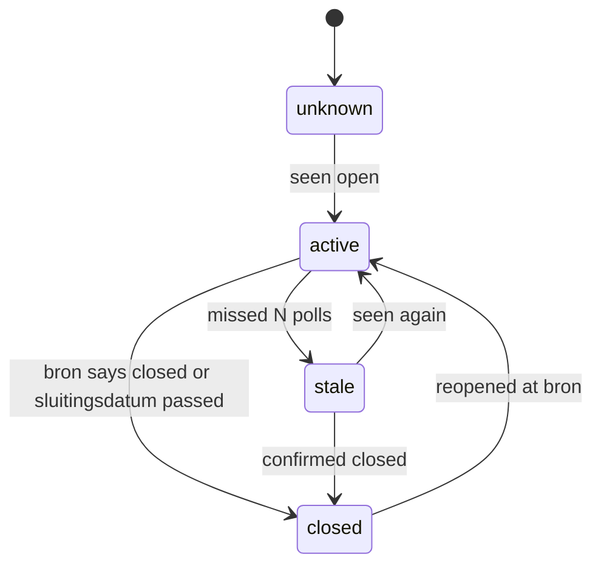

# Slice A Read Path - Plan

## Goal Capsule

- **Objective:** A recruiter can find current aanvragen from the Slice A sources in one screen, with Boolean meaning that is documented and reproducible, each hit traceable to bron, bronrecord, ingest-run and normalisatieversie, and with no duplicate ingest or snapshot effects on replay.
- **Means:** Bun + TypeScript + Effect-TS + Drizzle; Postgres as system of record; Manticore RT as derived index behind SearchAdapter via outbox; Trigger.dev Cloud for connector runs; MCP + REST generated from one capability registry (KTD1, KTD2, KTD4).
- **Authority:** Product Contract owns behavior. Planning Contract owns mechanism. Units cite those IDs and do not restate them.
- **Stop conditions:** Stop before Spott.io writes, Candidate Intelligence, rung-3 Playwright logins, semantic/vector search, DuckLake, and treating the 75-field model as a P0 gate.
- **Execution profile:** `code`. Test-first for parser, mappings, identity, registry coverage, and connector fixtures. Smoke-first for hosting, Manticore, and Trigger.dev wiring.
- **Tail ownership:** Abandoned spikes are removed from the diff. Capability-coverage gates pass. The Wednesday review pack exists before any donderdag-ready claim.

---

## Product Contract

### Summary

Build Slice A of Catapulze Job Intelligence: a thin vertical read path that ingests aanvragen from a small accepted source set, stores immutable raw payloads, normalizes with field provenance, deduplicates at three levels, serves Boolean + facet search through a SearchAdapter, and exposes the same actions to recruiter UI and agents.

This plan executes BUILD_BRIEF Slice A on the 27 Aug stack in `docs/brainstorms/2026-08-27-techstack-brainstorm.md`. It does not execute Slice B (Spott export) beyond leaving snapshot and approval interfaces.

### Problem Frame

The live Lovable/Neon prototype already has product shape (~242k rows) but fails on Boolean/full-text correctness, provenance, ingest idempotency, and latency after growth. The Motian cliff was an index mismatch, not a Postgres limit. Recruiters need instant Boolean search with source truth, and agents must use the same tools rather than a later MCP wrap.

### Key Decisions

- **Slice A is read-only plus QuerySnapshot.** Export, receipts, and standing approval stay Slice B. Governs R1, R12, R13.
- **Manticore RT is the search engine; Postgres stays SoR.** BUILD_BRIEF §5 Postgres-FTS default is superseded by the 27 Aug search research. `tsvector` remains a rebuild path, not the P0 query engine. Governs R7, R8.
- **DEC-005: Postgres 16 is on-box in Docker from P0.** The new Catapulze database is the SoR; Motian-Neon is a read-only import source only. Production requires protected persistence, private networking, tested off-site restore, monitoring, and database-first resource priority. Governs R17, R21.
- **First connectors are TenderNed then Inhuurdesk.** Indeed is out until an allowed route exists (JI-007). Governs R4, R5.
- **Canonical domain language is Dutch (`aanvraag`, `bron`).** Package and infra names stay English. Governs R2.
- **75-field `aanvraag` model is the target schema, not the Slice A completeness gate.** Unknown stays explicit. Governs R3, R6.
- **MCP + REST are the only data path; UI is one rendering.** Governs R14, R15.

### Requirements

**Scope**

- R1. Slice A delivers the BUILD_BRIEF Ideal State Criteria 1–5 and 7–10 for the accepted source set. Criterion 6 (Spott write after human approval) is interface-only: QuerySnapshot exists; no external write.
- R2. Persisted fields, API/MCP tool names, and recruiter copy use the canonical Dutch vocabulary in `docs/doelplaat/schema.json` and `docs/AGENT_NATIVE_ARCHITECTURE.md`.
- R3. Missing values are stored as `unknown`. The system does not invent locatie, tarief, or skills.

**Ingest**

- R4. TenderNed is the first live connector, using the verified public JSON API and mapping in `docs/sources/tenderned.md`.
- R5. Inhuurdesk is the second live connector, using the public WP JSON/RSS/JSON-LD routes in `docs/SOURCE_MATRIX.md`.
- R6. Every accepted record has an immutable raw payload in object storage, a content hash, `scrape_run_id`, and field-level provenance after normalisation.
- R7. Replaying the same bron payload does not create a second `SourceRecord`. Cross-source links are conservative, reversible, and reviewable. Lifecycle states `active|stale|closed|unknown` are traceable.

**Search**

- R8. P0 search covers titel and volledige beschrijving with `AND`, `OR`, `NOT`, parentheses, and quoted phrases. Syntax errors are user-visible. Precedence is documented and tested.
- R9. Filters exist for bron, contracttype/inhuurvorm, locatie, prijs/tarief when known, and freshness. Facet counts match the current selection.
- R10. Pagination is stable. Result count is visible. Search state is URL-shareable.
- R11. Representative Boolean queries over a 200k corpus meet p95 ≤ 100 ms at the SearchAdapter boundary (JI-NFR-02 as rewritten 27 Aug), excluding browser render. The gate uses a versioned benchmark profile (JI-016).

**Control**

- R12. `create_snapshot` produces an immutable QuerySnapshot: query text, parser/schema version, filters, result IDs, timestamp, `index_version`.
- R13. Saved searches store syntax/schema version and can be run manually. A schedule, if present, only creates a new pending snapshot. It never exports.
- R14. Every Slice A UI action has the same capability on REST and MCP, same authz path, deny by default. Human-only: login and secret entry.
- R15. Capability registry entries declare `sideEffectClass`, approval, auditClass, idempotency, and `wiredTransports`. Drift gates fail the PR when UI and agent paths diverge.

**Evidence and privacy**

- R16. Runs report found / new / changed / rejected / error. Source silence, volume drop, parser reject-rate, and auth failure are visible without daily LLM/vision.
- R17. Existing Neon v1 jobs are imported read-only with `v1_id` provenance. Recruitment tables are not imported (JI-MIG-05).
- R18. Secrets exist only at runtime via `secret_ref`. Repo, logs, and UI scans stay clean.
- R19. Slice A curated rows do not persist candidate or contact PII. Raw retention follows DEC-008 conservative default in Assumptions.
- R20. Connector parsers are versioned and rollbackable. Fixture contract tests detect source drift without live overload.
- R21. Production Postgres 16 separates admin, migrator and least-privilege runtime roles; uses an external protected volume, no public `5432`, continuous off-site WAL archiving with a tested restore, monitoring and resource limits. Postgres has priority over rebuildable Manticore. HA need or measured disk/RAM/CPU contention that threatens the DB SLO triggers a separate DB host or managed Postgres.

### Actors

- A1. Recruiter — searches, opens detail, marks relevant/not/followed, saves queries, creates snapshots.
- A2. Agent — same read/mark/snapshot tools as A1; cannot enter secrets or complete OAuth.
- A3. Operator — manages bron config, test-import, pause/reset circuit, views run health. Activating a bron requires a passing test-import and `voorwaarden_status`.

### Key Flows

- F1. Recruiter Boolean search
  - **Trigger:** A1 submits a query plus optional filters.
  - **Steps:** Parse → SearchAdapter → Manticore + facets → paginated hits → detail with provenance to raw.
  - **Outcome:** Hits match documented Boolean meaning. Syntax errors do not search.
  - **Covered by:** R8, R9, R10, R11
- F2. Connector poll to index
  - **Trigger:** Trigger.dev schedule for a ready bron.
  - **Steps:** Discover → fetch raw on new/changed hash → extract → normalise → validate → identity → outbox → Manticore projector.
  - **Outcome:** Postgres commits before search visibility. Index lag is observable.
  - **Covered by:** R4, R5, R6, R7
- F3. Idempotent replay
  - **Trigger:** Replay of a prior run or identical payload.
  - **Steps:** Hash lookup → skip duplicate SourceRecord → optional re-normalise on parser version bump.
  - **Outcome:** No duplicate curated identity. Search document updates only on content or parser change.
  - **Covered by:** R7, R20
- F4. Source silence
  - **Trigger:** Run error, unexpected zero output, or volume drop vs baseline.
  - **Steps:** Emit alert event with bron, last success, threshold, evidence, owner, runbook, dedupe key.
  - **Outcome:** A3 sees the event without opening the search UI.
  - **Covered by:** R16
- F5. Snapshot without export
  - **Trigger:** A1 or A2 calls `create_snapshot`.
  - **Steps:** Freeze query + result IDs + index_version. Later search changes do not mutate it.
  - **Outcome:** Approval/export can bind to this object in Slice B.
  - **Covered by:** R12, R13
- F6. Neon backfill
  - **Trigger:** Operator starts import.
  - **Steps:** Read-only source → map `(platform, external_id)` → `(bron_id, bron_referentie)` → raw object + curated row → reconcile counts.
  - **Outcome:** Rejects are counted. v1 stays parallel (JI-MIG-06), not cut over by this plan.
  - **Covered by:** R17
- F7. Agent parity
  - **Trigger:** A2 calls `search_aanvragen` / `get_aanvraag` / `create_snapshot` / `markeer_aanvraag`.
  - **Steps:** MCP tool → same handler pipeline as REST/UI (auth, role, rate-limit, audit).
  - **Outcome:** Preview by default; `full: true` opt-in. No DB credentials in the agent.
  - **Covered by:** R14, R15
- F8. Production database recovery
  - **Trigger:** Scheduled restore drill against the latest accepted backup chain.
  - **Steps:** Provision an empty isolated target → restore base backup plus WAL → run migrations/read-only integrity checks → record recovery point, duration, SHA, and evidence → destroy the drill target.
  - **Outcome:** Recovery is demonstrated without changing the production database. Missing or stale WAL, an unencrypted/unreachable backup, or a failed integrity check blocks production readiness.
  - **Covered by:** R21

### Acceptance Examples

- AE1. Covers R8. Given parser version V, when query `(Azure OR "platform engineer") NOT intern` runs twice, then hit IDs match and a fixture asserts precedence.
- AE2. Covers R4, R7. Given a saved TenderNed listing+detail fixture, when ingest runs twice, then exactly one SourceRecord and one curated identity exist.
- AE3. Covers R6. Given a search hit, when A1 opens detail, then bron, bron_referentie, scrape_run_id, normalisatieversie, and raw preview are visible.
- AE4. Covers R12. Given a snapshot S of 17 IDs, when a later ingest adds a matching aanvraag, then S still lists those 17 IDs.
- AE5. Covers R14. Given a UI search, when the same arguments go to MCP `search_aanvragen`, then IDs, count, and facets match.
- AE6. Covers R3. Given Inhuurdesk HTML with no structured tarief, when normalised, then `tarief_*` is `unknown` and the phrase stays in beschrijving.
- AE7. Covers R16. Given a connector returning 200 with zero new/changed vs a 7-day baseline drop past threshold, then one silence event is emitted and a second identical event is deduped.
- AE8. Covers R18. Given a configured `secret_ref`, when config is dumped to logs or GET bron, then the secret value is absent.
- AE9. Covers R21. Given an empty isolated Postgres 16 target, when the documented restore drill runs from off-site backup plus WAL, then the expected migration journal and integrity checks pass and the evidence records recovery point and duration without exposing production `5432`.

### Success Criteria

- SC1. Ideal State Criteria 1–5 and 7–10 have pass/fail evidence for the accepted source set (JI-055). Criterion 6 is evidenced only as “snapshot exists, no write attempted.”
- SC2. Golden Boolean fixtures from AE1 pass in CI.
- SC3. 200k benchmark profile records p50/p95/p99; p95 > 100 ms at SearchAdapter fails the gate (R11).
- SC4. `check-capability-coverage` and `check-capability-registry` fail a PR that adds a UI action without MCP+REST wiring (R15).
- SC5. Wednesday review pack contains SHA, environment, bron runs, reconciliation, golden queries, latency report, and open Gate-0 items (JI-054).
- SC6. Production readiness remains failed until JI-037 has current evidence for private networking, protected persistence, monitoring/resource limits, continuous WAL archival, and a successful isolated restore.

### Scope Boundaries

**In scope**

- Repo skeleton, Effect layers, Drizzle migrations, secret injection, roles.
- Bronregister with `ready|blocked|deferred` and `voorwaarden_status`.
- TenderNed + Inhuurdesk connectors, raw object storage, normalisation, three-level dedupe, lifecycle.
- SearchAdapter + Boolean parser + Manticore RT + outbox projector.
- Lean search UI, saved searches, QuerySnapshot, MCP+REST, capability registry, markeren.
- Motian-Neon read-only backfill into the new on-box Postgres, run metrics, source-silence events.
- On-box Postgres production gates and restore evidence (JI-037); a configured volume or backup job alone is not proof.
- JSON-LD adapter seam (config-driven) so BlueTrail/Hero/Pro-Act can follow without a new architecture.

**Deferred for later (Slice B / C / product)**

- Spott.io `commit_export`, receipts, standing `approval_policy` score mode (DEC-006).
- Indeed (JI-007) until Robbie confirms an allowed route or removes it.
- Rung-3 Playwright logins (Striive detail, StaffingNow, Flextender, DioR, Mercell s2c).
- Randstad Enterprise (ToS forbid automated search).
- Semantic/vector search, DuckLake analytics, dashboard marts beyond health, LLM daily extract, Candidate Intelligence, Company OS runtime beyond registry+two prompts if cheap.
- 75-field completeness, skill taxonomy curator, organisatie merge proposals.

**Outside this product's identity**

- Candidates, matching, screening, applications, interviews, messages (JI-SCP-01).
- Auto-reject of candidates or automatic candidate status writes.
- Generic SQL, browser, or ATS CRUD exposed to agents.

**Deferred to follow-up work (plan-local)**

- Coolify/Hetzner app topology beyond the database safety gates in R21/JI-037.
- Langfuse eval loop for qualification prompts (design only in Slice A).
- Firecrawl/Browserbase (not required for the two P0 HTTP sources).

### Open Questions

- Q2. **Deferred.** DEC-006 Spott contract. Slice B only.
- Q3. **Deferred.** DEC-008 exact retention days. Conservative default in A3.
- Q4. **Deferred.** Onefellow unauthenticated edge function: replay allowed? Not a P0 source.
- Q5. **Blocking for Indeed only.** JI-007 allowed route. Indeed is out of this plan until answered.

---

## Planning Contract

### Assumptions

- A1. Donderdag scope is Slice A read path, not Spot export (DEC-001 inferred; BUILD_BRIEF Slice A + brainstorm next step).
- A2. DEC-005 is final: P0 uses a new on-box Postgres 16 in Docker with portable SQL. Existing Motian-Neon is a read-only backfill source and receives no new Catapulze writes.
- A3. DEC-008: Slice A drops contact fields on normalise; raw payloads retain source bytes under object-storage lifecycle (90 days unless Robbie sets otherwise); audit events are not deleted by the same job.
- A4. Connector ToS for TenderNed (CC-0, §16 noted) and Inhuurdesk (no bot clause found 27 Aug) are `voorwaarden_status: toegestaan` as recorded in SOURCE_MATRIX. Robbie can revoke.
- A5. Search SLO p95 ≤ 100 ms is the 27 Aug rewrite of JI-NFR-02, not the BUILD_BRIEF 750 ms proposal.
- A6. Motian scraper packages are a later lift (rung 2/3). Slice A does not import 6k LOC scrapers.
- A7. Test runner is `bun test` with max 2 workers and no watch mode (JI-001).

### Key Technical Decisions

- KTD1. **Monorepo, Effect layers, no UI→DB imports.** Apps `api` (HTTP+MCP), `web` (lean UI), `worker` (Trigger.dev tasks). Packages `domain`, `application`, `connectors`, `search`, `infra`. CI layering gate fails a web import of Drizzle. Bun + Effect-TS + Effect Schema + Drizzle as in the 27 Aug brainstorm. Chosen over Python/FastAPI/Pydantic (doelplaat 25 Aug) because workers, MCP SDK, and Trigger.dev runtime are TypeScript.
- KTD2. **Postgres schemas `staging`, `curated`, `marts`; raw in object storage.** SCD2 on `curated.aanvraag_versie`. Outbox table in the same commit as the state change. Search and agents never take a write connection to curated. Aligns JI-DAT-02/03/07; rejects storing HTML/JSON in the row.
- KTD3. **P0 `aanvraag` columns are BUILD_BRIEF minimum plus provenance keys from schema.json.** Full 75-field table is not a migrate-blocking checklist. Extra source fields go to `bron_specifiek` JSONB with a documented key list (JI-BRN-06).
- KTD4. **One capability registry generates REST and MCP.** Handlers own behavior. Transports only reference ids. MCP TypeScript SDK v2 (spec 2026-07-28) accepts Standard Schema; Effect Schema is the source of truth and is adapted at the MCP boundary. Do not maintain a parallel Zod model. Annotations (`readOnlyHint`, `destructiveHint`) come from declared `sideEffectClass`, not name heuristics. Each tool call is an internal subrequest through authz. See [MCP TypeScript SDK v2](https://ts.sdk.modelcontextprotocol.io/v2/) and `docs/research/openship.md`.
- KTD5. **SearchAdapter emits Manticore queries; parser is owned in-process.** Recruiter Boolean is parsed to an AST, then emitted. UI never embeds SphinxQL. Postgres FTS is a rebuild/fallback adapter behind the same interface, not a second product dialect. Manticore RT index is projected from outbox. Facets use Manticore `FACET` / `aggs` in the same search pass ([Manticore faceted search](https://manual.manticoresearch.com/Searching/Faceted_search)).
- KTD6. **Trigger.dev Cloud tasks: one scheduled poller per bron, `concurrencyKey = bron_id`, `idempotencyKey = bron_id + cursor/window`.** Fan-out with `batchTrigger` (SDK batch size cap 1000). TTL on stale queued polls. Secrets from Trigger.dev env, not the bron row. Official APIs: [triggering](https://trigger.dev/docs/triggering), [queue concurrency](https://trigger.dev/docs/queue-concurrency).
- KTD7. **Connector ladder is config, not subclasses per brand.** Categories `feed | json-api | json-ld | html`. TenderNed = json-api; Inhuurdesk = json-api with HTML description. Playwright adapters exist as types only in Slice A.
- KTD8. **Identity: exact `(bron_id, bron_referentie)` first; cross-source grouping is conservative and reversible.** No auto-merge of curated rows. Uncertain links create `dedup_groep` in reviewable state. MinHash may wait; exact+normalized title/org/start is enough for P0. Embeddings are out.
- KTD9. **Roles: `recruiter | operator | admin`. Deny by default.** Recruiter: search, detail, mark, saved search, snapshot. Operator: bron runs and health. Admin: policy and bron activation. M365 login is human-only and may be a stub session in Slice A if SSO is not ready.
- KTD10. **Postgres 16 on-box from P0; Motian-Neon read-only.** Local compose contains Postgres, Manticore, object storage (MinIO or Hetzner-compatible), and Redis. Production Postgres uses a pre-created external protected volume, private-only `5432`, continuous encrypted off-site WAL archiving, a scheduled isolated restore drill, and database monitoring/resource limits. Postgres has priority; Manticore is derived and rebuildable. HA need or measured disk/RAM/CPU contention that threatens the DB SLO triggers a separate DB host or managed Postgres.

### High-Level Technical Design

Component topology:



Ingest to index (F2):



Aanvraag lifecycle:



Boolean AST (directional, not an implementation spec):

```text
Query  := Or
Or     := And (OR And)*
And    := Not (AND Not)*
Not    := NOT? Primary
Primary:= PHRASE | TERM | ( Query )
```

SearchAdapter maps AST + filters to Manticore and never to ad-hoc SQL LIKE.

### Sequencing

U1 → U2 → U3. U4 needs U3. U5 needs U2 and U3. U6 needs U2 and U5. U7 needs U6. U9 needs U7. U8 needs U4, U6, and U7. U10 needs U2. U8 and U9 may proceed in parallel after U7; U10 may proceed after U2 but remains an open production-readiness gate until its recovery and operations evidence passes.

### Sources and Research

Load-bearing:

- Origin: `docs/BUILD_BRIEF.md`, `docs/IMPLEMENTATION_BACKLOG.md`, `docs/brainstorms/2026-08-27-techstack-brainstorm.md`, `docs/SOURCE_MATRIX.md`, `docs/sources/tenderned.md`, `docs/AGENT_NATIVE_ARCHITECTURE.md`, `docs/doelplaat/schema.json`, `docs/research/search-architecture.md`, `docs/research/orchestration.md`, `docs/research/openship.md`.
- TenderNed TNS v2 is current on data.overheid.nl and “may change without notice” — staging schema checks stay mandatory ([dataset](https://data.overheid.nl/dataset/aankondigingen-van-overheidsopdrachten---tenderned)).
- MCP SDK v2 is the 2026-07-28 line; v1 `@modelcontextprotocol/sdk` is the upgrade-from path ([SDK v2](https://ts.sdk.modelcontextprotocol.io/v2/)).
- Trigger.dev `concurrencyKey`, `idempotencyKey`, `ttl`, and batch limits are documented for v3 APIs ([triggering](https://trigger.dev/docs/triggering)).
- Manticore Boolean + facets in one pass: [expressions](https://manual.manticoresearch.com/Searching/Expressions), [faceted search](https://manual.manticoresearch.com/Searching/Faceted_search).
- No `docs/solutions/` corpus yet. Institutional learnings live in `docs/research/` and the brainstorm anti-patterns (no engine-dialect flag; groen ≠ bewijs; layering also in CI).

---

## Output Structure

```text
apps/api/                 # Effect HTTP + generated MCP
apps/web/                 # Lean search UI
apps/worker/              # Trigger.dev task entry
packages/domain/          # Effect Schema, IDs, Boolean AST
packages/application/     # handlers + registry
packages/connectors/      # tenderned, inhuurdesk, json-ld seam
packages/search/          # SearchAdapter, Manticore emitter, projector
packages/infra/           # drizzle, object store, redis, manticore client
drizzle/                  # migrations
fixtures/connectors/      # saved HTTP fixtures
compose.yaml              # postgres, manticore, minio, redis
```

Implementer may adjust layout; unit file lists stay authoritative.

---

## Implementation Units

### U1. Workspace skeleton and safety rails

- **Goal:** A bun workspace that lints, typechecks, and runs tests with at most 2 workers, then exits. Secrets cannot be committed.
- **Requirements:** R18. JI-001, JI-040.
- **Dependencies:** none
- **Files:**
  - Create: `package.json`, `bun.lock`, `tsconfig.json`, `eslint.config.js`, `compose.yaml`, `.env.example`, `apps/api/package.json`, `apps/web/package.json`, `apps/worker/package.json`, `packages/domain/package.json`, `packages/application/package.json`, `packages/infra/package.json`
  - Create: `scripts/check-layering.ts`, `scripts/check-secrets-scan.ts`
  - Test: `scripts/check-layering.spec.ts`
  - Modify: `.gitignore` for `.env`, `node_modules`, coverage
- **Approach:**
  1. Workspace packages as in Output Structure.
  2. Effect runtime lives in api/worker; domain has no I/O.
  3. Layering script forbids `apps/web` → `drizzle` / `packages/infra`.
  4. Secret scan on diff; `.env.example` lists names only.
- **Execution note:** Smoke that `bun test` stops. Do not start watch servers in CI.
- **Patterns to follow:** JI-001 (no watch mode); brainstorm guard “layering also by CI”.
- **Test scenarios:**
  - Happy: `bun test` runs a trivial domain test and exits 0.
  - Edge: a web file importing `packages/infra` fails `check-layering`.
  - Error: committing a dummy AWS key fixture is caught by the scan test (using a clearly fake token).
- **Verification:** Fresh clone instructions in README install and test without extra global tools beyond bun.

### U2. Postgres core model and migrations

- **Goal:** Drizzle migrations create staging/curated/marts plus outbox and audit tables for BUILD_BRIEF operational entities needed in Slice A.
- **Requirements:** R2, R3, R6, R7, R19. JI-002, JI-DAT-02/03/06/07.
- **Dependencies:** U1
- **Files:**
  - Modify: `packages/db/src/schema/*.ts`, `packages/db/src/migrations/*.sql`, `packages/db/src/index.ts`
  - Test: `packages/db/src/core.spec.ts`
- **Approach:**
  1. Entities: `bron`, `scrape_run`, `source_record` (pointer+hash, not payload), `aanvraag_observation`, `aanvraag`, `aanvraag_versie`, `aanvraag_bron_link`, `dedup_groep`, `saved_search`, `query_snapshot`, `audit_event`, `outbox_event`, `agent_context` stub.
  2. UUIDs, `timestamptz`, `numeric` money + currency column.
  3. Unique `(bron_id, bron_referentie)` and unique content hash per bron.
  4. Runtime and tests use `postgres-js` through Drizzle; no Neon-specific runtime driver.
  5. No contact tables in Slice A.
- **Execution note:** Migration tests run against empty compose Postgres 16. They do not mutate production or Motian-Neon.
- **Patterns to follow:** KTD2, KTD3; `docs/doelplaat/schema.json` required keys for identity/provenance.
- **Test scenarios:**
  - Happy: migrate up on empty DB; required tables exist with FKs.
  - Edge: inserting two source_records with same hash+bron fails unique.
  - Error: `aanvraag` insert without `bron_id` fails NOT NULL.
  - Integration: SCD2 helper writes a new version and closes `geldig_tot` on the previous in one transaction with an outbox row.
- **Verification:** `drizzle-kit` history is reproducible from empty.

### U3. Bronregister and connector contract

- **Goal:** Bronnen are data. A connector can page, checkpoint, write minimised raw, and emit run metrics inside retention policy.
- **Requirements:** R4, R5, R6, R16, R18, R20. JI-003, JI-004, JI-BRN-04/06/07.
- **Dependencies:** U2
- **Files:**
  - Create: `packages/connectors/src/contract.ts`, `packages/connectors/src/object-store.ts`, `packages/application/src/bronnen/*`, `packages/domain/src/bron-config.ts`
  - Test: `packages/connectors/src/contract.spec.ts`, `packages/application/src/bronnen/bronnen.spec.ts`
- **Approach:**
  1. Bron row: method, interval, rate limit, crawl-delay, `voorwaarden_status`, `ready|blocked|deferred`, `secret_ref`, mapping document pointer.
  2. Contract: `discover`, `fetch`, `checkpoint`, `runMetrics`. Raw path `raw/{bron}/{yyyy}/{mm}/{dd}/{run}/{id}.{json|html|pdf}`.
  3. `activeer_bron` blocked without passing test-import and allowed voorwaarden (JI-BRN-04).
  4. No secrets in DB or repo.
- **Patterns to follow:** SOURCE_MATRIX ladder; KTD7.
- **Test scenarios:**
  - Happy: creating a bron in `deferred` does not schedule polls.
  - Edge: `voorwaarden_status=verboden` cannot transition to `ready`.
  - Error: missing `secret_ref` on a login method fails validation; json-api TenderNed does not require one.
  - Integration: fake connector writes an object and a source_record pointer in one run.
- **Verification:** An operator can list bronnen with status and last run without seeing secret values (AE8).

### U4. TenderNed and Inhuurdesk connectors

- **Goal:** Two P0 connectors complete F2 against fixtures and a bounded live read.
- **Requirements:** R4, R5, R6, R7, R20. JI-006, JI-018, JI-051.
- **Dependencies:** U3, U1
- **Files:**
  - Create: `packages/connectors/src/tenderned/*`, `packages/connectors/src/inhuurdesk/*`, `apps/worker/src/tasks/poll-bron.ts`, `fixtures/connectors/tenderned/*`, `fixtures/connectors/inhuurdesk/*`
  - Test: `packages/connectors/src/tenderned/tenderned.spec.ts`, `packages/connectors/src/inhuurdesk/inhuurdesk.spec.ts`
- **Approach:**
  1. TenderNed mapping and poll window from `docs/sources/tenderned.md` (size ≤ 100, 15 min, CPV/IDA filters as config).
  2. Inhuurdesk: listing JSON including HTML description; parse tarief from text only into structured fields when a single clear max amount exists; otherwise R3.
  3. Trigger.dev task per KTD6. Rate limit via Upstash token bucket keyed by bron.
  4. Live read is opt-in env; CI uses fixtures.
- **Execution note:** Contract tests on saved fixtures first. One documented live smoke outside CI.
- **Patterns to follow:** tenderned.md ingest pattern; SOURCE_MATRIX beleefdheid.
- **Test scenarios:**
  - Happy: Covers AE2. Fixture ingest twice → one SourceRecord.
  - Edge: TenderNed `size=101` is not requested; client caps at 100.
  - Error: 5xx with retry/backoff then run status `failed` and metric increment; other bron still polls (KTD6 concurrency isolation).
  - Integration: listing hash unchanged skips detail fetch.
- **Verification:** Run metrics include found/new/changed/rejected/error for both bronnen on fixture replay.

### U5. Normalise, identity, lifecycle

- **Goal:** Staging observations become curated aanvragen with provenance, reversible links, and lifecycle.
- **Requirements:** R3, R6, R7, R19. JI-008, JI-009, JI-050.
- **Dependencies:** U2, U3
- **Files:**
  - Create: `packages/application/src/normalise/*`, `packages/application/src/identity/*`, `packages/domain/src/lifecycle.ts`
  - Test: `packages/application/src/normalise/normalise.spec.ts`, `packages/application/src/identity/identity.spec.ts`
- **Approach:**
  1. Field provenance map: canonical field → source path + parser version.
  2. Enums and units normalised; unknown/invalid explicit.
  3. Exact identity `(bron_id, bron_referentie)`. Cross-source group only on high-confidence title+org+start; else reviewable group.
  4. Stale after N missed polls (N in bron config, default 3).
- **Execution note:** Property tests for hash stability and lifecycle transitions.
- **Patterns to follow:** BUILD_BRIEF §6 three dedupe problems; pipeline extract→normalise→dedupe; KTD8.
- **Test scenarios:**
  - Happy: Covers AE6. Unstructured tarief → unknown structured fields.
  - Edge: two bronnen same title/org/start → one reviewable group, two aanvraag rows, reversible split.
  - Error: schema-invalid observation quarantined; not searchable.
  - Integration: tarief change opens SCD2 version and outbox `aanvraag.gewijzigd`.
- **Verification:** Replay of U4 fixtures yields stable IDs and zero duplicate curated identities.

### U6. Boolean parser, SearchAdapter, Manticore, outbox projector

- **Goal:** Documented Boolean search over titel+beschrijving with filters/facets, p95 gate wiring, Postgres never the query dialect.
- **Requirements:** R8, R9, R10, R11. JI-010, JI-011, JI-012, JI-016.
- **Dependencies:** U2, U5
- **Files:**
  - Create: `packages/domain/src/boolean/*`, `packages/search/src/adapter.ts`, `packages/search/src/manticore/*`, `packages/search/src/projector.ts`, `packages/search/src/postgres-fts-fallback.ts`
  - Test: `packages/domain/src/boolean/parser.spec.ts`, `packages/search/src/adapter.spec.ts`, `packages/search/src/projector.spec.ts`
  - Create: `benchmarks/search/profile.json` (corpus pointer + query mix)
- **Approach:**
  1. Parser fixtures for AE1 plus unclosed paren, empty AND, nested NOT.
  2. Emitter to Manticore MATCH / bool JSON; filters as attributes.
  3. Projector consumes outbox and RT-upserts; delete/close updates status attribute.
  4. Result cache key `(ast_hash, index_version, filters)` in Redis.
  5. Benchmark profile required even if first run is local compose.
- **Execution note:** Parser is test-first. Manticore tests use compose or a recorded HTTP client; do not mock away MATCH semantics for golden queries.
- **Patterns to follow:** KTD5; search-architecture.md; JI-NFR-02 rewrite.
- **Test scenarios:**
  - Happy: Covers AE1. Phrase + OR + NOT.
  - Edge: empty index returns count 0 and empty facets with reason.
  - Error: invalid syntax returns structured error, no engine call.
  - Integration: after outbox event, search finds the new id; snapshot of previous query IDs unchanged once U7 exists — projector must not rewrite snapshots.
- **Verification:** Adapter tests do not import drizzle. p95 measurement command is documented in Verification Contract.

### U7. Capability registry, REST, and MCP

- **Goal:** F5 and F7 handlers exist behind REST and MCP from one registry. No recruiter chrome yet.
- **Requirements:** R12, R13, R14, R15. JI-014, JI-015, JI-041, JI-042.
- **Dependencies:** U6, U3
- **Files:**
  - Create: `packages/application/src/registry/capabilities.ts`, `scripts/check-capability-coverage.ts`, `scripts/check-capability-registry.ts`, `apps/api/src/http/*`, `apps/api/src/mcp/*`
  - Test: `packages/application/src/registry/capabilities.spec.ts`, `apps/api/src/http/search.spec.ts`, `apps/api/src/mcp/parity.spec.ts`
- **Approach:**
  1. Slice A capabilities: `search_aanvragen`, `get_aanvraag`, `list_versies`, `read_raw` (preview/full), `list_bronnen`, `get_bron`, `create_saved_search`, `create_snapshot`, `markeer_aanvraag`, `list_alerts`, `get_bron_health`, `ack_alert`, `start_run`/`start_test_import` (operator), `complete_task` stub.
  2. Preview default on get/raw (AGENT_NATIVE §1).
  3. MCP catalog generated from the registry. Streamable HTTP or stdio for local agents.
  4. Saved search stores parser/schema version. Snapshot freeze per R12.
  5. Coverage scripts inspect `wiredTransports` even before the web app exists, using a declared UI action list that U9 must implement.
- **Execution note:** Parity test is the gate. HTTP contract tests before UI.
- **Patterns to follow:** KTD4, KTD9; AGENT_NATIVE §2–§3; openship generated catalog.
- **Test scenarios:**
  - Happy: Covers AE4, AE5 for HTTP vs MCP (UI compared in U9).
  - Edge: `full: true` without recruiter role denied; preview still works.
  - Error: unauthenticated MCP tool call denied; `tools/list` may filter but authz is per call.
  - Integration: `create_snapshot` then ingest does not mutate snapshot IDs; markeren writes one audit+outbox event.
- **Verification:** Coverage scripts fail if a declared Slice A UI action has no mcp+rest transports.

### U9. Lean search UI

- **Goal:** F1 for A1: query, filters, count, pagination, detail provenance, saved search, snapshot CTA. No Spott write control.
- **Requirements:** R1, R8, R9, R10, R14. JI-013.
- **Dependencies:** U7
- **Files:**
  - Create: `apps/web/src/search/*`, `apps/web/src/detail/*`, `apps/web/src/snapshot/*`
  - Test: `apps/web/src/search/search.spec.ts`, `apps/web/src/detail/detail.spec.ts`
- **Approach:**
  1. UI calls REST only. No drizzle, no Manticore client.
  2. States: loading, empty, syntax error, engine error.
  3. Detail shows bron, bron_referentie, scrape_run_id, normalisatieversie, raw preview (AE3).
  4. Shareable URL holds term, filters, sort, page.
  5. Snapshot button creates QuerySnapshot. No export button.
- **Patterns to follow:** BUILD_BRIEF lean UI; R14 parity with U7 tools.
- **Test scenarios:**
  - Happy: Covers AE3. Search → detail provenance.
  - Edge: empty result set shows empty state, not a table of zeros.
  - Error: Boolean syntax error from API renders the parser message.
  - Integration: same arguments in UI and MCP yield equal IDs (AE5); markeren from UI is visible to MCP get.
- **Verification:** Recruiter can complete F1 without opening MCP. Coverage script still passes.

### U8. Observability, Neon backfill, e2e, review pack

- **Goal:** F4 and F6 work. Slice A can be evidenced without claiming production-all-sources.
- **Requirements:** R16, R17, SC1, SC5. JI-005, JI-030, JI-031, JI-052, JI-054, JI-MIG-01/02/05.
- **Dependencies:** U4, U5, U6, U7
- **Files:**
  - Create: `packages/application/src/observability/*`, `packages/application/src/backfill/neon-v1.ts`, `apps/api/src/http/health.ts`, `docs/runbooks/source-silence.md`, `docs/review/README.md`
  - Test: `packages/application/src/observability/silence.spec.ts`, `packages/application/src/backfill/neon-v1.spec.ts`, `tests/e2e/read-path.spec.ts`
- **Approach:**
  1. Silence event fields per JI-031.
  2. Backfill mapping table in repo; sample 200-record fixture extracted from v1 schema notes, not live prod in CI.
  3. E2E: fixture bron → raw → normalise → search → snapshot.
  4. Review pack template: SHA, env, runs, reconcile, golden queries, latency, open Gate-0.
- **Patterns to follow:** BUILD_BRIEF observability; JI-MIG-05 skip candidates.
- **Test scenarios:**
  - Happy: Covers AE7. Volume-drop event once.
  - Edge: backfill duplicate v1_id is idempotent.
  - Error: backfill source unreachable → failed run, no partial curated without raw pointer.
  - Integration: e2e read-path test green on fixtures.
- **Verification:** Review pack fills without a Spott sandbox.

### U10. On-box Postgres production hardening

- **Goal:** Close R21 and JI-037 without treating configuration as recovery evidence.
- **Requirements:** R21, SC6. DEC-005, JI-037.
- **Dependencies:** U2
- **Files:**
  - Create or modify: production Compose/Coolify configuration, backup configuration, monitoring rules, and a versioned restore runbook/evidence template.
  - Test: isolated restore drill and database integrity checks.
- **Approach:**
  1. Separate admin, non-superuser migrator and non-superuser runtime credentials; runtime gets no role/database/schema-create privileges.
  2. Pre-create and protect the external Postgres volume; production automation never invokes `docker compose down -v`.
  3. Bind `5432` only to the private network and verify it is unreachable from the public internet.
  4. Archive WAL continuously to encrypted off-site object storage with explicit retention and alerting on lag/failure.
  5. Restore base backup plus WAL into an empty isolated Postgres 16 target; record recovery point, duration, migration journal, integrity result, environment, and commit SHA.
  6. Monitor availability, disk, WAL/back-uplag, connections, locks, query latency, CPU, and memory. Alert before disk or resource exhaustion.
  7. Set CPU/memory/disk budgets so Postgres wins contention; throttle or move Manticore first because its index is rebuildable.
  8. Re-evaluate topology when HA is required or measured disk/RAM/CPU contention threatens the DB SLO; move Postgres to a separate host or managed service.
- **Test scenarios:**
  - Happy: AE9 restore drill passes on an empty isolated target.
  - Edge: Manticore reaches its resource ceiling while Postgres remains within its reserved budget and SLO.
  - Error: public `5432`, stale/missing WAL, failed restore, backup lag, or low disk blocks the production-readiness gate.
- **Verification:** Current restore and monitoring evidence is attached to the release pack. A mounted volume, successful backup upload, or green container healthcheck alone does not pass.

---

## Verification Contract

| Gate | Command / artefact | Applies | Pass signal |
|---|---|---|---|
| Unit + property | `bun test` (max 2 workers, no watch) | every PR | exit 0 |
| Layering | `bun run check:layering` | U1+ | web cannot import infra |
| Capability | `bun run check:capability-coverage` and `check:capability-registry` | U7+ | UI/MCP/REST wired |
| Secret scan | `bun run check:secrets` | every PR | no live credentials |
| Connector fixtures | `bun test packages/connectors` | U4+ | AE2 |
| Parser | `bun test packages/domain` Boolean suite | U6+ | AE1 |
| Search integration | compose + adapter tests | U6+ | golden queries + facets |
| E2E read path | `bun test tests/e2e/read-path.spec.ts` | U8 | JI-052 |
| Benchmark | `bun run bench:search --profile benchmarks/search/profile.json` | U6/U8 | p95 ≤ 100 ms at adapter or explicit fail in review pack |
| Live smoke | documented opt-in, not CI | U4 | one TenderNed page + one Inhuurdesk listing |
| Postgres exposure | external network probe plus host/Compose inspection | U10 | `5432` unreachable publicly and only private service path works |
| Backup and restore | isolated Postgres 16 restore drill from off-site base backup + WAL | U10/release | journal/integrity pass with recorded recovery point and duration |
| DB capacity | monitoring dashboard and alert test | U10/release | DB/disk/WAL/back-up/query/resources visible; alerts route; Postgres budget has priority |

`release:validate` is the union of the PR gates plus e2e and a filled `docs/review/` pack. Behavioral skill eval for qualification prompts is not required in Slice A.

---

## Definition of Done

**Global**

- Product Contract R1–R21 have evidence or an explicit out-of-scope note in Scope Boundaries.
- No Spott write path is callable.
- No abandoned spike code in the default branch diff.
- README describes compose, env names, and how to run search locally.
- Open Q2–Q5 remain labeled deferred/blocking as above; none silently treated as solved.

**Per unit**

| Unit | Done when |
|---|---|
| U1 | lint, typecheck, tests exit; layering and secret scan exist |
| U2 | migrations apply on empty Postgres; uniqueness and SCD2 tests pass |
| U3 | bron lifecycle honors voorwaarden and test-import gate |
| U4 | fixture replay is idempotent for both connectors |
| U5 | unknown fields, reversible groups, lifecycle tests pass |
| U6 | Boolean fixtures pass; adapter has no drizzle import; projector updates RT |
| U7 | AE4–AE5 (HTTP/MCP) pass; coverage scripts pass |
| U9 | AE3 and AE5 (UI) pass; no export control rendered |
| U8 | e2e read-path green; silence event shape tested; review template filled once |
| U10 | private port, protected volume, monitoring/resource alerts, continuous WAL and isolated restore all have current evidence |

---

## System-Wide Impact

- **Data:** New on-box Postgres 16 is the SoR. Motian-Neon remains read-only and dual-runs only as an import source until JI-MIG-06, which this plan does not close.
- **Search:** Motian/Lovable title-fast path is not reused. Index is derived and rebuildable from Postgres+raw.
- **Authz:** Agents and UI share the handler pipeline. MCP list filtering is not authorization.
- **Ops:** Trigger.dev Cloud and Upstash become runtime dependencies. Postgres backup, restore and capacity are production gates. Manticore is a second process to monitor, but its rebuildable index yields resources to Postgres.
- **Privacy:** Raw may contain PII from source HTML. Access is preview-gated. Retention job is required before claiming DEC-008 done.

---

## Risks and Dependencies

| Risk | Mitigation |
|---|---|
| TenderNed JSON “may change without notice” | Fixture schema tests; alert on unexpected shape (tenderned.md risk 1) |
| Manticore RT durability vs Postgres | Outbox + rebuild job from curated; SearchAdapter fallback stub exists but is not the product path |
| p95 100 ms missed at 200k | Versioned benchmark fails closed; do not ship “instant” claim; reopen OpenSearch only on measured miss (brainstorm omgooi-trigger) |
| On-box Postgres data loss or resource contention (DEC-005) | Protected external volume; continuous off-site WAL; isolated restore drill; DB-first resource budgets; move to separate/managed DB on HA need or measured SLO threat |
| ToS change on Inhuurdesk | `voorwaarden_status` can pause without code change |
| Trigger.dev bill > $150–200 | concurrencyKey per bron; skip unchanged hashes; omgooi to self-host is documented, not this slice |
| Effect Schema ↔ MCP Standard Schema impedance | One adapter module; registry tests encode round-trip |
| Existing 242k backfill quality | Import rejects visible; do not block live TenderNed/Inhuurdesk on perfect v1 mapping |
| Indeed expected by stakeholders | Explicitly out; JI-007 remains a product conversation |
| Raw HTML/PDF contains incidental PII | Preview-gated `read_raw`; recruiter role; retention job (A3); no contact columns in curated |
| Manticore working set vs 32 GB box | P0 corpus is 200k, not 7.5M; compose + CCX33 sizing from `docs/COSTS.md`; rebuild from Postgres if the RT index is lost |
| Registry UI-action list drifts from `apps/web` | `check-capability-coverage` fails closed; U9 cannot add a click without a registry id |

**Dependencies:** bun toolchain; Postgres 16 host and protected external volume; off-site WAL target; Motian-Neon read-only credentials for import; Trigger.dev account for scheduled polls; object storage credentials; no Spott sandbox.

---

## Alternative Approaches Considered

- **Postgres FTS as P0 engine.** Rejected: BUILD_BRIEF default lost to measured Boolean+facet needs; kept as rebuild adapter only (KTD5).
- **Python FastAPI + Pydantic + Alembic as in requirements v2 JSON.** Rejected: 27 Aug stack decision; Trigger.dev and MCP SDK are TS (KTD1).
- **One connector framework that browser-automates all 23 sources.** Rejected: 12 sources are HTTP/feed; Playwright is rung 3.
- **Skip MCP until after UI.** Rejected: AGENT_NATIVE parity rule and R14; cheaper to generate both from registry now.
- **Full 75-field migrate before search.** Rejected: brainstorm — model grows from the slice (KTD3).

---

## Phased Delivery

1. U1–U3: skeleton + SoR + bron contract (no live fetch).
2. U4–U5: two connectors + identity (search may be SQL smoke only internally; not product).
3. U6–U7: Boolean search + API/MCP parity.
4. U9: lean UI.
5. U8: read-path evidence pack.
6. U10: production database evidence. Production claim only if SC1–SC6 pass.

---

## Documentation and Operational Notes

- Update README status from discovery-only to Slice A in progress.
- Runbook `docs/runbooks/source-silence.md` for F4.
- Do not rewrite BUILD_BRIEF in this PR except a pointer to this plan if desired; stack mismatch (FTS vs Manticore) is already recorded as Key Decision.
- Connector live smoke uses a descriptive User-Agent and configured crawl-delay.

---

## Future Considerations

Standing approval policy, Spott export, rung-3 accounts, DuckLake, and qualification agents consume QuerySnapshot, registry, and eval-shaped markeren from this slice. Do not pre-build their handlers beyond stubs listed in U7.
