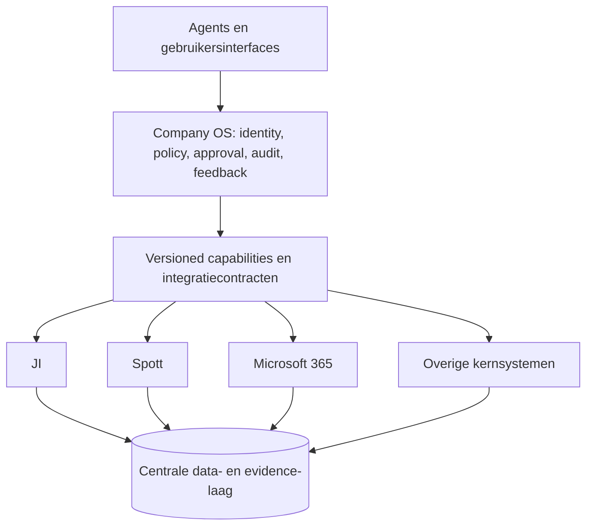

# Catapulze-platform — integratie-inventaris

Status: RJC-451, concept voor review 
Peildatum: 6 september 2026 (repository-, ADR- en PR-status) 
Providerdocumentatie: read-only gecontroleerd op 5 september 2026 
Scope: Job Intelligence (JI), Spott, Microsoft 365, Clay, LinkedIn, Please, Moneybird, Revolut en optioneel Metaview

## Besluit en doel

Op 5 september 2026 is EffectTS gekozen als richting voor het volledige Catapulze-project. Metingen in RJC-454 en adapterbewijs in RJC-455 dienen daarom als migratie- en regressiecriteria, niet als een nieuwe adoptiebeslissing. Het bestaande stackontwerp koos op 27 augustus al voor Bun, TypeScript, EffectTS, Drizzle en Effect Schema. Dat ontwerp noemt Effect Schema als enige schemasource; er hoort geen parallel Zod-domeinmodel naast te ontstaan.

RJC-451 legt eerst de integratiegrenzen vast. Het document:

- inventariseert eigenaarschap, richting, contract en gegevensminimisatie;
- houdt onbevestigde leverancier- en tenantdetails expliciet open;
- kiest de gecontroleerde JI–Spott-keten als eerste verticale keten;
- kiest één volgende integratie op aantoonbare bedrijfswaarde en contractbeschikbaarheid;
- start geen providerwrites en reserveert geen ADR-nummer.

De door de opdrachtgever aangeleverde [Catapulze Architectuur Explorer](https://claude.ai/code/artifact/93692ad4-4974-4204-986b-d955d28576dc) beschrijft vier lagen: centrale datalaag, kernsystemen, Company OS en agents. Deze historische doelarchitectuur geeft richting, maar bewijst niet wat nu live, gecontracteerd of geautoriseerd is. Broncode, actuele ADR's, providercontracten en tenantautorisatie blijven beslissend.

MCP is in dit model een transport. Identity, rechten, approvals, idempotency, receipts, bewaartermijnen en audit worden in de Company OS-laag afgedwongen.

## Bewijslabels

| Label | Betekenis |
| --- | --- |
| Bevestigd | In de repositorysnapshot, een geaccepteerd besluit of op 5 september 2026 bereikbare officiële documentatie aangetroffen |
| Voorgesteld | Werkhypothese die een bevoegde eigenaar moet accepteren |
| Onbekend | Niet aantoonbaar uit de geraadpleegde bronnen; vereist tenant-, contract- of leveranciersbevestiging |

Rollen in dit document zijn voorstellen. Er staan bewust geen persoonsnamen in. Elke rol moet in de bevoegde tracker of het eigenaarsregister aan een echte eigenaar worden gekoppeld.

## Systeeminventaris

| Systeem | Bedrijfsuitkomst | Voorgestelde verantwoordelijke rol | Bron van waarheid | Richting en oppervlak | Frequentie, volume en freshness/SLO | Rechten, quota en sandbox | Contractstatus op peildatum |
| --- | --- | --- | --- | --- | --- | --- | --- |
| Job Intelligence | Aanvragen uit meerdere bronnen verzamelen, herleidbaar normaliseren, doorzoeken en als vaste snapshot laten goedkeuren | Product owner JI + platform engineering | `aanvraag` en `bron`; eigen canonieke ID's, observaties, snapshots, approvals en exportreceipts | Inbound API/feed/HTML/browser en batch waar toegestaan; API/MCP als leespad; webhooks per bron onbekend; gecontroleerde outbound action naar Spott | Bronritme en volume per bron; totaal en actuele SLO nog per bronmatrix te bevestigen. Repo-ontwerp noemt 600k nieuwe aanvragen/maand en p95 ≤100 ms als ontwerpschaal, niet als huidige productieclaim | Bronrechten, quota en sandbox per bron onbekend; productiepayloads buiten documentatie | Intern contract deels geïmplementeerd; actuele production readiness valt buiten RJC-451 |
| Spott | Goedgekeurde aanvragen omzetten in ATS/CRM-vacatures en later voorstel-/plaatsingsresultaten teruglezen | Recruitment operations + integration owner | `professional`, `opdrachtgever`, `voorstel`, `plaatsing`; Spott vacancy `id` is externe crosswalk voor een geëxporteerde aanvraag | REST read/write; MCP alleen als gebruikersassistent en niet als standing export; webhook en batch voor de beoogde flow onbekend; eerste keten JI → Spott | Eventgedreven na approval; voorgestelde freshness ≤5 min. Werkelijk volume onbekend. Publieke limiet in repo-spike: 600 requests/min; bij tenant bevestigen | REST `x-api-key`; secretref `SPOTT_API_KEY`. Tenant write scopes en sandboxautorisatie onbekend | Publieke API-overview en OpenAPI bevestigd; repo-spike bevestigt GET en minimale POST-vorm. Geen providerwrite uitgevoerd |
| Microsoft 365 | Organisatie-identiteit, agenda, e-mail, bestanden en samenwerking gecontroleerd beschikbaar maken voor Company OS-flows | M365 tenant admin + security/privacy owner | M365 blijft bron van waarheid voor tenantidentiteit en workspace-objecten; geen van de acht canonieke recruitment-/financiële entiteiten verhuist hierheen | Microsoft Graph REST; change notifications waar het gekozen resourcecontract dat ondersteunt; MCP alleen als aanvullend transport | Voorgesteld: events via notifications, reconcile-batch dagelijks; volume, abonnementsduur en SLO per resource/tenant onbekend | Entra app/consent en least-privilege Graph permissions vereist; secretrefs nog niet geregistreerd. Throttling is resource- en tenantafhankelijk. Geschikte ontwikkeltenant/sandbox onbekend | Officiële Graph-overview, permissions, change notifications en throttlingdocs bevestigd |
| Clay | Goedgekeurde bedrijfs- of contactrecords verrijken voor een concrete workflow | Growth/research operations + privacy owner | Clay is afgeleide verrijkingsbron; Catapulze bewaart provenance, geen nieuw canoniek eigenaarschap | Publieke productintegraties bestaan; gewenste API/webhook/batch/MCP-contracten voor deze tenant onbekend | Alleen on-demand/bounded batch voorgesteld; volume, freshness/SLO en kostenquota onbekend | Tenantrechten, credits/quota, sandbox en secretrefs onbekend | Officiële Clay-documentatie en integratiepagina bereikbaar; geen bruikbaar publiek integratiecontract voor de beoogde flow bevestigd |
| LinkedIn | Goedgekeurde sourcing- of organisatiecontext ophalen binnen verleende productrechten | Sourcing operations + privacy/legal owner | LinkedIn blijft bron van waarheid voor eigen member/company-data; Catapulze bewaart alleen minimale assertions met provenance | OAuth API uitsluitend voor goedgekeurde producten/scopes; geen browserautomatisering als API-vervanging; webhook/batch/MCP onbekend | Alleen on-demand of binnen contractueel toegestaan ritme; volume, freshness/SLO en rate limits hangen af van producttoegang | De meeste permissions en partnerprogramma's vereisen expliciete LinkedIn-goedkeuring; tenant/app, quota, sandbox en secretrefs onbekend | Officiële toegangspagina bevestigd; feitelijke recruitment-/member-scopes niet bevestigd |
| Please | Contract-, payroll- en mogelijk facturatieproces na plaatsing uitvoeren | Contract/payroll operations + privacy/legal owner | `contract`; exacte ownership van payroll- en factuurvelden nog contractueel vaststellen | Gewenst: plaatsing → contract en status/receipt terug. API, webhook, batch en MCP onbekend | Eventgedreven voorgesteld; volume, freshness/SLO en quota onbekend | Account, scopes, sandbox en secretrefs onbekend | Officiële productsite bevestigd; geen publiek technisch contract aangetroffen. Leveranciersgesprek vereist |
| Moneybird | Verkoopfacturen en betaalstatus administreren vanuit geautoriseerde contract-/plaatsingsuitkomsten | Finance operations + finance integration owner | `factuur`; Moneybird-ID als externe crosswalk | REST API en gedocumenteerde webhooks; reconcile-batch voorgesteld; MCP onbekend; create/send blijft aparte approval-bound action | Eventgedreven factuuractie en webhook/reconcile voorgesteld; werkelijk volume onbekend. Throttling geldt; exacte tenantlimiet bij onboarding bevestigen | OAuth of personal API token; officiële sandbox administration beschikbaar; secretrefs nog niet geregistreerd | Officiële introductie, authenticatie, OpenAPI en sandbox bevestigd. Procesmapping en tenantautorisatie open |
| Revolut | Ontvangsten/uitgaven en betaalreconciliatie koppelen aan financiële bewijsstukken | Finance operations + security owner | Banktransacties bij Revolut; Catapulze bewaart alleen financiële crosswalk/status. Moneybird blijft eigenaar van `factuur` | Voorgesteld: read-only transactiereconcile; betaalwrite is buiten deze inventaris. Business API/webhooks nader contracteren; MCP onbekend | Dagelijkse reconcile voorgesteld; volume, freshness/SLO en quota onbekend | Business-accountrechten, certificaten/scopes, sandbox en secretrefs onbekend | Officiële developer-URL bekend, maar geautomatiseerde readback kreeg een security challenge; contractinhoud niet als bevestigd opgenomen |
| Metaview (optioneel) | Met toestemming gespreksnotities of gestructureerde interviewuitkomsten aan een bestaande context koppelen | Recruitment operations + privacy owner | Metaview blijft bron voor transcript/notitie; Catapulze bewaart alleen goedgekeurde minimale afleiding en provenance | Officiële integratiepagina beschikbaar; API/webhook/batch/MCP onbekend | Alleen eventgedreven na expliciete deelname-/verwerkingsgrond; volume en SLO onbekend | Tenantrechten, consentmodel, quota, sandbox en secretrefs onbekend | Product- en integratiepagina bevestigd; geen publiek technisch contract bevestigd. Niet opnemen in eerste twee integraties |

`Candidate Intelligence` is een toekomstig product, geen extra systeemrij in deze inventaris. Kandidaatmatching, ranking en statusautomatisering blijven achter de eigen gate RJC-345. Deze inventaris autoriseert geen verwerking of scoring van kandidaten.

## Canonieke entiteiten en crosswalks

Voorgesteld doelmodel: Catapulze kent elk concept een stabiel intern ID toe en bewaart externe ID's in versioned crosswalks. Dit is geen claim dat het volledige schema al bestaat. Een koppeling wijzigt niet stil het canonieke eigenaarschap. Migratie gebeurt per entiteit en per flow; er komt geen big-bang identity migration.

| Concept | Conceptuele bron van waarheid | Canoniek Catapulze-ID | Externe crosswalks | Open contractvraag |
| --- | --- | --- | --- | --- |
| `professional` | Spott | `professional_id` | provider + tenant + externe professional-ID | Mag JI alleen refereren, of ook minimale profielassertions cachen? |
| `opdrachtgever` | Spott | `opdrachtgever_id` | Spott company-ID en eventuele bronorganisatie-ID's | Matchingregels, merges en juridische entiteit versus handelsnaam |
| `aanvraag` | JI | `aanvraag_id` | bronrecord-ID/URL en na export Spott vacancy `id` | Wanneer is een Spott-update een nieuwe approval-bound action? |
| `bron` | JI | `bron_id` | onveranderlijke vooraf toegewezen bron-ID plus externe feed/account-ID | Wie accepteert voorwaarden, ritme en pauzering per bron? |
| `voorstel` | Spott | `voorstel_id` | externe proposal/submission-ID | Beschikbare readcontracten, statussemantiek en kandidaatgrondslag |
| `plaatsing` | Spott | `plaatsing_id` | externe placement-ID | Welke status activeert contractvoorstel en welke approval is vereist? |
| `contract` | Please | `contract_id` | Please-contract-ID; eventueel Spott-placement-ID als relatie, niet als identiteit | API-beschikbaarheid, versies, statusmodel en delete/correctieroute |
| `factuur` | Moneybird | `factuur_id` | Moneybird sales-invoice-ID; contract- en plaatsingsrelaties apart | Draft/create/send-scheiding, correcties en betaalstatusbron |

Minimale crosswalkvelden: `canonical_entity_type`, `canonical_id`, `provider`, `tenant_or_administration_id`, `external_id`, `contract_version`, `first_observed_at`, `last_verified_at`, `status` en provenance. Crosswalkmutaties zijn auditbaar en omkeerbaar. Providerpayloads blijven buiten crosswalks.

## Gegevens-, voorwaarden- en verwijdermatrix

Alle grondslagen hieronder zijn open compliancevragen totdat de privacy/legal owner ze per flow heeft bevestigd. “Voorgesteld” is geen juridisch oordeel. Productiepayloads, credentials en persoonsgegevens horen niet in documentatie of issues.

| Flow | Minimale velden | Grondslag en voorwaarden | Retentie en delete/correctie | Open vraag vóór activering |
| --- | --- | --- | --- | --- |
| Bronnen → JI | externe ID/URL, titel, omschrijving, organisatie, locatie, contracttype, tarief indien gepubliceerd, publicatie-/ophaaltijd, contenthash, provenance | Voorgesteld: gerechtvaardigd belang of contract, per bron te bevestigen; robots/ToS/licentie en toegestane herpublicatie registreren | Raw en curated termijnen per bron open onder RJC-324; bronrecord tombstone en canonieke unlink/delete-route vereist | Bronvoorwaarden, minimale velden, incidentiele PII, bewaartermijn en verwijderverzoekroute |
| JI → Spott | goedgekeurde snapshot-ID, `aanvraag_id`, company crosswalk, naam/titel, beschrijving, vereiste vacaturevelden, idempotency key | Contractuele recruitmentuitvoering voorgesteld; Spott-overeenkomst en write scope bevestigen | Bewaar requesthash, status en receipt; payloadretentie en remote correct/delete-route onbekend | Company/stage mapping, sandbox, write scope, update/deletebeleid en approvalgeldigheid |
| Spott → JI/Company OS | externe vacature-, voorstel- of plaatsings-ID, status, gewijzigdtijd en minimale receipt/assertion | Zelfde doelbinding als oorspronkelijke recruitmentflow; member-/kandidaatvelden uitgesloten totdat apart toegestaan | Alleen benodigde status/provenance; reconcile- en correctieroute ontwerpen | Beschikbare endpoints, statussemantiek, webhooks en kandidaatgegevensgrens |
| Microsoft 365 → Company OS | tenant/object-ID, actor-ID, resource-ID/type, eventtijd, minimale metadata; body/attachment alleen wanneer een concrete capability dit vereist | Werkgevers-/contractuele context en grondslag per resource bevestigen; Graph permissions en tenantbeleid zijn bindend | Resourcegebonden retentie; deletion propagation en Purview/hold-conflicten ontwerpen | Welke eerste resource, delegated of application permissions, consent, DLP en auditowner? |
| Company OS → Microsoft 365 | capability-ID, actor, doelresource, minimale action-input, approval/evidence-ID, idempotency key | Alleen met doelbinding, least privilege en geautoriseerde actor | Audit + receipt; remote update/delete volgens gekozen resourcecontract | Welke writes leveren nu aantoonbare waarde? Geen write in de eerste read-only baseline |
| Clay ↔ Company OS | canoniek organisatie-/contact-ID, aangevraagde attributen, providerassertion, bron en ophaaltijd | Toestemming, contract of gerechtvaardigd belang per attribuut; Clay terms en subverwerkers bevestigen | Field-level TTL en delete propagation verplicht; standaardtermijn onbekend | API-contract, credits, dataherkomst, gebruiksrechten, opt-out en delete-API |
| LinkedIn → Company OS | provider-ID/URL en alleen attributen die expliciet door goedgekeurde scope zijn toegestaan | Alleen verleende OAuth-productrechten en passende grondslag; scraping niet als fallback | Korte field-level TTL voorgesteld; correctie/delete/withdrawalroute vereist | Productgoedkeuring, scopes, opslagbeperkingen, displayvoorwaarden en rate limits |
| Spott-plaatsing → Please | `plaatsing_id`, professional-/opdrachtgevercrosswalk, contractparameters die juridisch noodzakelijk zijn, approval-ID | Contractuitvoering voorgesteld; Please-verwerkers-/dienstvoorwaarden en rollen bevestigen | Wettelijke en contractuele termijnen vastleggen; rectificatie, beëindiging en deletebeperking ontwerpen | Technisch contract, verplichte velden, payrollrollen en documentretentie |
| Please → Moneybird | `contract_id`, factuurdebiteur-crosswalk, bedrag/btw/periode/regelniveau, approval-ID | Contract en wettelijke administratieplicht voorgesteld; rolverdeling bevestigen | Financiële wettelijke retentie kan delete beperken; correctie via credit-/correctieflow | Is Please of Catapulze factuurinitiator, en welke bron bepaalt bedragen/btw? |
| Moneybird + Revolut → Company OS reconcile | Moneybird factuur-ID, Revolut banktransactie-ID, bedrag, valuta, boek-/waardedatum, reconcile-status | Wettelijke administratie en overeenkomst voorgesteld; PSD/bankvoorwaarden bevestigen | Financiële retentie en toegangslogging vereist; unlink/correctie in plaats van historie wissen waar wet dat vereist | Read scopes, accountselectie, matchtoleranties, webhooks en handmatige uitzonderingsflow |
| Metaview → Company OS | meeting/interview-ID, participant-consentstatus, goedgekeurde notitie/assertion, tijd en provenance | Expliciete transparantie en passende grondslag vóór opname/verwerking; leveranciersterms bevestigen | Transcriptretentie minimaal en tenantgestuurd; participant delete/correctieroute vereist | Consent, kandidaatimpact, transcriptlocatie, API-contract en uitsluiting uit ranking |

## Volgorde

### 1. Eerste verticale keten: JI → Spott

De eerste keten blijft: vaste JI-zoekresultaatsnapshot → menselijke approval → idempotente Spott REST-action → externe vacancy-ID en receipt → veilige readback/reconcile. De repo heeft al een publieke Spott-contractspike en werk rond provider-disabled guards, reservering, capabilities en veilige CRUD. Activering wacht op tenantrechten, company/stage mapping en een geautoriseerde sandbox. MCP is geen exportpad.

### 2. Volgende integratie: Microsoft 365 read-only identity/workspace baseline

Microsoft 365 is de volgende integratie na JI–Spott, onder voorbehoud van tenantconsent. De keuze combineert:

- hoge platformwaarde: identity en workspace-context zijn bruikbaar voor meerdere toekomstige Company OS-capabilities;
- een publiek en versioned Microsoft Graph-contract met gedocumenteerde permissions, change notifications en throttling;
- een veilige eerste stap: tenant- en resource-inventaris plus read-only capability, zonder providerwrite;
- geen afhankelijkheid van het nog onbekende Please-contract.

Moneybird heeft eveneens een goed gedocumenteerde API en sandbox, maar de factuurflow hoort na bevestiging van de plaatsing→contract→factuurverantwoordelijkheid. Please blijft daarom eerst een contract-discoverygate. Clay, LinkedIn en Metaview missen voor de beoogde flow nog scope- of contractbewijs. Revolut volgt pas na een geaccepteerd Moneybird-reconcilecontract.

Stopconditie voor de Microsoft 365-baseline: geen code of tenantactie voordat één resource, businessdoel, owner, delegated/application permissionmodel, minimale velden, retentie en sandbox/ontwikkeltenant zijn geaccepteerd.

## EffectTS-migratiegrens

EffectTS geldt projectbreed voor nieuwe en gemigreerde applicatiecode, maar vervangt geen databasegaranties, externe systemen of frameworkcontracten. Bestaande outbox leases/fencing, checkpoints, idempotency keys, approvals, receipts en crosswalks blijven domein- en databasegaranties.

RJC-456 moet een gefaseerde migratiekaart opleveren voor:

| Gebied | Migratiedoel | Grens |
| --- | --- | --- |
| `packages/domain` | Effect Schema als canoniek schema en typed errors | Pure deterministische regels blijven gewone functies waar dat helderder is |
| `packages/application` | Services, Layers, scoped resources en typed failures | Domeingarantie niet reduceren tot runtime-retry |
| `packages/connectors` | interruption, timeout, retry policy, observability en providererrors | Providercontract en rate limit blijven adapter-specifiek |
| `packages/db` | Effect-services rond Drizzle lifecycle/transactions | Drizzle en Postgres blijven persistencecontract |
| `packages/search` | Effect-services rond index/read-adapters en typed search failures | Manticore, querysemantiek en `SearchAdapter` blijven eigen contracten |
| `packages/performance` | Effect-compatible meetfixtures en regressierapportage | Metingen blijven bewijs en worden geen productruntime |
| `packages/auth`, `packages/env` | typed config/auth boundaries en redaction | Better Auth/frameworkcontracten behouden |
| `packages/api`, `apps/server` | één geobserveerde runtimeboundary en veilige error mapping | Hono/tRPC/HTTP-contracten versioned houden |
| `apps/worker`, Trigger.dev-taken | Effect-programma binnen worker-/taakboundary met expliciete cancellation/retry-semantiek | Trigger orchestration, checkpoints en idempotency niet dubbel modelleren |
| `apps/web`, `packages/ui` | gedeelde schema's en Effect waar async/error/resourcegedrag dat rechtvaardigt | React/Next lifecycle en eenvoudige pure UI-code blijven framework-idiomatisch |
| `packages/config` | gedeelde compiler/lint/testconfig voor de migratie | Geen productlogica in config |

Deze inventaris reserveert geen ADR-nummer en claimt niet dat de migratie al is uitgevoerd.

## Bestaand werk en issue-traceability

| Issue | Relatie met deze inventaris | Geen duplicaat maken voor |
| --- | --- | --- |
| RJC-452 | Legt modulegrenzen, canonieke identifiers en versioned integratiecontracten vast | Dezelfde platform-ADR |
| RJC-454 | Meet huidige fout-, cancellation-, resource- en observabilitybaseline | Adoptievote; meting is migratie-/regressiebewijs |
| RJC-455 | Bewijst de Effect-grens met representatieve adapters | Losse generieke Effect-spike zonder productflow |
| RJC-456 | Levert projectbrede migratiekaart en schema/frameworkgrenzen | Eén big-bang refactorissue of nieuw ADR-nummer |
| RJC-457 | Parent voor gecontroleerde JI–Spott-keten en feedback | Tweede ketenparent |
| RJC-458 | Actor/scope/policy/correlation actioncontract | Nieuwe approval-/policyvariant |
| RJC-459 | Snapshot → approval → Spott → receipt | Nieuwe exportorchestratie |
| RJC-460 | Feedback, outcome en replay-evals | Nieuwe feedbackparent |
| RJC-322 | Afgerond DEC-006-productbesluit over Spott; status bewijst geen tenantwrite of sandboxautorisatie | Een tweede productkeuzebesluit |
| RJC-336 | Spott REST/API-spike en repo-contractbewijs | Nog een algemene Spott-spike |
| RJC-324 | Veldbeleid, minimalisatie, retentie en verwijdering; open beleidsgate | Los algemeen privacyissue voor dezelfde velden |
| RJC-345 | Aparte Candidate Intelligence-gate | Candidate ranking/statuswerk vanuit RJC-451 |
| RJC-426 | Provider-disabled guard en echte Spott-compositie | Nieuwe provider-toggle |
| RJC-435 | Duurzame exportreservering en unknown-result reconciliation | Tweede idempotency/reservation-implementatie |
| RJC-439 | MCP SDK/transport; de officiële transportwijziging staat via PR #161 op de huidige main | Eigen MCP-transport per provider |
| RJC-440 | Private MCP-cataloguscachehints en meetbaar hergebruik; geleverd via PR #161 | Provider-specifieke cachevariant |
| RJC-441 | Client- en authmodel; de first-party signed-session-grens staat via PR #161 en ADR-0012 op de huidige main | Parallel authmodel |
| RJC-443 | Contextbootstrap | Tweede contextbootstrap |
| RJC-444 | Veilige CRUD/readbacks | Brede ongecontroleerde provider-CRUD |
| RJC-446 | Waarheidsgetrouwe capability discovery | Tweede capabilitycatalogus |
| RJC-447 | Read-only sourcingprompt en evals | Candidate automation |

Nieuw werk ontstaat pas wanneer contract-discovery een concrete, nog niet gedekte capability oplevert. Maak dan één issue per bounded providerflow, gekoppeld aan RJC-452 en de relevante privacy-/actiongate. Onbekende API's zijn discoveryvragen, geen geschatte implementatietaken.

## Open owner- en contractgates

RJC-451 kan naar review zodra bevoegde eigenaars de onderstaande vragen expliciet krijgen; open antwoorden mogen niet als aannames worden dichtgeschreven:

1. Wijs per systeem een product-/procesowner, integration owner en privacy/security owner toe in de bevoegde tracker.
2. Bevestig per tenant/administration welke omgevingen, scopes, quota, kosten en sandboxen bestaan.
3. Accepteer het canonieke entiteits- en crosswalkmodel, inclusief merge/unlink/correctie.
4. Bevestig per flow grondslag, minimale velden, leveranciersvoorwaarden, retentie en delete/correctieroute onder RJC-324.
5. Kies voor Microsoft 365 exact één eerste read-only resource en permissionmodel.
6. Verkrijg een technisch Please-contract voordat contract-/payrollwerk wordt geraamd.
7. Bevestig Moneybird als factuur-SoT en de grens tussen draft, create en send.

## Actuele repository-, ADR- en PR-status

Deze publicatie is gecontroleerd tegen de fetched `origin/main@55dd8774ecb8d8dde4429098667c33a92c0ab0a3` op 6 september 2026. Hosting is geen selectiecriterium voor een providercontract, maar beïnvloedt wel de runtimegrens. De volgende GitHub- en tracker-readbacks geven de actuele status:

- RJC-418 staat `In Progress` en legt de gekozen beweging van Neon Free naar on-box PostgreSQL in Coolify vast, met Trigger paid static egress allowlisting en R2-back-ups. Dit is richting en werkstatus, geen bewijs dat de cutover of restoregates gereed zijn.
- PR [#149](https://github.com/RyanLisse/catapulze-job-intelligence/pull/149) is op 6 september 2026 gemerged vanaf head `4a06a00fcbb2b90b9c3d61cdf0607a4ed0a23127`; ADR-0011 staat daardoor op de huidige main en supersedeert ADR-0006. De uitvoering onder RJC-418 blijft open.
- PR [#159](https://github.com/RyanLisse/catapulze-job-intelligence/pull/159) is gemerged vanaf head `2137463455f19afd0e42dfc38b9e1188b845f323`; RJC-438 staat `Done` en de gereconcilieerde bouwbrief/agentarchitectuur staan op de huidige main.
- PR [#161](https://github.com/RyanLisse/catapulze-job-intelligence/pull/161) is gemerged vanaf head `c019847d4dae43f2b45a0602be39b1a64d7c1494`; RJC-439 en RJC-441 staan `Done` en de officiële MCP-transportlaag, cache-/availabilitybeleid en first-party signed-session-grens staan op de huidige main. Dit bewijst geen deployment, tenanttoegang of providerwrite.

Daarom is ADR-0006 op de huidige main-branch documenthistorie, niet de huidige gekozen productierichting. De oudere `main@2049008`-statusregels in de geraadpleegde bouwbrief en agentarchitectuur zijn point-in-time bronnotities; voor de actuele repositorystatus geldt bovenstaande snapshot. RJC-451 wijzigt deze hostingdocumenten niet en claimt geen deployment.

## Geraadpleegde bronnen

De officiële providerlinks hieronder zijn in de voorafgaande inventarisatie op 5 september 2026 read-only gecontroleerd; deze publicatie heeft de providerinhoud niet opnieuw geverifieerd. De aangeleverde Architectuur Explorer is in de voorafgaande assessment gelezen en in deze pass niet opnieuw opgehaald. Een bereikbare documentatiepagina bewijst geen tenanttoegang of contractuele toestemming.

| Bron | Gebruik en verificatiestatus |
| --- | --- |
| [Catapulze Architectuur Explorer](https://claude.ai/code/artifact/93692ad4-4974-4204-986b-d955d28576dc) | Door opdrachtgever aangeleverde historische doelarchitectuur; geen live-statusbewijs |
| [`BUILD_BRIEF.md`](BUILD_BRIEF.md) | JI-systeemgrens, provenance, approval, idempotency, fasering en privacygates |
| [`AGENT_NATIVE_ARCHITECTURE.md`](AGENT_NATIVE_ARCHITECTURE.md) | Company OS-control plane, capability- en transportgrenzen; implementatiestatus in document gerespecteerd |
| [`spott-slice-b-spike.md`](spott-slice-b-spike.md) | REST/MCP-scheiding, auth, rate limit, vacancy-ID en minimale write; geen live write uitgevoerd |
| [`2026-08-27-techstack-brainstorm.md`](brainstorms/2026-08-27-techstack-brainstorm.md) en [`Slice A-plan`](plans/2026-08-27-2022-feat-slice-a-read-path-plan.md) | Bestaande EffectTS-/Effect Schema-keuze en integratiearchitectuur |
| [`ADR-register`](adr/README.md), [`ADR-0006`](adr/ADR-0006-neon-as-system-of-record.md), [`ADR-0008`](adr/ADR-0008-cloudflare-r2-for-raw-payloads.md), [`ADR-0010`](adr/ADR-0010-bron-health-and-alert-storage.md), [`ADR-0011`](adr/ADR-0011-postgres-on-box-trigger-static-ips.md), [`ADR-0012`](adr/ADR-0012-first-party-mcp-client-auth.md) | Main-branch data-, storage- en authbesluiten; actuele hosting- en PR-status staat hierboven |
| [Spott API overview](https://docs.spott.io/docs/developers/api-overview) en [OpenAPI](https://docs.spott.io/api-reference/openapi.json) | HTTP 200; publiek contract bevestigd |
| [Microsoft Graph overview](https://learn.microsoft.com/en-us/graph/overview), [permissions](https://learn.microsoft.com/en-us/graph/permissions-overview), [change notifications](https://learn.microsoft.com/en-us/graph/change-notifications-overview) en [throttling](https://learn.microsoft.com/en-us/graph/throttling) | HTTP 200; publiek contract voor volgende read-only discovery bevestigd |
| [LinkedIn API access](https://learn.microsoft.com/en-us/linkedin/shared/authentication/getting-access) en [versioning](https://learn.microsoft.com/en-us/linkedin/marketing/versioning) | HTTP 200; documentatie bevestigt dat de meeste productrechten expliciete goedkeuring vereisen |
| [Moneybird introduction](https://developer.moneybird.com/introduction), [authentication](https://developer.moneybird.com/authentication), [API](https://developer.moneybird.com/api) en [OpenAPI](https://raw.githubusercontent.com/moneybird/openapi/refs/heads/main/openapi.yml) | HTTP 200; OAuth/token, sandbox, throttling en publiek API-contract bevestigd |
| [Clay documentation](https://university.clay.com/docs), [integrations](https://www.clay.com/integrations) en [terms](https://www.clay.com/terms-of-service) | Documentatie bereikbaar; beoogd tenantcontract en toegestane velden niet bevestigd |
| [Please](https://www.please.nl/) | Officiële productsite HTTP 200; geen publiek technisch contract aangetroffen |
| [Revolut Business API](https://developer.revolut.com/docs/business/business-api) | Officiële URL gaf een security challenge aan geautomatiseerde readback; inhoud niet als geverifieerd gebruikt |
| [Metaview integrations](https://www.metaview.ai/integrations) | Officiële integratiepagina HTTP 200; geen publiek technisch contract voor de beoogde flow bevestigd |

Niet geraadpleegd: private tenants, leveranciersportalen, overeenkomsten, DPIA's, productiepayloads en secrets. Daardoor blijven werkelijke owners, rechten, volumes, kosten, bewaartermijnen en omgevingen reviewgates.
