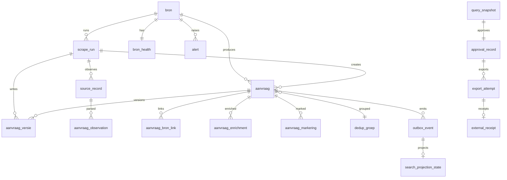

# Data Model and Persistence

The system stores its durable state in Postgres, organised into three
schema zones — **staging**, **curated**, and **marts** — plus an **auth**
set of tables in the default `public` schema. All table definitions live in
`packages/db/src/schema`, grouped by zone. Drizzle ORM maps them to typed
clients; hand-authored SQL migrations under `packages/db/src/migrations`
create and evolve the schema, journaled in
`packages/db/src/migrations/meta/_journal.json`.

## Schema zones

`packages/db/src/schema/schemas.ts` declares the three Postgres schemas as
Drizzle `pgSchema` objects:

| Zone | `pgSchema` | Role |
| --- | --- | --- |
| staging | `staging` | Raw, append-only source evidence per scrape run |
| curated | `curated` | Normalised domain state, outbox, projections, user writes |
| marts | `marts` | Read-only analytics surface (no contact columns) |
| auth | (default `public`) | Better-auth identity tables: `user`, `session`, `account`, `verification` |

`0000_core.sql` creates all three schemas first, then every table. The
`marts` schema is created but carries no tables in the migrations; it is the
reserved zone for analytics/read-only BI. The `core.spec.ts` test asserts the
three schemas exist and that curated contains **no** `contact`, `candidate`,
or `aanvraag_contact` tables — PII is deliberately kept out of the curated
zone.

### staging

The staging zone holds per-run, append-only evidence and is the only zone the
ingestion pipeline writes raw observations into.

- `source_record` — one row per `(bron_id, bron_referentie)` source reference.
  Uniqueness is `(bron_id, bron_referentie)`; the same `content_hash` is
  allowed for distinct references. Carries `raw_payload_ref`,
  `content_hash`, the run that produced it (`scrape_run_id`), and
  discover-pass fields added later: `listing_hash` (0012, nullable — NULL
  never authorises a fetch skip), `missed_polls` / `last_seen_at` /
  `last_seen_scrape_run_id` / `last_missed_scrape_run_id` (0009, for stale
  detection).
- `aanvraag_observation` — parsed payload snapshot per source record per run,
  with `outcome` of `new | changed | unchanged` and a replay-unique index on
  `(scrape_run_id, source_record_id, content_hash)`.

Both tables reference `curated.bron` and `curated.scrape_run`, so staging
depends on curated for its foreign keys (cascade on bron/run delete).

### curated

The curated zone is the system of record for normalised domain state and all
durable coordination (outbox, projections, approvals, exports, alerts). Its
core ingestion chain is `bron -> scrape_run -> {source_record, aanvraag}`,
with `aanvraag_versie` providing SCD2 history (see below).

Key tables and their responsibilities:

- `bron` — a configured data source. Status (`ready | blocked | deferred`),
  `voorwaarden_status` (`toegestaan | verboden | te_toetsen`), schedule,
  rate limit, crawl delay, retention, and a `secret_ref` constrained by a
  CHECK to the `op://`, `vault://`, or `trigger://` schemes (plaintext
  secrets are rejected at the DB layer). The `bron_active_policy_check`
  enforces that an active bron must be `ready` and `toegestaan` — you cannot
  activate a source until its conditions are cleared.
- `scrape_run` — one connector execution. `run_kind` (`test | poll |
  backfill`), `status` (`running | succeeded | failed | cancelled`), run
  metrics, a `fence_token` (capped at `2^53-1` for JS safety), and a strict
  failure envelope: a failed run must carry a `(failure_phase, failure_class,
  failure_code, failure_message)` tuple drawn from a fixed allow-list
  (`scrape_run_failure_tuple_check`); non-failed runs must have all four NULL.
- `aanvraag` — the normalised vacancy aggregate. Unique per
  `(bron_id, bron_referentie)`; optional legacy `v1_id` crosswalk. Carries
  commercial fields (`tarief_min/max`, `tarief_eenheid`, `tarief_valuta`,
  `contracttype`, `werkvorm`), location (`locatie_land`, `locatie_tekst`,
  `sluitingsdatum`), and the current `versie` pointer.
- `aanvraag_versie` — SCD2 version rows (see below).
- `aanvraag_bron_link` — cross-source links when the same vacancy appears in
  multiple bronnen; one is `is_primary`.
- `dedup_groep` — deduplication groups keyed by a canonical `dedup_key`
  (normalised titel/opdrachtgever/startDatum joined by U+001F). The unique
  partial index on `dedup_key` lets concurrent imports converge on one group
  via `INSERT ... ON CONFLICT DO NOTHING` then re-select.
- `aanvraag_enrichment` — per-field enrichment (`locatie | tarief | contract |
  remote`) from `deterministic` or `llm` sources, with a `0..1` confidence.
- `aanvraag_markering` — per-user, per-scope marking of an aanvraag as
  `relevant | niet_relevant | gevolgd`, with a revision counter.
- `outbox_event` — the durable event log drained into Manticore (see below).
- `search_projection_state` / `search_projection_checkpoint` /
  `search_projector_runtime` — projection watermark, index checkpoint, and
  live projector identity.
- `saved_search` / `query_snapshot` / `approval_record` — saved searches,
  point-in-time query result snapshots, and approval gates for exports.
- `export_effect` / `export_attempt` / `external_receipt` /
  `external_id_crosswalk` — idempotent export of approved vacancies to an
  external target (`spott`), with reserved effects, attempt records, and
  provider receipts.
- `bron_health` / `alert` — circuit-breaker state per bron and deduplicated,
  ackable alerts.
- `audit_event` / `agent_context` — audit trail and agent context store.

### auth

The default schema holds Better-auth tables: `user` (with a `role` of
`recruiter | operator | admin | approver`, added in 0014), `session`,
`account` (OAuth), and `verification`. These are identity only; domain state
lives in curated.

## Core table relationships

*Core curated tables, the staging observation chain, the outbox-driven
search projection, and the export approval flow. Zones are separated by
schema prefix in SQL; foreign keys cross staging into curated.*

## SCD2 for aanvraag history

Vacancy history uses slow-changing-dimension type 2, implemented in
`packages/db/src/scd2.ts` as `writeAanvraagVersion`. Each aanvraag has a
current `versie` on `aanvraag` and a chain of rows in `aanvraag_versie`,
where each version has `geldig_van` (valid from) and `geldig_tot` (valid to,
NULL for the open/current version). The partial index
`aanvraag_versie_open_idx` (`WHERE geldig_tot IS NULL`) makes the current
version cheap to find.

`writeAanvraagVersion` performs the version transition atomically in one
transaction:

1. Close the currently-open `aanvraag_versie` row (set `geldig_tot = now()`).
2. Insert the new `aanvraag_versie` row with `geldig_van = now()` and the
   new `snapshot`/`content_hash`/`raw_payload_ref`.
3. Insert an `outbox_event` for the aggregate (so the search projector learns
   of the change).
4. Update `aanvraag` itself with the new `versie`, `content_hash`,
   `raw_payload_ref`, and `scrape_run_id`.

Because the version write and the outbox insert share one transaction, the
search index never sees an event for a version that was not durably
committed, and a crash that rolls back the version leaves no orphan outbox
row.

## The outbox and search projection

`curated.outbox_event` is the durable event log that bridges curated state
and the Manticore search index. Rows carry `aggregate_id`, `aggregate_type`,
`event_type`, `payload`, a monotonic `sequence_number`
(`GENERATED ALWAYS AS IDENTITY`, bigint since 0006), and per-row claim/retry/
dead-letter columns.

The drain (`packages/db/src/outbox-drain.ts`, `drainPostgresOutbox`) claims
rows in batches with a `FOR UPDATE SKIP LOCKED` scan ordered by
`sequence_number`, stamps a `claim_token` (fencing token) and a
`claimed_until` lease. A `NOT EXISTS` subquery keeps one aggregate inside one
drain at a time, and a transaction-scoped advisory lock serialises claim
statements so two drains never split a hot aggregate. After the engine write,
the drain acks (`processed_at`) or blames (`retry_count + 1`,
`last_error`); rows reaching `maxAttempts` (default 5) are dead-lettered and
excluded from claims until requeued.

Two reconciliation flows re-emit into the outbox when curated and the index
diverge:

- `projection-repair.ts` emits `aanvraag.projection_repair` events for
  detected divergence (missing/extra documents, physical corruption).
- `search-reindex.ts` emits `aanvraag.search_reindex` events, used for a
  generation-scoped rebuild.

The projection watermark is `search_projection_state` (one row per
aggregate: `applied_sequence`, `generation`, `projection_hash`). The drain
skips the Manticore write when the hash is unchanged within the same
generation, so curated edits that do not touch indexed fields never reindex.
`search_projection_checkpoint` (one row per index) is the durable high-water
mark; `search_projector_runtime` (0023) is the live container/release SHA
self-report, since the projector has no HTTP surface of its own.

## Roles and the runtime client

Three Postgres roles are used:

- **migrator** — owns schema changes. `requireMigrationDatabaseUrl` forces
  migrations to use `MIGRATION_DATABASE_URL` and never fall back to the
  runtime `DATABASE_URL`, so a missing deploy secret fails before DDL runs.
- **app runtime** — restricted DML only, not superuser, no `CREATE` privilege
  on `curated`, but may `SELECT` from `drizzle.__drizzle_migrations` for
  readiness checks. `core.spec.ts` asserts both roles are non-superuser and
  that the app role cannot create curated tables.
- **admin** — the `user.role` value for privileged UI users (distinct from
  the DB superuser role); `0014` added the `recruiter | operator | admin |
  approver` CHECK.

The runtime client is `createBronRuntimeClient(databaseUrl)` in
`packages/db/src/runtime-client.ts`. It opens a `postgres` connection
(`max: 10`, `connect_timeout: 5s`, `idle_timeout: 20s`, `max_lifetime: 30m`)
and wraps a Drizzle instance with the stores the ingestion runtime needs:
`bronPersistence`, `observationRecorder`, `runLifecycleStore`,
`knownHashStore`, and `lifecycle` (missed-polls ports). The API server uses
the shared `db` client from `packages/db/src/index.ts`, built from
`env.DATABASE_URL`.

## Migration journal and readiness

Migrations are hand-authored SQL files split on `--> statement-breakpoint`,
numbered `0000_core` through `0023_search_projector_runtime`, and journaled in
`packages/db/src/migrations/meta/_journal.json` (Drizzle v7, PostgreSQL
dialect). Each entry has an `idx`, a `when` timestamp, and a `tag` matching
the file basename.

Runtime readiness compares the latest journal `when` against the
`created_at` of the most recent row in `drizzle.__drizzle_migrations`:
`resolveExpectedMigrationTimestamp(journal)` returns the last entry's `when`,
and `evaluateDbReadiness` returns `{ ready: false, reason:
"migration_mismatch" }` if they differ, or `"database_error"` if the query
throws. This makes a deploy whose database has not received the latest
migration fail readiness rather than serve against a stale schema.

Upgrade correctness is verified for real when Postgres is reachable:
`migration-upgrade.spec.ts` replays each prior migration's statements in a
dedicated `ji_migration_upgrade_test_*` database (validated by
`requireMigrationUpgradeDatabaseUrl`) and asserts the upgrade SQL produces
the expected schema and backfill — e.g. 0007 backfills `query_snapshot`'s
`index_version`/`search_applied_sequence`/`search_generation` from legacy
integer values, and 0001 keeps legacy observation migration fail-closed and
history-aware (it refuses to migrate observations without an immutable
`contentHash` and dedupes replay keys).

## Key invariants

- A bron must be created inactive and can only be activated after a succeeded
  test-import and `toegestaan` conditions (`bron_active_policy_check`).
- `secret_ref` is constrained to `op|vault|trigger` schemes; plaintext is
  rejected at the DB layer even via direct DML.
- A failed `scrape_run` must carry a complete failure envelope from the
  fixed allow-list; any other combination violates
  `scrape_run_failure_tuple_check`.
- An `outbox_event` row is only ever acked by the drain holding its
  `claim_token` (fencing); a stalled drain's late ack touches nothing.
- The SCD2 version write and the outbox insert are one transaction — no
  orphan events, no unprojected committed versions.
- Curated contains no contact/PII tables (`core.spec.ts` forbids
  `contact`, `candidate`, `aanvraag_contact`); PII is excluded by zone
  design.
