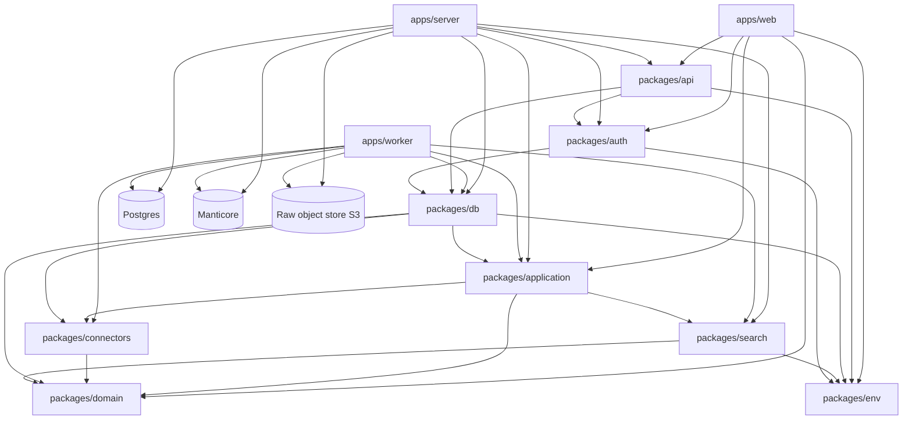
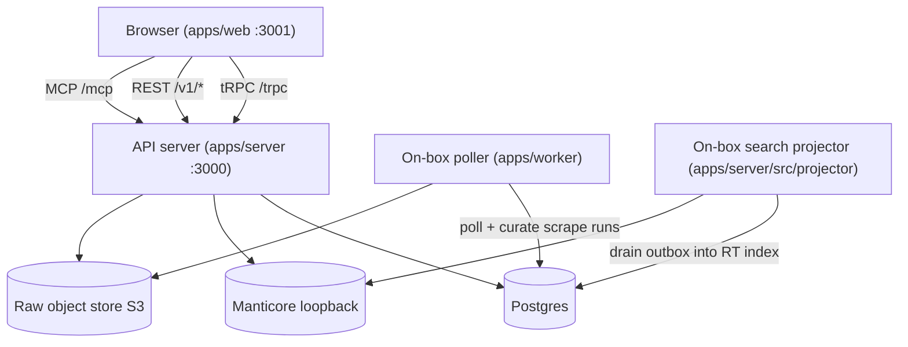
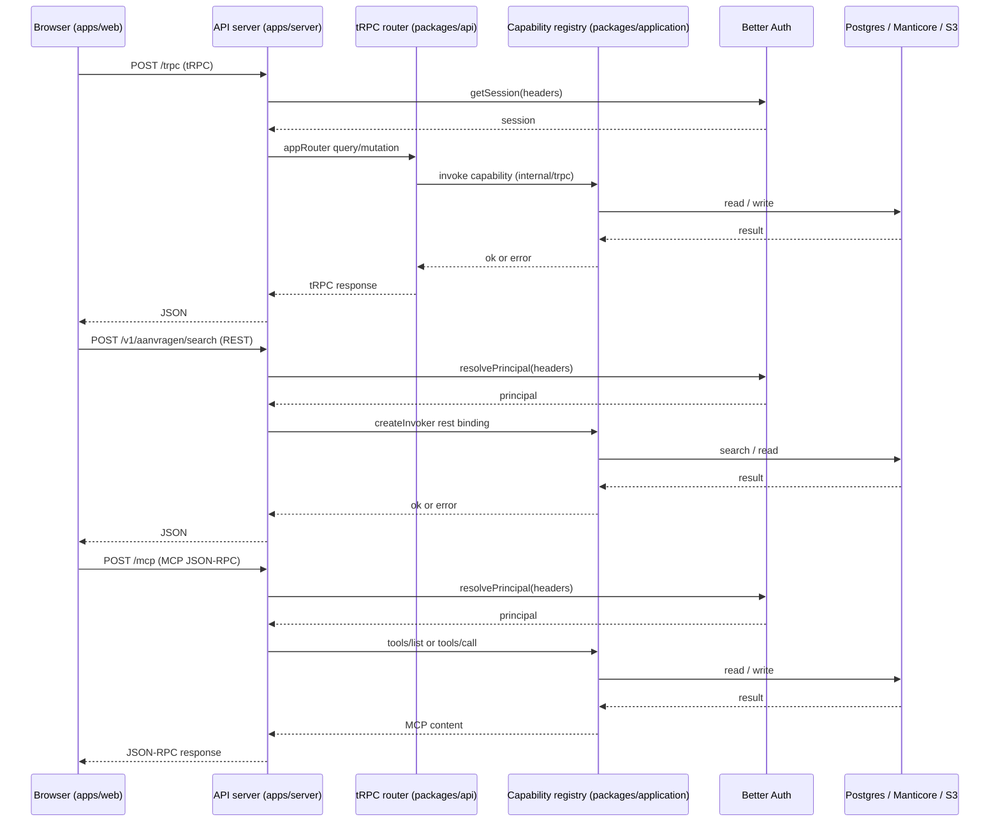

# Architecture Overview

Catapulze Job Intelligence is a Bun monorepo published under the `@ji` (Job
Intelligence) workspace scope. The system has one web UI, one API server, and
two on-box background processes, all sharing a single durable state in Postgres
and a Manticore full-text search index. This page describes the package layout,
the enforced dependency layering, the three runtime processes, and how a request
travels from the browser to the capability registry and on to the stores.

## Monorepo layout

The workspace packages and their roles (from `AGENTS.md`):

| Path | Role |
| --- | --- |
| `apps/web` | Next.js UI on port 3001 |
| `apps/server` | Hono + tRPC API on port 3000; also hosts the on-box projector process |
| `apps/worker` | On-box poller process (`apps/worker/src/poller/main.ts`) |
| `packages/api` | tRPC router and procedures |
| `packages/application` | Use-case layer; the capability registry (`packages/application/src/registry`) |
| `packages/auth` | Better Auth |
| `packages/connectors` | Connector contract and source adapters |
| `packages/db` | Drizzle schema and postgres-js client |
| `packages/domain` | Domain types and Boolean parser (Slice A) |
| `packages/search` | Manticore search engine, adapter, and projector helpers |
| `packages/env` | Typed env for server and web |
| `packages/ui` | Shared UI components |
| `packages/config` | Shared TypeScript config |

The dependency edges between packages follow a strict layering: the web app may
only reach the server over tRPC (`packages/api`) or the capability registry
(REST/MCP); it must not import `@ji/db`, `drizzle-orm`, or anything under
`packages/infra`. `packages/domain` is the shared types core with no
workspace dependencies beyond `effect`; `packages/application` is the use-case
layer that depends on connectors, domain, and search; `packages/connectors` is
the source-adapter layer; and `packages/db` is the persistence layer that
depends on application, connectors, domain, and env.

Caption: package dependency layering and the shared durable state the runtime
processes read and write. The web app never reaches Postgres, Drizzle, or the
raw object store directly.

### Layering enforcement

`scripts/check-layering.ts` scans every `apps/web/**/*.{ts,tsx}` source file for
import specifiers matching a forbidden list and fails the build if any are
found. The forbidden specifiers are:

- `@ji/application/identity` and `@ji/application/sources`
- `@ji/db`
- `@ji/infra`
- `drizzle-orm` and `drizzle-kit`

plus path fragments `/packages/db`, `/packages/infra`, `packages/db/`, and
`packages/infra/`. The check runs via `bun run check-layering` and is part of the
pre-push gate. `AGENTS.md` states the rule plainly: do not query Postgres from
the web app; reads and writes go through `apps/server` / `packages/api`, and
secrets stay in per-app `.env` files.

## The three runtime processes

Three long-running processes share the Postgres + Manticore state. Each holds a
distinct `pg_advisory_lock` key so only one instance of each runs at a time.

Caption: runtime topology. The API server serves the web app over tRPC, REST,
and MCP; the poller curates scrape runs; the projector drains the search outbox
into Manticore. All three touch the same Postgres and (for the server and
projector) the loopback Manticore.

### API server

`apps/server/src/index.ts` is the Hono entrypoint. It wires, in order: a
logger, CORS restricted to the allowed web origin, a JSON body limit on `/v1/*`
and `/mcp`, the Better Auth handler at `/api/auth/*`, the tRPC server at
`/trpc/*`, health and readiness routes, and the capability surface. The
capability surface has three parts:

- `GET /v1/capabilities` — the capability discovery document
  (`createCapabilityDiscoveryHandler`).
- `app.all("/v1/*", ...)` — the REST capability handler
  (`createRestCapabilityHandler`), which matches a route by method and path
  pattern, resolves the session principal, authorizes by permission, and
  invokes the bound capability.
- `POST /mcp` — the MCP handler (`createMcpHandler`), which parses JSON-RPC,
  resolves the principal from the session, and dispatches `tools/list` and
  `tools/call` to the registry-backed MCP server.

The server is bound to the production Slice A registry built by
`createProductionSliceARegistry`, which composes the Postgres-backed stores,
the Manticore search engine, the raw object store, the Redis result cache, and
the `PRODUCTION_UNAVAILABLE_CAPABILITIES` availability policy. On `SIGINT` or
`SIGTERM` the server drains in-flight requests for up to 10 seconds, then closes
the database.

### On-box poller

`apps/worker/src/poller/main.ts` is the poll and curate process. It waits for a
singleton `pg_advisory_lock` (key `613_204_877`) over `POLLER_DATABASE_URL`, then
loops: abandon stale runs, load due poll candidates, partition by the live flag,
and run each due source with bounded concurrency. Each source runs the ingest
pipeline (`runBronIngestPipeline`) and then drains the curation backlog with a
per-source time budget. It runs next to the database so a poll cycle is local
round trips rather than transatlantic compute.

### On-box search projector

`apps/server/src/projector/main.ts` is the search projector. It waits for a
singleton `pg_advisory_lock` (key `847_732_991`, deliberately distinct from the
poller's) over a direct `PROJECTOR_DATABASE_URL`, reads the Neon outbox over the
pooled `DATABASE_URL`, and writes to a loopback-only Manticore. ADR-0006 keeps
Manticore off the public network, so the projector runs next to it. The
projector loop drains a batch, loops immediately while rows remain, otherwise
waits `POLL_INTERVAL_MS`; a transient failure doubles the backoff up to
`MAX_BACKOFF_MS`, while a schema mismatch or lost advisory lock stops the loop
for good. The server exposes the projector's runtime readback at
`GET /projector/runtime`.

## Request flow: web to capability registry to stores

A request from the browser takes one of three transport paths, all converging on
the same capability registry.

Caption: the three transport paths (tRPC, REST, MCP) all resolve a principal from
the session and invoke the same capability registry, which validates input,
authorizes by permission, checks the transport binding, runs the handler, and
validates the output/failure envelope before returning.

### tRPC path

The web app imports `appRouter` from `packages/api/src/routers/index.ts`, which
defines `healthCheck` (public) and `privateData` (protected) procedures. The tRPC
context (`packages/api/src/context.ts`) resolves the Better Auth session from
the request headers; `protectedProcedure` throws `UNAUTHORIZED` when no session
exists. The server mounts the router at `/trpc/*` via `@hono/trpc-server` with
that context.

### REST and MCP paths

The REST and MCP handlers both live in `apps/server/src/capabilities`. They share
a principal resolver (`createSessionPrincipalResolver`) that calls
`auth.api.getSession` and maps the session user's role to an
`InvocationPrincipal` (kind `user`, permissions from `permissionsForRole`).
Both handlers enforce the cookie-origin CSRF policy (`hasAllowedCookieOrigin`)
and apply the `PRODUCTION_UNAVAILABLE_CAPABILITIES` availability policy, which
marks `commit_export`, `complete_task`, `start_run`, and `start_test_import` as
non-executable in production while keeping them discoverable.

The REST handler matches routes by method and path pattern, ranking static
segments above `{param}` siblings so `/v1/bronnen/overlap` is not swallowed by
`/v1/bronnen/{id}`. It normalizes capability-specific body aliases (for example
`id` to `bronId` or `aanvraagId`) before invoking the registry. The MCP handler
parses JSON-RPC, requires the `MCP-Protocol-Version` routing header, and
dispatches `tools/list` and `tools/call` to an MCP server built from the same
registry, filtering tools by the principal's permissions and recording metrics.

## Capability registry

`packages/application/src/registry` is the single application boundary that
REST, MCP, and UI actions all invoke. `createSliceARegistry` builds a
`SliceARegistryBundle` from `SliceAHandlerDeps`: it constructs the capability
catalog (`createSliceACapabilityCatalog`), freezes each capability definition,
and builds a `CapabilityRegistry` whose `createInvoker` binds a capability by
`(transport, operation)`.

Each capability is defined by `defineCapability` with:

- an `id`, `outcome`, and `effect` (`read` or `internal-write`);
- an `authorization.permission` checked against the principal's permissions;
- `bindings` — the `(transport, operation)` pairs the capability accepts
  (`dualBindings` wires both a REST route and an MCP tool name);
- `inputSchema`, `outputSchema`, and `failureSchema` — Effect Schema adapters
  (ADR-0014) whose `safeParseAsync` is the checked validation contract;
- a `handler` receiving the parsed input and an authorized invocation context.

When `createInvoker` is called, the registry:

1. authorizes — checks `principal.permissions.has(permission)`, returning
   `UNAUTHENTICATED` or `FORBIDDEN`;
2. checks the transport binding — returns `TRANSPORT_NOT_BOUND` if the
   `(transport, operation)` pair is not wired;
3. parses the input with `inputSchema.safeParseAsync` — returns `INVALID_INPUT`
   on failure, `INTERNAL_ERROR` on a thrown parser;
4. calls the handler with the authorized principal;
5. validates the handler's return envelope (`{ ok, value } | { ok: false, error }`);
6. parses the output with `outputSchema` (or the failure with `failureSchema`),
   reporting contract violations via the internal error reporter.

The catalog exposes capabilities like `search_aanvragen`, `get_aanvraag`,
`batch_get_aanvragen`, `list_versies`, `read_raw`, `list_bronnen`, `get_bron`,
saved-search CRUD, snapshot creation and approval, export commit and status,
`markeer_aanvraag` and markering read/clear, alert listing and ack, run start,
test import, dashboard overview, bron stats, scrape-run listing, and the
sourcing assessment. Roles are `recruiter`, `operator`, `admin`, and
`approver`; `permissionsForRole` expands each role into the permission set the
registry checks.

## Production composition and readiness

`createProductionSliceARegistry` composes the production dependency set:

- Postgres-backed stores for aanvragen, alerts, approvals, audit, bron health,
  export attempts/effects, external crosswalk/receipts, markeringen, raw
  payloads, saved searches, snapshots, and the curate store;
- a `ManticoreSearchEngine` sharing one `PostgresSearchVersionStore` checkpoint
  with the projector's `drainPostgresOutbox` call (RJC-384);
- a Redis-backed result cache when `REDIS_URL` is set, otherwise an in-memory
  cache;
- an S3 raw object store — production refuses to start if the raw object store
  resolves to the worker-local filesystem backend;
- `assertProductionPersistence`, which fails production startup if any Slice A
  store is still the in-memory implementation (except the dated
  `VOLATILE_STORE_ALLOWLIST`, currently only `operatorRuns`).

Readiness is component-wise (RJC-391). `/health` and `/livez` are process-only
liveness ("OK"); `/readyz` checks Postgres, Manticore, the raw object store,
Redis, and the search projection independently, each on a 1500 ms timeout with a
2000 ms composite cache window. The worst component decides the overall verdict
(`ready`, `degraded`, or `unavailable`); outbox lag above 300 s is `degraded`
but stays servable, and the projection component reports generation, applied
sequence, lag, and schema hash. The server also exposes `GET /version` returning
the release SHA and `GET /projector/runtime` for the on-box projector's
deploy readback.

## Related pages

- [Data Model and Persistence](/openwiki/architecture/data-model.md) — Postgres
  schema zones, SCD2 versioning, and the search outbox.
- [Capability Registry](/openwiki/concepts/capability-registry.md) — the
  capability catalog, transports, and authorization model.
- [Domain Model](/openwiki/concepts/domain-model.md) — domain types and the
  Boolean parser.
- [Deployment and Readiness](/openwiki/operations/deployment-and-readiness.md)
  — component-wise readiness, advisory locks, and the runbooks.
- [Ingest Pipeline](/openwiki/workflows/ingest-pipeline.md) — the poller and
  curation drain.
