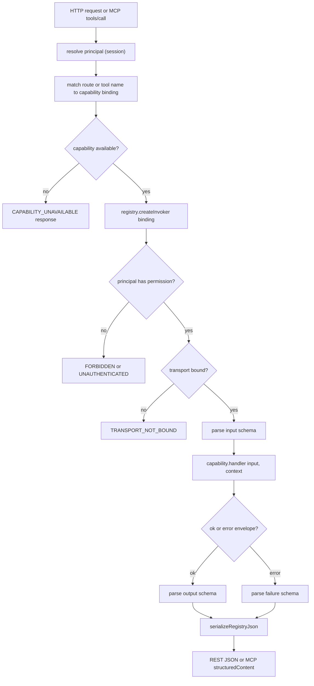

# Capability Registry

The capability registry is the **single application boundary** for Job Intelligence. Every user outcome — searching vacancies, approving a snapshot, exporting to Spott, acknowledging an alert — is defined once as a *capability* and invoked through one registry. UI actions, REST routes, and the MCP `tools/list` + `tools/call` endpoint all call the same capability handlers; there is no second domain implementation beside the registry. This is the agent-native design premise: agents are first-class citizens from day one, so the recruiter's UI and the agent's tool surface share one permissioned, schema-validated invocation path.

## One capability, three transports, one handler

A capability is one user outcome bound to one handler and to one or more transports. The registry validates input, authorises the principal, checks that the transport is bound, runs the handler, and validates the output envelope — identically — regardless of whether the call arrived over REST, MCP, or an internal/tRPC path.

*One capability bound to REST, MCP, and UI through the same handler and registry invoker.*

## Capability definition

A capability is defined with `defineCapability` (`packages/application/src/registry/capability.ts`). Each definition carries:

- **`id`** — stable capability identifier (`search_aanvragen`, `commit_export`).
- **`authorization.permission`** — the permission string the principal must hold (e.g. `recruiter`, `slice-a:read`, `export`).
- **`bindings`** — a list of `{ transport, operation }` pairs. `dualBindings(method, path, toolName)` produces one REST binding (`"POST /v1/aanvragen/search"`) and one MCP binding (`"search_aanvragen"`) in one call.
- **`effect`** — `"read"` or `"internal-write"`.
- **`grounding`** — whether the handler output is grounded in retrieved data (`true`) or only validated.
- **`handler`** — the function `(input, context) => CapabilityHandlerResult<Output, Failure>`.
- **`inputSchema` / `outputSchema` / `failureSchema`** — Effect Schema adapters that are the single source of truth for the contract (ADR-0014 / CTP-469). JSON Schema descriptors for REST/MCP are *derived* from these via `toJsonSchema`, never hand-maintained.

The four transports recognised by the registry are `internal`, `trpc`, `rest`, and `mcp`. An `InvocationContext` carries the resolved `operation`, `principal`, `requestId`, and `transport`.

## Catalog and registry construction

`createSliceACapabilityCatalog(deps)` (`packages/application/src/registry/capabilities.ts`) builds the full catalog — currently 34 capabilities — by calling `defineCapability` for each outcome and wrapping it with `defineSliceACapabilityEntry`. The entry adds metadata that the transports consume but the core registry does not require: `sideEffectClass` (`read` / `proposal` / `commit`), `auditClass`, `target` (`internal` / `external`), `reversible`, and `wiredTransports` — the declared `mcp:`, `rest:`, and `ui:` bindings that prove the capability is wired to every surface it claims.

`createSliceARegistry(deps)` (`packages/application/src/registry/catalog.ts`) calls `createSliceACapabilityCatalog` and passes the capabilities to `createCapabilityRegistry`. At construction the registry:

1. Snapshots and freezes each capability definition.
2. Validates every field (`id`, `outcome`, `permission`, `effect`, `handler`, schemas, bindings).
3. Rejects **duplicate capability ids** (`DUPLICATE_CAPABILITY`).
4. Rejects **duplicate bindings** (`DUPLICATE_BINDING`) — no two capabilities may claim the same REST route or MCP tool name.
5. Derives JSON Schema descriptors for each input/output and rejects any that are not JSON-serialisable or, for MCP inputs, not an `object` root.
6. Requires a non-empty catalog to supply an `InternalErrorReporter` (`MISSING_ERROR_REPORTER`).

Construction is fail-closed: if any check fails, `createCapabilityRegistry` returns `{ ok: false, error }` and `createSliceARegistry` throws. The legacy `productionCapabilityCatalog` / `productionCapabilityRegistry` exports in `catalog.ts` remain empty and unused; the server builds the real registry via `createSliceARegistry(deps)`.

## Per-call invocation pipeline

`registry.createInvoker(binding)` returns a `BoundCapabilityInvoker` that, for each call with `rawInput` and a `TrustedInvocation` (`principal`, `requestId`), runs:

1. **Trusted-invocation validation** — reconstructs a frozen `InvocationContext` from the binding's transport/operation and the supplied principal; rejects malformed context with `INVALID_CONTEXT`.
2. **Capability lookup** — `UNKNOWN_CAPABILITY` if the id is not registered.
3. **Authorisation** — `UNAUTHENTICATED` if no principal, `FORBIDDEN` if the principal lacks `authorization.permission`.
4. **Transport binding check** — `TRANSPORT_NOT_BOUND` if the (transport, operation) pair is not in the capability's bindings.
5. **Input validation** — `inputSchema.safeParseAsync`; `INVALID_INPUT` on failure, `INTERNAL_ERROR` if the schema throws.
6. **Handler execution** — calls `handler(input, context)`; `INTERNAL_ERROR` if it throws.
7. **Envelope validation** — the handler must return `{ ok: true, value }` or `{ ok: false, error }`; `HANDLER_CONTRACT_VIOLATION` otherwise.
8. **Output validation** — on success, `outputSchema.safeParseAsync`; on failure, `failureSchema.safeParseAsync`. Either mismatch is `HANDLER_CONTRACT_VIOLATION`.

Internal errors are reported through the `InternalErrorReporter` with a bounded timeout (`reporterTimeoutMs`, clamped to 5 s) and counted in `registry.health()` as `reporterFailures` / `reporterTimeouts`. The reporter never blocks the response: if it times out or throws, the invocation still returns its contract-violation error.

## Transport bindings and parity

`dualBindings(method, path, toolName)` (`packages/application/src/registry/handlers/bindings.ts`) emits both a REST binding and an MCP binding for a capability in one declaration. The `check-capability-registry` script asserts that every capability id in `sliceACapabilityIds` has exactly one REST and one MCP binding, and that each `wiredTransports` entry in metadata corresponds to a real binding (and vice versa). The `check-capability-coverage` script additionally asserts that every UI action references a capability that is wired to `mcp:`, `rest:`, and `ui:` transports.

### REST adapter

`restRoutesFromRegistry(registry)` (`apps/server/src/capabilities/rest.ts`) extracts REST bindings from the catalog descriptors and sorts them by specificity so static path segments outrank `{param}` segments (preventing `GET /v1/bronnen/{id}` from swallowing `GET /v1/bronnen/overlap`). `createRestCapabilityHandler` then:

- Matches the HTTP method + pathname against the sorted routes.
- Enforces cookie-origin CSRF checks on write methods.
- Resolves the principal from the session via a `PrincipalResolver`.
- Checks `authorization.permission` (403) and availability (`CAPABILITY_UNAVAILABLE`, HTTP 503).
- Normalises path params, JSON body, and query string into one `RestJsonBody` via `normalizeRestInput` — a closed adapter that maps capability-specific aliases (e.g. `id` → `aanvraagId`, `snapshotId`).
- Invokes the registry with `transport: "rest"`.
- Serialises the result with `serializeRegistryJson` (a JSON round-trip through `jsonValueSchema` that strips non-JSON values) and maps invocation/domain error codes to HTTP statuses.

### MCP adapter

`createMcpHandler` (`apps/server/src/capabilities/mcp.ts`) wraps the official `@modelcontextprotocol/server` SDK. `tools/list` returns the tools the resolved principal is authorised to see, each annotated with availability, effect class, and JSON Schema in `_meta`; unavailable-but-authorized tools stay discoverable so agents can read the status, while `tools/call` still guards execution. `tools/call`:

- Finds the tool by name; `INVALID_PARAMS` if unknown.
- Checks availability — returns `CAPABILITY_UNAVAILABLE` (`isError: true`) instead of executing.
- Parses arguments against `restJsonBodySchema` (shared with REST).
- Invokes via `invokeMcpToolCanary` → `invokeMcpTool` → `registry.createInvoker({ transport: "mcp" })`.
- Serialises the result with the same `serializeRegistryJson` and returns it as MCP `structuredContent`.

Both REST and MCP share `serializeRegistryJson` and the `transport-boundary` Zod schemas (`jsonValueSchema`, `restJsonBodySchema`, `pathParamsSchema`, `restQuerySchema`), so the wire-level value normalisation is identical. The `parity.spec.ts` suite asserts byte-equal REST and MCP results for `search_aanvragen`, `get_dashboard_overview`, `get_bron_stats`, `list_scrape_runs`, and `get_scrape_run`, and that unauthenticated MCP calls are denied with `UNAUTHENTICATED`.

### Discovery

`createCapabilityDiscoveryDocument` (`apps/server/src/capabilities/discovery.ts`) produces a per-principal view of the catalog: for each capability it reports `allowed`, `availability` (including `executable`), effect evidence (`grounded-handler-output` / `validated-handler-output` / `none`), and a `statusMap` listing the `mcpTools`, `restOperations`, and `uiActions` derived from `wiredTransports`. The server exposes this at `GET /v1/capabilities`.

## Capability availability

Some capabilities are not executable in production. `PRODUCTION_UNAVAILABLE_CAPABILITIES` (`apps/server/src/capabilities/capability-availability.ts`) maps four capabilities to a status and reason:

| Capability | Status | Reason |
|---|---|---|
| `commit_export` | `disabled` | Export unavailable until a production export provider is connected |
| `complete_task` | `fixture-stub` | Task completion is a stub, no durable completion |
| `start_run` | `fixture-stub` | Run dispatch uses a fixture contract without a durable dispatcher |
| `start_test_import` | `fixture-stub` | Test import uses a fixture contract without a durable dispatcher |

`isCapabilityExecutable` returns `true` only when `status === "implemented"`. When a call targets an unavailable capability, REST returns HTTP 503 with `code: CAPABILITY_DISABLED` and MCP returns an `isError` result with the same code — the registry reports the unavailability rather than executing a stub effect. Capabilities not listed in the policy default to `implemented`. The MCP `tools/list` keeps unavailable tools discoverable (so an agent can read the reason and safe next step), but `tools/call` still guards execution.

## Authorisation model

Authorisation is per-call and per-capability. An `InvocationPrincipal` carries a `kind` (`user` / `agent` / `service`), a `subjectId`, and a `Set<string>` of permissions. The registry checks `principal.permissions.has(capability.authorization.permission)` on every invocation — there is no transport-level role bypass. Roles and permissions are defined in `packages/application/src/registry/roles.ts`: `recruiter` grants `slice-a:read` + `recruiter`; `operator` grants `slice-a:read` + `operator`; `approver` grants `slice-a:read` + `approval` + `export`; `admin` grants all. Some handlers apply finer-grained checks inside the handler — for example, `get_aanvraag` returns `FORBIDDEN_FULL` when `full: true` is requested without the recruiter role, so preview access is broader than full-detail access.

## Server wiring

`apps/server/src/index.ts` builds one production registry via `createProductionSliceARegistry` and wires three surfaces to it:

- `restRoutesFromRegistry(sliceA.registry)` → `createRestCapabilityHandler` → `app.all("/v1/*", restHandler)`
- `createMcpHandler(sliceA.registry, resolvePrincipal, { entries, unavailableCapabilities })` → `app.post("/mcp", mcpHandler)`
- `createCapabilityDiscoveryHandler(sliceA.registry, sliceA.entries, ...)` → `app.get("/v1/capabilities")`

A separate tRPC router (`app.use("/trpc/*", trpcServer({ router: appRouter }))`) provides the typed client API; `trpc` is a declared transport in the registry types. All three HTTP surfaces share the same `resolvePrincipal` (a Better Auth session resolver) and the same `PRODUCTION_UNAVAILABLE_CAPABILITIES` policy.

## Schemas as the single source of truth

Per ADR-0014 / CTP-469, Effect Schema is the hand-maintained source of truth for every public capability contract. The registry's input/output/failure validation uses `safeParseAsync` on the Effect Schema adapter; the JSON Schema descriptors published to REST and MCP are derived via `toJsonSchema`; the Standard Schema v1 (`~standard`) adapter is derived from the same schema. There is deliberately no second hand-written Zod canonical for the same tool I/O. The `transport-boundary` Zod schemas exist only for wire-level normalisation (JSON value validation, path/query parsing) and are not a duplicate domain contract.

## Extension and invariants

- **Adding a capability**: call `defineCapability` inside `createSliceACapabilityCatalog`, wrap it with `defineSliceACapabilityEntry` including `wiredTransports`, and add its id to `sliceACapabilityIds`. The coverage and registry scripts will fail the build if the new capability lacks exactly one REST and one MCP binding, or if a declared UI action is missing its transports.
- **Transport parity invariant**: REST and MCP invoke the same handler through the same registry invoker with the same serialisation. Parity is asserted by `parity.spec.ts`; a capability that returns different shapes per transport is a defect.
- **Availability invariant**: an unavailable capability never executes; both transports return `CAPABILITY_DISABLED` with the reason. Listing it in `tools/list` is allowed; calling it is not.
- **Construction-time invariant**: duplicate ids, duplicate bindings, invalid schemas, and a missing error reporter for a non-empty catalog all fail at registry construction, not at call time.
