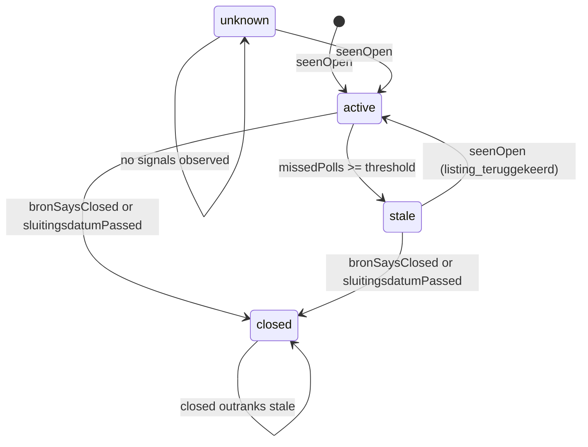

# Domain Model

The `@ji/domain` package is the pure, Effect-free core of the ingestion
system. It defines the vocabulary every other package speaks — what a source
is, how a vacancy record is identified, how recruiter free-text queries become a
searchable AST, and what it means for a field to be genuinely absent. The
package is deliberately framework-light: Effect Schema is the hand-maintained
source of truth for public *shapes* and *enums*, while the *rules* (lifecycle
transitions, bron activation, the Boolean parser) stay pure functions so they
can be reasoned about and tested in isolation.

## Bron, aanvraag, and source records

A **bron** is an ingestable data source — TenderNed, CTM, Flinter, etc. Each
bron is assigned a **`BronId`** up front by a human, not auto-generated. The id
keys the known-hash store, observations, and seed rows, so two sources sharing
one id cross-contaminate the moment either goes live. Uniqueness across the
registry is asserted by `sources.spec.ts`.

A **bron config** (`BronConfig`) is the operational record for a bron:

| field | role |
| --- | --- |
| `bronId` | globally unique opaque id |
| `naam` | free-form display name (capped at `BRON_NAAM_MAX_LENGTH` = 200) |
| `method` | one of `feed`, `json-api`, `json-ld`, `html`, `playwright` |
| `status` | bron status: `ready`, `blocked`, `deferred` |
| `voorwaardenStatus` | conditions status: `toegestaan`, `verboden`, `te_toetsen` |
| `interval`, `crawlDelayMs`, `rateLimitPerMinute` | schedule and rate-limit controls |
| `loginVereist`, `secretRef`, `mappingRef` | auth and mapping configuration |

The config's shape and enums are Effect Schema definitions; the cross-field
rules (a login or Playwright connector requires a `secretRef`; a `verboden`
bron can never transition to `ready`) live in pure functions:

- `validateBronConfig` — returns a list of field-level validation issues.
- `requiresSecretRef` — true when `loginVereist` or `method === "playwright"`.
- `canTransitionBronStatus` — refuses a transition to `ready` when
  `voorwaardenStatus === "verboden"`.
- `shouldScheduleBronPoll` — true only when `status === "ready"` and
  `voorwaardenStatus === "toegestaan"`.
- `activateBron` — the full activation gate: config must validate, a test import
  must pass, `voorwaardenStatus` must be `toegestaan`, and the status
  transition must be allowed. Returns `{ ok: true, status: "ready" }` or a
  reason string.

A **bron_referentie** is the source-native identifier per record — an id for
most connectors, a URL path for json-ld, an href slug for Flinter. It sits in
two unique btree indexes (`source_record_bron_referentie_uidx` and
`aanvraag_bron_referentie_uidx`), and a btree v4 entry caps at 2704 bytes, so an
oversized value would fail the insert. `boundBronReferentie` keeps a value
under `BRON_REFERENTIE_MAX_LENGTH` (2000) UTF-8 bytes unchanged; when it
exceeds the cap, it replaces it with a `sha256:`-prefixed digest of the whole
value. Truncating would silently merge two records that differ only past the
cut, so a digest is used instead — the same convention as `dedup_key`.

An **aanvraag** is the normalised vacancy record derived from source
observations. It is unique per `(bron_id, bron_referentie)`. A
`NormalisedAanvraagDraft` is the hand-off shape from a source normaliser into
the curation pipeline: each field carries provenance (`parserVersion`,
`sourcePath`), and fields the source genuinely does not publish carry the
`UNKNOWN` sentinel rather than `null`.

## Opaque ids

All domain ids are plain strings (`BronId`, `AanvraagId`, `ScrapeRunId`,
`SourceRecordId`, etc.), not UUID-validated. This is deliberate so existing
non-UUID fixtures and operator refs keep compiling. The `DomainIdString`
schema is the Effect Schema source of truth for opaque id strings, re-exported
as `DomainIdSchema`.

The following id types are defined in `ids.ts`:

| type | meaning |
| --- | --- |
| `BronId` | a configured bron |
| `ScrapeRunId` | one connector execution |
| `SourceRecordId` | one source observation row |
| `AanvraagId` | a normalised vacancy |
| `AuditEventId`, `OutboxEventId`, `SavedSearchId`, `QuerySnapshotId`, `DedupGroepId`, `ApprovalRecordId`, `AgentContextId` | supporting ids |

## Aanvraag lifecycle

The aanvraag lifecycle has four states, modelled as a const tuple and an Effect
Schema:



The lifecycle states for an aanvraag.

The `resolveLifecycleStatus` function is a pure derivation from
`LifecycleTransitionInput`:

```ts
resolveLifecycleStatus({
  bronSaysClosed,        // the source explicitly reports closed
  sluitingsdatumPassed,  // the closing date is in the past
  seenOpen,              // the record appeared in this complete listing
  missedPolls,           // consecutive complete runs the record was absent
  missedPollsBeforeStale, // threshold, defaults to 3
  current,               // the current lifecycle status
})
```

Two independent close signals feed the derivation, and they are owned by two
different steps:

- `bronSaysClosed` and `sluitingsdatumPassed` come from the **normaliser** and
  yield `closed`. Being observed again never reopens a `closed` record here:
  `seenOpen` is checked *after* the close signals, so `closed` always outranks
  `active`.
- `missedPolls` is counted per **complete listing run** at the run boundary
  (`reconcileMissedPolls`) and yields `stale`, never `closed`. A `stale` record
  that reappears in a listing is live again and goes back to `active` (with
  reden `listing_teruggekeerd`). Normalisers pass `missedPolls: 0` because the
  count is unknown at normalise time.

`closed` therefore always outranks `stale`: a date-closed record that also
disappears stays `closed`. `canReopenFromClosed` is true only when `seenOpen`
holds and neither close signal does.

The default stale threshold is `DEFAULT_MISSED_POLLS_BEFORE_STALE` (3). The
`LIFECYCLE_REDENEN` tuple (`listing_verdwenen`, `listing_teruggekeerd`) records
*why* a lifecycle status changed without the source saying so, carried in the
outbox payload and the SCD2 snapshot so an operator can tell a
listing-disappearance close from a date-based one.

## Boolean query parser

The Boolean parser (`packages/domain/src/boolean`) parses recruiter free-text
queries into a `BooleanNode` AST that the search adapter consumes. The parser
is stable: `BOOLEAN_PARSER_VERSION` is `1` and is carried in every successful
parse result so saved searches and golden fixtures can detect a version
mismatch.

The AST node types are:

| node | shape |
| --- | --- |
| `BooleanTerm` | `{ kind: "term", value: string }` |
| `BooleanPhrase` | `{ kind: "phrase", value: string }` |
| `BooleanNot` | `{ kind: "not", operand: BooleanNode }` |
| `BooleanAnd` | `{ kind: "and", operands: BooleanNode[] }` |
| `BooleanOr` | `{ kind: "or", operands: BooleanNode[] }` |

The parser is a hand-written tokenizer + recursive-descent parser:

- **Tokens**: `term`, `phrase`, `lparen`, `rparen`, `or`, `and`, `not`, `eof`.
- **Keywords**: `OR`, `AND`, `NOT` — matched case-insensitively, but only when
  not part of a larger term (`ANDroid` stays a term, not `AND` + `roid`).
- **Phrases**: double-quoted, with backslash escapes for embedded quotes. An
  unclosed phrase is a tokenize error.
- **Precedence**: `NOT` binds tightest, then `AND` (explicit and implicit —
  adjacent terms without an operator form an `AND`), then `OR`.
- **Implicit AND**: a term/phrase/`NOT`/`(` immediately following another
  primary is an implicit `AND`, so `Azure "platform engineer"` is `Azure AND
  "platform engineer"`.
- **Grouping**: parentheses group, and an unclosed `(` is a parse error.
- **Errors**: every error is `{ code: "syntax_error", message, offset }`,
  including `Query must not be empty` for blank input, `Unclosed phrase`,
  `Unclosed parenthesis`, `Missing operand before AND/OR`, and `Unexpected
  end of query`.

`parseBooleanQuery` returns a discriminated union: `{ ok: true, ast, version }`
on success or `{ ok: false, error }` on failure. The search adapter calls it
to turn a user query string into the AST that the Manticore emitter
translates to a match expression and the KNN builder turns into a vector
search text.

## UNKNOWN and CLEARED provenance discipline

When a source genuinely does not publish a field, the field is `UNKNOWN` — a
sentinel string `"unknown"` — with honest provenance. The discipline is:

- **Never infer** a field from a neighbouring field. If the source does not
  publish a tarief, start date, or deadline, the field is `UNKNOWN`, and a
  docblock records that it is missing at the source so a later reader does not
  mistake it for a parsing bug.
- **`isUnknown`** narrows the sentinel; `UnknownValueSchema` is the Effect
  Schema literal.
- **`CLEARED`** (`"cleared"`) is the explicit clear tombstone: it overwrites a
  last-known curated value with `null`. `isCleared` narrows it, and
  `CLEARED_BRON_MARKER_KEY` (`"_cleared"`) is the reserved `bron_specifiek`
  key that records *which* commercial keys were intentionally cleared.
- **`UNKNOWN` is not `CLEARED`.** A field that was never published is
  `UNKNOWN`; a field that was published and then deliberately removed is
  `CLEARED`.

The `NormalisedAanvraagDraft` uses these sentinels throughout:
`bronUrl`, `locatieTekst`, `opdrachtgeverNaam`, and `startDatum` are
`string | typeof UNKNOWN`; the `NormalisedTarief` subfields (`eenheid`, `max`,
`min`) are `TariefEenheid | typeof CLEARED | typeof UNKNOWN`. This keeps the
distinction between "the source does not publish this" and "the source
published this and we cleared it" durable through the pipeline.

## Schema helpers

`schema-helpers.ts` provides the shared Effect Schema primitives the domain
models are built from: `NonEmptyString`, `TrimmedNonEmptyString`,
`FiniteNumber`, `IntegerNumber`, `PositiveInteger`, `NonNegativeInteger`,
`DomainIdString`, `BronReferentieSchema`, and `BronNaamSchema`. The
`BRON_REFERENTIE_MAX_LENGTH` (2000) and `BRON_NAAM_MAX_LENGTH` (200) caps are
defined here because they reflect physical btree index limits, not arbitrary
display limits.

Production Effect *runtime* activation stays off in this package — these are
schema definitions, not a runtime layer. The only import of `effect` is
`Schema`, re-exported so consumers see a stable surface.
