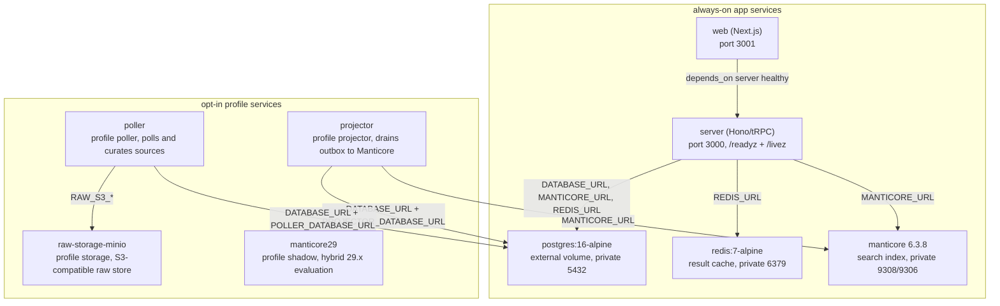
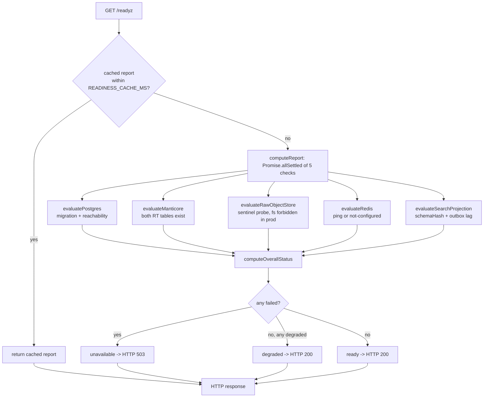

# Deployment, Readiness & Runbooks

Catapulze runs as a Bun monorepo with one web UI, one API server, and two
on-box background processes, all sharing Postgres as the system of record and a
Manticore full-text search index derived from it. This page covers the Docker
Compose topology, the Postgres role separation and on-box production baseline
that gate a deploy (DEC-005 / ADR-0011), the `/livez`/`/readyz`/`/health`
endpoints, the typed per-process environment contracts, and the runbook and ADR
index that own the operational detail.

## Docker Compose topology

`docker-compose.yml` is the single source for the local development and the
on-box production topology. It defines the always-on app services and the
opt-in background services that are only started through Compose profiles.

Diagram: the `docker-compose.yml` service topology, showing the always-on app
services and the opt-in profile services with their dependency edges.

The always-on services are:

| Service | Image / build | Port | Notes |
| --- | --- | --- | --- |
| `postgres` | `postgres:16-alpine` (pinned digest) | `127.0.0.1:5432` | External protected volume; role bootstrap via `tools/postgres/init/10-bootstrap-roles.sh`. |
| `web` | `apps/web/Dockerfile` | `3001` | Next.js; `INTERNAL_SERVER_URL` defaults to `http://server:3000`. Depends on `server` healthy. |
| `server` | `apps/server/Dockerfile` | `3000` | Hono/tRPC API; healthcheck probes `/readyz`. Depends on postgres, manticore, redis healthy. |
| `redis` | `redis:7-alpine` | `127.0.0.1:6379` | Result cache; optional in readiness (`not-configured` when unset). |
| `manticore` | `manticoresearch/manticore:6.3.8` | `127.0.0.1:9308`, `9306` | Healthcheck greps for the `aanvragen` table. |

The opt-in services are gated behind Compose profiles and never start under a
plain `docker compose up`:

| Service | Profile | Purpose |
| --- | --- | --- |
| `projector` | `projector` | Long-running on-box search projector; drains the Postgres outbox into Manticore. Healthcheck disabled (no HTTP surface). |
| `poller` | `poller` | Long-running on-box poller; polls and curates sources into Postgres. `stop_grace_period: 300s` so a source in flight can finish. |
| `raw-storage-minio` / `raw-storage-minio-init` | `storage` | Local S3-compatible target for the durable raw object store; one-shot bucket bootstrap. |
| `manticore29` | `shadow` | Shadow instance for evaluating Manticore 29.x hybrid search side-by-side with the pinned 6.3.8 production instance. |

The `postgres_data` volume is `external: true`; Compose never creates or removes
it. `docker compose down` may remove containers, but **`docker compose down -v`
is forbidden in this environment** (DEC-005) — production automation must never
tear down the protected volume, and a static check
(`bun run check:production-compose-guard`) fails when production scripts or
workflows attempt it.

## Postgres role separation and the on-box production baseline

Postgres is the system of record. Manticore is a derived, fully rebuildable
index from Postgres and the outbox. The Compose `postgres` service pins
`postgres:16-alpine` by digest and bootstraps three distinct roles on first
init through `tools/postgres/init/10-bootstrap-roles.sh`:

- **admin** — `POSTGRES_USER` / `POSTGRES_ADMIN_PASSWORD`; the superuser used
  only for bootstrap and one-off administration.
- **migrator** — a non-superuser role that can create schemas and tables but
  not roles or databases. Drizzle connects via `MIGRATION_DATABASE_URL`.
- **app** — a restricted runtime role with only schema `USAGE` plus DML on
  migrator-created objects; it has no schema `CREATE`. The server and workers
  connect via `DATABASE_URL` / `CATAPULZE_DATABASE_URL`.

The init script validates that the three role names are distinct PostgreSQL
identifiers, revokes `PUBLIC` access on the database and `public` schema, and
grants `CONNECT, CREATE` to the migrator and `CONNECT` only to the app role.
Default privileges give the app role DML on future migrator-created tables.

### DEC-005 production baseline gates

A deploy is only accepted as production-ready when all of these gates are closed
with evidence. The external volume and private port binding are configuration
preconditions, not proof that backup and restore are operational — restore
evidence must be captured before the environment is marked production-ready.

1. **Protected external volume.** Postgres data lives on a pre-created,
   externally-managed volume (`POSTGRES_DATA_VOLUME`). `docker compose down`
   may remove containers; `docker compose down -v` is forbidden against it.
2. **Private port.** Port `5432` is not public. Locally it binds only to
   `127.0.0.1` on the Docker/host network. In production (ADR-0011) Coolify
   keeps Postgres on the internal `coolify` network and the Hetzner firewall
   admits TCP 5432 only from the Trigger.dev static egress IPs (paid plan).
   An external probe from a non-allowlisted IP must find 5432 closed.
3. **Role separation.** Admin, migrator, and runtime roles are distinct
   least-privilege roles; the runtime is not a superuser and cannot create
   roles, databases, or schemas. Only the migrator gets
   `MIGRATION_DATABASE_URL`; only the app role gets `DATABASE_URL`.
4. **WAL archiving.** Continuous WAL archiving goes to off-site
   S3-compatible object storage (preferred: wal-g; alternative: pgBackRest),
   with a separate bucket and lifecycle policy. Alerts fire when the last
   WAL upload is older than 15 minutes or the last base backup older than 26
   hours.
5. **Restore evidence.** A restore into an empty, isolated database is
   tested periodically (monthly during P0, at least quarterly after),
   validating the migration journal, constraints, reconciled row counts, one
   real API read, and a measured `RPO <= 1 hour` / `RTO <= 4 hours`. Without a
   recent successful restore test the database is not production-ready.
6. **Monitoring.** Covers availability, disk/volume, CPU/memory, connection
   pool wait, locks, query latency, WAL growth, backup freshness, and restore
   outcome. Disk alerts at 70% warning / 80% critical; pool above 80%; locks
   older than 30 seconds; cgroup memory pressure and OOM events.
7. **Resource priority.** Postgres gets priority on the host. A Manticore
   index may be dropped and rebuilt; Postgres data may not. Start budget on a
   32 GB / 8 vCPU host: Postgres 8 GB reservation / 12–14 GB limit, Manticore
   up to 8 GB, app/workers/monitoring ~4 GB total, at least 6 GB host page
   cache.
8. **Strong unique credentials.** Production uses strong, unique credentials
   from the deployment secret manager; the local `.env.example` values are
   explicitly forbidden in production.

The exit to a separate database host or managed Postgres is an explicit new
decision, triggered only when measured evidence shows a single host cannot meet
HA, RTO/RPO, or resource-contention SLOs.

### ADR-0011: on-box Postgres + Trigger.dev static IPs

ADR-0011 restores the dedicated on-box PostgreSQL 16 instance as the production
system of record and supersedes ADR-0006 (Neon as SoR) for production. Neon Free
hit the 512 MB project size limit (RJC-404); Trigger.dev paid plans now expose
static egress IPs per AWS region, which are allowlisted in the Hetzner firewall
`catapulze-prod` on TCP 5432. Coolify apps reach Postgres over the internal
network; Trigger.dev Cloud reaches it only through the static-IP allowlist.
Motian/Neon remains a read-only backfill/import source (DEC-005), never the
runtime `DATABASE_URL`.

## Health and readiness endpoints

The server exposes three health routes, wired in `apps/server/src/index.ts`
through `createHealthRoutes` (`apps/server/src/http/health.ts`):

| Route | Handler | Behavior |
| --- | --- | --- |
| `/health` | `createLivenessHandler()` | Combined handler aliasing the liveness response. |
| `/livez` | `createLivenessHandler()` | Process-only: returns `OK` (200) while the event loop runs. Independent of every component check. |
| `/readyz` | `createReadinessHandler(...)` | Component-wise readiness (RJC-391). Returns 200 for `ready`/`degraded`, 503 for `unavailable`. |

Diagram: the `/readyz` request flow — a cached composite of five independent
component checks, each on its own timeout, with the worst status deciding the
overall verdict and HTTP code.

### Component rules

Each component is checked independently on its own timeout
(`READINESS_CHECK_TIMEOUT_MS`, 1500 ms) and the composite result is cached for
`READINESS_CACHE_MS` (2000 ms) so a probe storm cannot DoS Manticore or S3.
A hung dependency always resolves as `failed`/`"timeout"`, never a hung
request; raw errors (which may embed connection strings) are never serialized —
every `reason` is a fixed, pre-defined string.

| Component | `failed`/worse means | Maps to overall |
| --- | --- | --- |
| `postgres` | Migration mismatch or database unreachable | `unavailable` |
| `manticore` | Unreachable, or `SHOW TABLES` does not list both partition tables (`aanvragen_active` and `aanvragen_archive`, RJC-383) | `unavailable` |
| `rawObjectStore` | Filesystem backend selected in production (hard failure); S3 sentinel probe fails or times out | `unavailable` (filesystem in prod); `degraded` (S3 failure) |
| `redis` | Unset (`REDIS_URL` not configured) → `not-configured`; configured but live ping fails → `degraded` (falls back to in-process cache) | does not affect overall / `degraded` |
| `searchProjection` | `schemaHash` mismatch → `unavailable` (drain halted; stale generation); outbox lag > 300s → `degraded` (`lag_elevated`); > 3600s → `degraded` (`lag_critical`); checkpoint/lag read fails → `degraded` (`projection_read_failed`) | `unavailable` or `degraded` |

The overall status is `unavailable` if any of postgres, manticore,
rawObjectStore (filesystem-in-prod), or searchProjection (schema mismatch) is
`failed`; otherwise `degraded` if any component is `degraded`; otherwise
`ready`. `degraded` still returns HTTP 200 — the product still serves search,
and a load balancer should keep routing.

### Docker/Coolify HEALTHCHECK probes `/livez`

The `apps/server/Dockerfile` `HEALTHCHECK` probes `/livez`, not `/readyz`.
Coolify treats a failing image HEALTHCHECK as deploy rollback, which removes the
Traefik backend even when the process is up. `/readyz` is the app readiness
contract for operators and routing decisions; `/livez` is the container
liveness gate. The Compose `server` healthcheck, by contrast, uses `/readyz`
because it gates the `web` service's `depends_on` start order.

The projector has no HTTP surface; its Dockerfile healthcheck runs
`bun src/projector/heartbeat.ts --check` against the heartbeat file written by
the advisory-lock poll loop.

## Environment contracts

Environment is typed per process in `packages/env`. Each process gets its own
Effect Schema source of truth (ADR-0014); validation runs at import time and
fails fast on missing or malformed values. Secrets stay in `apps/server/.env`
and `apps/web/.env` (gitignored); `.env.example` lists names and placeholders
only and is never used as production secrets.

| Process | Schema file | Required highlights |
| --- | --- | --- |
| server | `packages/env/src/server.ts` | `BETTER_AUTH_SECRET` (min 32), `BETTER_AUTH_URL`, `CORS_ORIGIN`, `DATABASE_URL`, `MANTICORE_URL` (default `http://127.0.0.1:9308`), `REDIS_URL` (optional), `NODE_ENV`, `RAW_S3_*` (optional), `SEARCH_HYBRID`, Effect feature flags. |
| web | `packages/env/src/web.ts` | `NEXT_PUBLIC_SERVER_URL`, `INTERNAL_SERVER_URL` (optional, http-only), `APP_RELEASE_SHA`. |
| projector | `packages/env/src/projector.ts` | `DATABASE_URL` (may be pooled), `PROJECTOR_DATABASE_URL` (direct — rejects known Neon pooler hosts), `MANTICORE_URL`, `SEARCH_HYBRID`. |
| poller | `packages/env/src/poller.ts` | `DATABASE_URL`, `POLLER_DATABASE_URL` (direct), `POLLER_TICK_MS` (default 60000), `POLLER_CONCURRENCY` (default 2), `POLLER_CURATE_BUDGET_MS`, `POLLER_ABANDON_RUN_AFTER_MS` (default 6h), `SEARCH_PROJECTOR` (pinned `onbox`), `RAW_S3_*`, per-source live flags. |
| database (DB-only consumers) | `packages/env/src/database.ts` | `DATABASE_URL` only — scoped so DB-only scripts do not require server-only auth vars. |

### Direct vs pooled database URLs

Long-running singleton processes (projector, poller) hold a Postgres
session-level advisory lock. A pooled endpoint (PgBouncer / Neon pooler) can
move consecutive queries between backend sessions and silently break the
singleton guarantee, so `PROJECTOR_DATABASE_URL` and `POLLER_DATABASE_URL` must
use a **direct** endpoint. `packages/env/src/projector-database-url.ts`
validates this at startup: it rejects `*-pooler.*.neon.tech` and
`*.pooler.*.neon.tech` hostnames and requires a `postgres:`/`postgresql:`
protocol. Ordinary data queries may still use a pooled `DATABASE_URL`.

### Release SHA

`APP_RELEASE_SHA` is optional and falls back to Coolify's `SOURCE_COMMIT`
(the exact commit Coolify built), resolved once in each process env. The
`/version` route, readiness telemetry, and runtime rows all read
`env.APP_RELEASE_SHA`.

## Docker Compose smoke

`scripts/docker-compose-smoke.sh` runs an isolated end-to-end Compose smoke
against a fresh Postgres volume. It starts postgres, manticore, and redis;
optionally starts the `storage` profile MinIO when `SMOKE_RAW_STORAGE=1`; runs
migrations; bootstraps the durable search generation through the built server
image; starts the projector to drain the replay; runs projection
reconciliation; then asserts `/readyz` (200), the web root (200), and the
`/dashboard` logged-out redirect (307). It never tears down the external
volume on cleanup (`docker compose down`, never `down -v`).

`docker-compose.smoke.yml` is a separate override that injects synthetic MinIO
S3 settings into the server only for the opted-in smoke lane; the base
Compose file keeps its filesystem fallback and production deployment contract.
`docker-compose.backup.yml` overlays wal-g + MinIO for isolated backup/restore
drills (`tools/postgres/restore-drill.sh`).

## Runbook and ADR index

Operational detail lives in `docs/runbooks/` and architectural decisions in
`docs/adr/`. This page references them rather than duplicating their content.

### Key runbooks

| Runbook | Scope |
| --- | --- |
| `docs/runbooks/postgres-on-box.md` | On-box Postgres production gate: protected volume, private port, credentials/roles, backup/restore hard gate, monitoring, resource priority, exit criteria. |
| `docs/runbooks/readiness.md` | `/readyz` component-wise readiness (RJC-391): response shape, component rules, tuning constants, extension points. |
| `docs/runbooks/onbox-poller.md` | On-box poller: why it exists, env contract, live flags, cadence, run abandonment. |
| `docs/runbooks/search-projector.md` | On-box projector (RJC-387): deploy contract, advisory lock, supervision, schema-mismatch exit. |
| `docs/runbooks/neon-restore.md` | Neon read-only restore / backfill procedures (historical; ADR-0006 superseded). |
| `docs/runbooks/curation-recovery.md` | Curation backlog recovery. |
| `docs/runbooks/spott-export-reconciliation.md` | Spott.io export reconciliation. |
| `docs/runbooks/mcp-edge-smoke.md` | MCP edge smoke. |
| `docs/runbooks/trigger-on-box-cutover.md` | Trigger.dev static-IP firewall + `DATABASE_URL` flip (RJC-418 remainder). |
| `docs/runbooks/hetzner-deploy.md` | Ordered Hetzner deploy procedure. |
| `docs/runbooks/automatic-production-deploy.md` | Coolify automatic production deploy. |

### Key ADRs

| ADR | Decision |
| --- | --- |
| ADR-0004 | Postgres environment strategy: on-box for local/CI and production; managed Postgres as an escape hatch. |
| ADR-0005 | Trigger.dev worker reachability to Postgres and Manticore (Proposed; resolved by ADR-0011 for Postgres, the on-box projector for Manticore). |
| ADR-0006 | Neon as system of record — **Superseded by ADR-0011** for production; Neon remains a read-only import source. |
| ADR-0011 | Postgres on-box in Coolify + Trigger.dev static egress IP allowlist on TCP 5432 (Accepted; RJC-418 cutover). |
| ADR-0014 | Effect-TS project-wide adoption (per-process env schemas). |

### Related pages

- [/openwiki/architecture/overview.md](/openwiki/architecture/overview.md) — monorepo layout, package layering, the three runtime processes, request flow.
- [/openwiki/architecture/data-model.md](/openwiki/architecture/data-model.md) — Postgres zones, SCD2, outbox, search projection checkpoint.
- [/openwiki/operations/quality-gates.md](/openwiki/operations/quality-gates.md) — the four quality verbs (`fix`, `check`, `gate`, `wiki`) and the pre-push gate.
- [/openwiki/workflows/ingest-pipeline.md](/openwiki/workflows/ingest-pipeline.md) — poll → raw → normalise → curate → outbox.
- [/openwiki/workflows/search-projection.md](/openwiki/workflows/search-projection.md) — outbox drain into Manticore, generation/checkpoint lifecycle.
