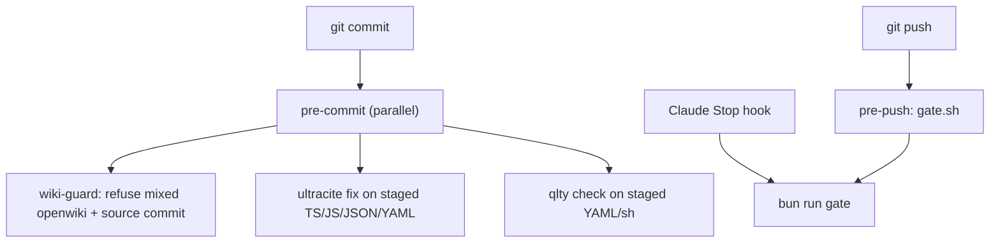

# Quality Gates

The repository is kept safe by a layered set of gates: a fast scoped
formatter/linter on every commit, a full pre-push gate, and a set of
standalone check scripts that enforce architectural and operational invariants.
The gates are owned by Lefthook and the `tools/quality/` shell scripts; they are
the only thing that keeps a change from landing ungated. Never use `--no-verify`.

## Entrypoints and verbs

Quality is driven by npm scripts in `package.json`, each delegating to a shell
helper under `tools/quality/`:

| Verb | Script | Scope |
| --- | --- | --- |
| `bun run fix` | `tools/quality/fix-changed.sh` | Auto-fix changed files vs `origin/main`. |
| `bun run check` | `tools/quality/check-changed.sh` | Lint changed files + Qlty. |
| `bun run fix:all` | `ultracite fix` | Whole-tree escape hatch. |
| `bun run check:all` | `ultracite check` | Whole-tree escape hatch. |
| `bun run gate` | `tools/quality/gate.sh` | Full pre-push gate. |
| `bun run check-layering` | `scripts/check-layering.ts` | Web→server→db layering boundary. |
| `bun run check-secrets` | `scripts/check-secrets-scan.ts` | Committed-secret scan. |
| `bun run check:capability-coverage` | `scripts/check-capability-coverage.ts` | Capability catalog coverage. |
| `bun run check:capability-registry` | `scripts/check-capability-registry.ts` | Capability registry binding parity. |
| `bun run check:postgres-compose` | `scripts/check-postgres-compose.ts` | Compose Postgres safety invariants. |
| `bun run check:production-compose-guard` | `scripts/check-production-compose-guard.ts` | Guard against `docker compose down -v` outside the isolated CI volume job. |

`fix` and `check` are **scoped to changed files**: they resolve the union of
branch, staged, unstaged, and untracked changes against `origin/main` (or
`$QUALITY_BASE_REF`) via `tools/quality/resolve-changed.sh`, and never fall back
to the whole tree. `docs/` and `openwiki/` are excluded from the changed-file set
by policy. `fix:all` / `check:all` are deliberate whole-tree escape hatches, not
the default.

Qlty is required for `bun run check` and `bun run gate`; both fail
intentionally when the Qlty CLI is missing, so a missing quality-owner is never
reported green.

## Lefthook ownership

Lefthook is the **sole owner of `.git/hooks`** (`lefthook.yml`). Never run
`qlty githooks install`. `bun install` runs `lefthook install --reset-hooks-path`
via the `prepare` script.



*Lefthook owns pre-commit (scoped format + lint) and pre-push (full gate); the Claude Stop hook re-runs the same gate.*

Pre-commit runs three parallel jobs: a wiki-guard that refuses commits mixing
`openwiki/` with non-wiki source; `ultracite fix` on staged
`*.{ts,tsx,js,jsx,mjs,cjs,json,yml,yaml}` (excluding `docs/`, `openwiki/`, and the
verify skill); and `qlty check` on staged YAML/sh and `.github/**`. Pre-push runs
`gate.sh` as a **script job** rather than a command job, because lefthook skips
command jobs with "no matching push files" and builds its push list without
deletions — a deletion-only push once landed ungated (CTP-503).

## The full pre-push gate

`tools/quality/gate.sh` is the full gate. Both the lefthook pre-push hook and the
Claude Code Stop hook call it. It runs, in order:

<!-- openwiki: mermaid parse failed and this diagram was converted to a text fence so it does not break rendering. Fix the diagram source and restore the mermaid fence. Parser error: Parse error on line 11: ...erformance"] PERF -> CIM["check-types: Expecting 'SEMI', 'NEWLINE', 'EOF', 'AMP', 'START_LINK', 'LINK', 'LINK_ID', got 'MINUS' -->
```text
flowchart TD
  HOOKS{"core.hooksPath set?"} -->|yes| FAIL1["exit 1: run bun install / lefthook install"]
  HOOKS -->|no| UC["ultracite check (all)"]
  UC --> QLTYCHECK{"qlty CLI present?"}
  QLTYCHECK -->|no| FAIL2["exit 1: install Qlty"]
  QLTYCHECK -->|yes| Q["qlty check --all --no-formatters"]
  Q --> TYPES["check-types (turbo)"]
  TYPES --> BF["check-types:backfill"]
  BF --> PROD["check-types:production"]
  PROD --> PERF["check-types:performance"]
  PERF -> CIM["check-types:ci-metrics"]
  CIM -> BENCH["check-types:benchmarks"]
  BENCH --> LAY["check-layering"]
  LAY --> SEC["check-secrets"]
  SEC --> MANT{"MANTICORE_URL set?"}
  MANT -->|yes| MANTB["check:manticore-bench-empty"]
  MANT -->|no| MIG["prepare migration-upgrade DB"]
  MANTB --> MIG
  MIG --> TEST["bun test (REQUIRE_DATABASE_TESTS=1)"]
  TEST --> PCG["check:production-compose-guard"]
  PCG --> PCC["check:postgres-compose"]
  PCC --> PASSED["gate: passed"]
```

*The gate phases in order, from format/lint through type-checks, layering, secrets, and Postgres-gated tests.*

Each phase is wrapped in `run_phase`, which prints elapsed seconds (and writes a
performance artifact when `PERF_METRICS_DIR` is set) so any CI or local log
shows where gate time goes. The gate refuses to start if `core.hooksPath` is set
(that means Lefthook is not installed); run `bun install` / `lefthook install` to
clear it.

The gate loads `.env` and `tools/quality/load-compose-env.sh` before running so
the Stop hook and bare `bun run gate` — which do not inherit a developer's
interactive shell exports — see the same `POSTGRES_*` credentials Docker Compose
used to start Postgres, instead of falling back to the `ji_admin` defaults baked
into `tools/postgres/*.ts`. CI never has a `.env` file (it is gitignored), so the
load is a no-op there.

### Postgres-gated tests

A reachable Postgres makes the gate run the migration-upgrade suite and the full
test suite with `REQUIRE_DATABASE_TESTS=1`. When `DATABASE_UPGRADE_TEST_URL` is
unset, the gate prepares a dedicated migration-upgrade database via
`tools/postgres/ensure-migration-upgrade-db.ts`; its result is dispatched as
`READY:` (run the suite), `FAIL:` (a real Postgres error — **never** a skip, in
CI or on a laptop), or `SKIP:` (only a laptop with no Postgres running at all
gets the graceful skip; in CI `SKIP:` fails loudly). This is the RJC-395 guard:
every merged migration between 0006 and 0010 once passed CI with this suite
silently skipped.

`bun test` itself does not type-check; a change can be 300/300 green and still
fail `check-types` in the gate. Run `bun run gate` — or at minimum
`bun run check-types` — before calling a change done.

## Lint and format

Linting and formatting use **Ultracite** (Oxlint + Oxfmt) plus a vendored
[anti-slop](https://github.com/dmmulroy/anti-slop) plugin at
`tools/oxlint/anti-slop/`. Treat that copy as owned project tooling: change rules
here, not via a published package. `oxfmt.config.ts` extends `ultracite/oxfmt`
and ignores `docs/`, `openwiki/`, agent config dirs, `.github/`, and the
anti-slop plugin itself. `oxlint.config.ts` extends `ultracite/oxlint/core` and
`ultracite/oxlint/next`, loads the vendored `anti-slop` and `anti-slop-effect`
plugins, and scopes the Effect-specific `anti-slop-effect` rules to the
packages/apps with a direct `effect` dependency via overrides.

Qlty (`.qlty/qlty.toml`) covers shell, workflows, and secrets; Ultracite +
anti-slop owns TS/JS. All `qlty check` invocations use `--no-formatters`; never
`qlty fmt`.

## check-layering — the web→server→db boundary

`scripts/check-layering.ts` enforces that `apps/web` never imports the database
or server-internal layers. It scans every `apps/web/**/*.{ts,tsx}` source for
import specifiers and rejects any that match the forbidden prefixes:
`@ji/application/identity`, `@ji/application/sources`, `@ji/db`, `@ji/infra`,
`drizzle-orm`, `drizzle-kit`, or path fragments containing `/packages/db`,
`/packages/infra`, `packages/db/`, `packages/infra/`. Reads and writes go
through `apps/server` / `packages/api`; do not query Postgres from the web app.
Run `bun run check-layering` after changing web imports.

## check-secrets — committed-secret scan

`scripts/check-secrets-scan.ts` walks the workspace (excluding generated
directories such as `node_modules`, `dist`, `.git`, `.turbo`, `openwiki/`, and
the `.qlty` cache) and rejects files matching AWS access keys (`AKIA…`),
GitHub PATs (`ghp_…`), live OpenAI keys (`sk-live-…`), and PEM private key
blocks. It materializes a sha256 input manifest of the scanned file set and
verifies it on re-run, so a change to the scan inputs is surfaced as a manifest
mismatch rather than silently re-scanned. `.env` and `.env.*` (except
`.env.example`) are excluded; secrets stay in `apps/server/.env` and
`apps/web/.env` and must never be committed.

## Capability coverage and registry parity

Two scripts keep the capability catalog consistent (see the
[Capability Registry](../concepts/capability-registry.md) page):

- `scripts/check-capability-registry.ts` asserts that every
  `sliceACapabilityIds` entry exists in the catalog, exposes exactly one REST and
  one MCP binding, and that every `wiredTransports` entry resolves to a real
  binding and vice-versa.
- `scripts/check-capability-coverage.ts` walks `sliceAUiActions` and asserts
  each UI action's `capabilityId` resolves to a capability with the expected
  `mcp:`, `rest:`, and `ui:` wired transports.

Both run against `createTestSliceADeps()` so they are deterministic and do not
require a live server.

## Compose safety guards

`scripts/check-postgres-compose.ts` runs `docker compose config --format json`
against `.env.example` and asserts the production-baseline invariants: the
`postgres` service exists, `volumes.postgres_data` is external and named (so
compose lifecycle cannot destroy production data), port 5432 binds to
`127.0.0.1`, and the `postgres` and `manticore` services declare `mem_limit`
with postgres exceeding manticore. It also rejects a read-only `manticore.conf`
bind mount (the image entrypoint chowns `/etc/manticoresearch` before searchd
starts) and asserts the manticore healthcheck pins the `aanvragen` RT table.

`scripts/check-production-compose-guard.ts` scans `.github/workflows`,
`scripts/`, and `tools/postgres/` for `docker compose down -v` usage outside the
single allowed CI volume job (`ci.yml`), so a volume-wiping command cannot
destroy the named external data volume outside its isolated CI context.

## Operational discipline

A linked worktree can run a commit without hooks: `bun install` there fails on
its `lefthook install --reset-hooks-path` step (it tries to rewrite the outer
repo's `.git/hooks` and is refused), so `git commit` silently skips pre-commit
until Lefthook is installed. After any worktree commit, re-run the gates by hand.
Never use `--no-verify`.

The Clawpatch protocol keeps CI fixes surgical: one CI finding → one patch →
`bun run gate` → then push. Do not pile unrelated formatter, backup, compose, or
YAML fixes into the same commit; `fix` never self-commits.

`bun run gate` is also what the Claude Code Stop hook runs (`.claude/settings.json`),
so an agent's session ends with the same gate a developer's push triggers.
