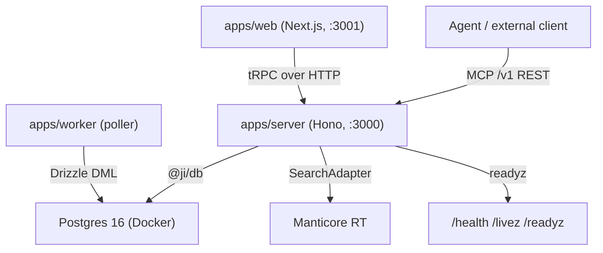

# Quickstart

This is the onboarding entry point for the **Catapulze Job Intelligence** repository. It states what the system is, how the codebase is laid out, how to run it locally, and which wiki page to read for each follow-on topic.

## What this system is

A Bun monorepo (workspace scope `@ji`) that collects job vacancies — *aanvragen* — from ~23 Dutch public sources, normalises and deduplicates them, makes them instantly searchable (Boolean queries plus facets), and exports the approved subset idempotently to Spott.io after human approval. It is **agent-native from day one**: the same capability surface is exposed over REST, tRPC, and MCP, and approval state is data rather than a side channel.

The repository identity, role map, stack summary, and DEC-005 production baseline live in `README.md`; the working rules and Ultracite code standards live in `AGENTS.md`.

## Stack in one line

Bun + TypeScript + Effect-TS + Drizzle · Postgres 16 on-box in Docker (zones staging/curated/marts, SCD2, outbox) · Manticore RT behind a SearchAdapter · Trigger.dev Cloud · Hetzner + Coolify · Redis (Upstash) for rate-limits and versioned result-cache · DuckLake for analytics/export · MCP + REST as the only datapath · a capability registry with approval-as-data.

## Monorepo layout

| Path | Role |
| --- | --- |
| `apps/web` | Next.js UI on port 3001 |
| `apps/server` | Hono + tRPC API on port 3000; also hosts MCP and REST capability handlers and the on-box projector |
| `apps/worker` | On-box poller process (`bun src/poller/main.ts`); replaces the Trigger.dev `schedule-slice-a-polls` fan-out |
| `packages/api` | tRPC router and procedures |
| `packages/application` | Use-case layer (bronregister, Slice A) |
| `packages/auth` | Better Auth |
| `packages/connectors` | Connector contract and source adapters |
| `packages/db` | Drizzle schema and `postgres-js` client |
| `packages/domain` | Domain types and Boolean parser (Slice A) |
| `packages/env` | Typed env for server and web |
| `packages/search` | Search adapter / projection |
| `packages/performance` | Performance tooling |
| `packages/ui` | Shared UI components |
| `packages/config` | Shared TypeScript config |

The `apps/server` process is the single integration boundary: it assembles the production Slice A capability registry (`createProductionSliceARegistry`), binds it to REST (`/v1/*`), MCP (`/mcp`), tRPC (`/trpc/*`), and health (`/health`, `/livez`, `/readyz`) handlers, and resolves the session principal through Better Auth. `apps/web` consumes the API only over `@ji/api`; it must never import `@ji/db`, `drizzle-orm`, or any infra package.


Caption: the three runtime processes and the single integration boundary at `apps/server`.

## Local run

A fresh clone needs only Bun (`1.3.14+`) for basic validation — no extra global linters or test runners.

```bash
bun install --frozen-lockfile
cp .env.example .env
cp apps/server/.env.example apps/server/.env
cp apps/web/.env.example apps/web/.env
# fill BETTER_AUTH_SECRET via: openssl rand -base64 32
bun run docker:volume:create
docker compose up -d postgres
bun run db:migrate
bun run dev
```

| App | URL |
| --- | --- |
| Web | http://localhost:3001 |
| API | http://localhost:3000 |

The local Compose `postgres` service uses an external protected volume created by `bun run docker:volume:create`; `docker compose down` is fine, but `docker compose down -v` is forbidden for this environment. Admin, migrator, and runtime are separate Postgres roles; the runtime app role is not a superuser and can only use the schema plus DML on migrator-owned objects. Drizzle migrates via `MIGRATION_DATABASE_URL`; the server uses the restricted app role via `DATABASE_URL`.

Handy scripts: `bun run dev:web`, `bun run dev:server`, `bun run db:studio`, `bun run fix`, `bun run check`, `bun run gate`, `bun run wiki`, `bun test`, `bun run check-layering`, `bun run check-secrets`.

## Hard rules that cost real failures

- **`bun test` does not type-check.** A change can be 300/300 green and still fail `check-types` in the pre-push gate. Run `bun run gate` — or at minimum `bun run check-types` — before calling a change done.
- **The web app must never import `@ji/db`, `drizzle-orm`, or `packages/infra`.** All DB access goes through `apps/server` / `packages/api`. Run `bun run check-layering` after changing web imports; it refuses `@ji/db`/`drizzle-orm` imports from `apps/web`.
- **`bun run check` and `bun run gate` require the [Qlty CLI](https://docs.qlty.sh/cli/installation).** They fail intentionally when Qlty is missing, so a missing quality owner is never reported green. `bun run gate` also requires a reachable test Postgres and runs the migration and constraint tests for real; create the external volume once with `bun run docker:volume:create`, start only the test service with `docker compose up -d postgres`, and stop it after with `docker compose down`.
- **Package scripts prepend `./node_modules/.bin` to `PATH`** because the parent directory name (`clients:catapulze`) contains a colon, which splits Unix `PATH` when an absolute `node_modules/.bin` path is prepended. Do not switch these scripts back to bare `tsc`/`turbo`/`ultracite`.
- **Secrets stay out of git.** `.env.example` lists names and placeholders only; `bun run check-secrets` scans tracked files for obvious secret patterns.
- **A commit in a linked worktree may run without hooks.** `bun install` there fails on its `lefthook install --reset-hooks-path` step; until it is installed, `git commit` silently skips pre-commit. After any worktree commit, re-run the gates by hand. Never use `--no-verify`.

## Quality verbs

| Script | When |
| --- | --- |
| `bun run fix` | Auto-fix on branch-, staged, unstaged, and untracked changes (Ultracite/Oxlint/Oxfmt) |
| `bun run check` | Lint on changed files + Qlty (`--no-formatters`) |
| `bun run gate` | Full pre-push gate: Ultracite, Qlty, types, layering, secrets, Postgres-gated tests |
| `bun run wiki` | Update OpenWiki locally |

The Claude Code **Stop** hook and lefthook pre-push both call the same `bun run gate`. `tools/quality/gate.sh` loads missing `POSTGRES_*` from `.env` (falling back to `.env.example`) so hooks see the same Compose credentials as the running Postgres without overriding already-set env vars (CI).

## OpenWiki in this repo

`openwiki/` is an **evidence index** generated from source code and tests — optional context for agents and humans, not a product spec. Treat source code and tests as authoritative; OpenWiki pages summarise evidence and do not override briefs or acceptance criteria. Do not commit `openwiki/` together with feature code (a pre-commit guard enforces this). Update locally with `bun run wiki`; private paths are listed in `.openwikiignore`.

## Task-routing map

Where to go next, by task:

| If you are working on … | Read this page |
| --- | --- |
<!-- openwiki: broken internal link [/openwiki/architecture/overview] file "/openwiki/architecture/overview" does not exist. Fix the href or restore the target, then delete this comment. -->
| Monorepo layout, package layering, the three processes, request flow web → server → registry → stores | [Architecture Overview](/openwiki/architecture/overview) |
| Postgres zones (staging/curated/marts), SCD2, outbox, key tables, the Drizzle migration journal | [Data Model & Persistence](/openwiki/architecture/data-model.md) |
| The capability registry as the single application boundary: REST/MCP/tRPC transport binding, authorisation, parity | [Capability Registry](/openwiki/concepts/capability-registry.md) |
| Core domain concepts: bron/aanvraag/source records, ids, the Boolean query parser, lifecycle states, UNKNOWN provenance | [Domain Model](/openwiki/concepts/domain-model.md) |
| End-to-end ingest: source registry → connector discover/fetch → observation → normalise → curate → SCD2 write, run by the on-box poller | [Ingest Pipeline](/openwiki/workflows/ingest-pipeline.md) |
| How curated rows become searchable: outbox drain, the on-box projector, Manticore adapter, index versioning, cached search read path | [Search Projection](/openwiki/workflows/search-projection.md) |
| The approval-gated, idempotent export to Spott.io: snapshot approval, `commit_export` with idempotency keys, external receipts, reconciliation | [Export & Approval](/openwiki/workflows/export-approval.md) |
| The pre-push gate and the guardrails that keep the monorepo safe: lint/format, layering, secrets, capability coverage, type-check, Postgres-gated tests | [Quality Gates](/openwiki/operations/quality-gates.md) |
| Docker Compose topology, Postgres role separation and on-box production baseline (DEC-005), health/readiness, env config, the runbook/ADR index | [Deployment, Readiness & Runbooks](/openwiki/operations/deployment-and-readiness.md) |
| How tests are structured: `bun test` (no type-check), Postgres-gated suites, migration-upgrade, e2e live jobs, fixture recording, search/relevance benchmarks | [Testing & Benchmarks](/openwiki/testing/test-strategy.md) |

## Minimal validation checklist

For a change that should not touch runtime behaviour:

```bash
bun install --frozen-lockfile
bun test
bun run check-types
bun run check-layering
bun run check-secrets
```

For anything that could change runtime behaviour or cross a layer boundary, run `bun run gate` instead of the minimal checklist — it runs the same steps plus the Postgres-gated suites and the migration-upgrade test.
