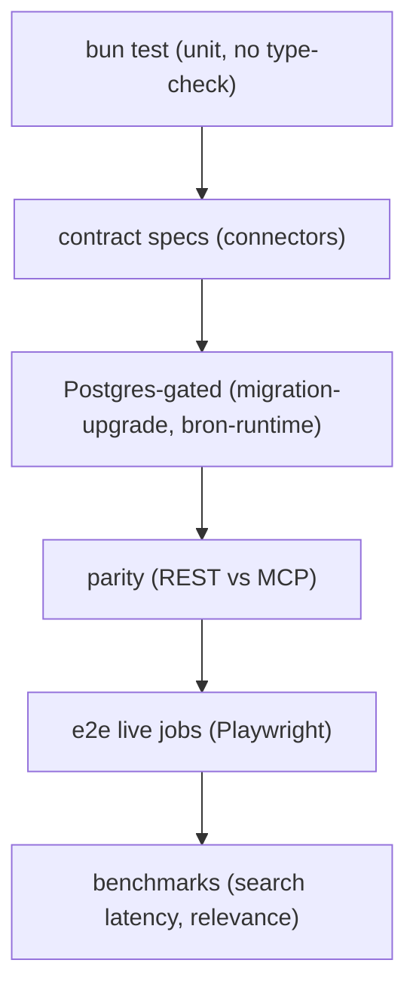

# Testing & Benchmarks

The repository uses a layered testing strategy where each layer proves a
different invariant and runs only when its external dependency is available.
Layers compose from cheapest to most expensive: unit specs run everywhere,
contract specs validate every connector against the same discover/fetch/normalise
contract, Postgres-gated suites verify migrations and durable adapters for real,
transport-parity specs prove REST and MCP return identical results, live-jobs E2E
exercises the deployed stack through a browser, and benchmarks measure latency
and relevance.

Above: the test layers, cheapest to most expensive. Each gate runs the prior
layer plus the next; benchmarks are opt-in beyond the gate.

## `bun test` — the unit layer

`bun test` is the repository's primary test runner. The root `test` script is
`bun test --max-concurrency 2 --path-ignore-patterns '**/dist/**'`, capped at two
workers and never run in watch mode (bunfig's `[test]` notes "must run and
exit"). Spec files sit next to their source as `foo.spec.ts` rather than in a
mirror tree. **`bun test` does not type-check** — type safety is a separate
concern owned by `bun run check-types` (turbo), which the gate requires in
addition to the unit suite. `bunfig.toml` registers a single test preload,
`tools/postgres/test-isolation.ts`, which runs once per `bun test` invocation
before any test file.

## Postgres isolation and gated suites

Several suites are *Postgres-gated*: they run against a real Postgres but skip
silently when no server is reachable, and throw only when `REQUIRE_DATABASE_TESTS=1`
or the relevant `_TEST_URL` is set. The gate (`tools/quality/gate.sh`) always
exports `REQUIRE_DATABASE_TESTS=1` for the test phase, so a reachable local
Postgres makes these suites run for real instead of skipping.

### Per-process database isolation

`tools/postgres/test-isolation.ts` is loaded via `bunfig.toml`'s
`[test].preload`. On every `bun test` invocation it:

1. Does nothing if `DATABASE_TEST_URL` is already set (a caller took
   responsibility for that database).
2. Probes the admin Postgres connection; if unreachable, no-ops unless
   `REQUIRE_DATABASE_TESTS=1`, in which case it throws — never silently
   falling back to the shared `ji_test` database.
3. Otherwise creates a fresh `ji_test_iso_<pid>_<random>` database, re-applies
   the least-privilege role grants, runs the real Drizzle migrations against it
   as the migrator role, and points `DATABASE_TEST_URL` /
   `DATABASE_APP_TEST_URL` / `DATABASE_ADMIN_TEST_URL` at it.
4. A global `afterAll` drops the isolated database with `WITH (FORCE)`.

One database per `bun test` *process* (not per suite or file) is the isolation
boundary, because `bun test` runs every matched file in a single process. Two
concurrent invocations get two different isolated databases. Every existing
spec's `process.env.DATABASE_TEST_URL ?? "<shared ji_test URL>"` fallback picks
up the isolated database with no per-spec changes.

### Migration-upgrade suite

`packages/db/src/migration-upgrade.spec.ts` has its own dedicated
`ji_migration_upgrade_test_*` database, separate from the per-process isolation
above. The guard (`packages/db/src/migration-upgrade-guard.ts`) validates an
explicit `DATABASE_UPGRADE_TEST_URL` before any Postgres constructor: it must be
a `postgres://` or `postgresql://` URL whose pathname matches
`/^ji_migration_upgrade_test_[a-z0-9_]+$/`, and it rejects `database`/`db`
constructor override input and query parameters. The suite uses
`describe.serial` to run the `0000_core` → `0001` upgrade path for real,
resetting schemas, applying migration statements, seeding fixtures, and
asserting historical observations are classified as new, unchanged, then
changed.

When `DATABASE_UPGRADE_TEST_URL` is unset, the gate provisions its own
disposable default via `tools/postgres/ensure-migration-upgrade-db.ts`, which
prints `READY:<name>|<url-file>` (the full URL with password written to a
mode-0600 temp file, never to a log), `SKIP:<reason>` (server unreachable —
graceful only outside CI), or `FAIL:<reason>` (reached the server but auth or
permission failed — always a hard failure). The spec silently skips only when
no URL is available and `REQUIRE_DATABASE_UPGRADE_TESTS` is not set.

### Bron-runtime and readiness suites

`packages/db/src/bron-runtime.spec.ts` probes Postgres directly, migrates the
schema, and exercises the durable `PostgresBronPersistence`,
`PostgresRunStore`, and `PostgresObservationRecorder` adapters against the real
database — asserting truthful metrics across adapter and connection
re-instantiation. `apps/server/src/readiness.spec.ts` tests the `GET /readyz`
handler with injected fakes (no Postgres required): it asserts 200 ready when
every component is healthy, 503 with `migration_mismatch` when Postgres reports
one, `timeout` when Manticore doesn't answer within budget, `table_missing` when
the RT table is absent, and 200 `degraded` when the raw object store probe fails.

### Residue guard

`tools/postgres/residue-guard.spec.ts` is a tripwire that connects directly to
the literal shared `ji_test` database (deliberately ignoring
`DATABASE_TEST_URL`, which isolation has repointed elsewhere) and fails if it
finds `search_projection_checkpoint` rows with `test-index-*` or `drain-*`
index names, or `source_record` rows under a `bron` with `categorie =
'runtime-test'`. It confirms tables exist before counting and treats a
confirmed-absent table as a pass, but does not swallow real query failures.

## Connector contract specs

`packages/connectors/src/contract.spec.ts` validates the discover/fetch/observation
contract across every source using fake connectors and in-memory stores. It
asserts the raw-object path layout, content-addressed path parsing and
rejection of malformed digests, the `CrawlDelayLimiter`'s per-bron isolation
and rate limiting, `withRetry` backoff semantics, the observation recorder's
fence-token staleness protection and new/changed/unchanged classification, the
run lifecycle store's monotone fence tokens and terminal-run reuse rejection, and
`runConnector`'s bounded-key handling of oversized `bronReferentie` values.

### Fixtures are real recordings

Connector fixtures under `packages/connectors/src/fixtures/` (and the
canonical root `fixtures/connectors/` tree referenced by the relevance corpus)
are real capture recordings, not synthetic data. `loadConnectorFixture` loads a
fixture envelope, validates its `contractVersion` against
`CONNECTOR_FIXTURE_CONTRACT_VERSION` (`connector-fixture/v1`), and returns the
source-specific payload. The relevance corpus (`benchmarks/relevance/corpus.ts`)
runs each source's real connector in fixture mode through the real normaliser —
the same discover → fetch → normalise path production ingestion uses — so the
corpus is exactly what the product would index from those captures.

## Transport parity

`apps/server/src/capabilities/parity.spec.ts` asserts that REST and MCP return
identical results for the same capability. For `search_aanvragen` it upserts
documents, invokes the capability through both the REST invoker and
`invokeMcpTool`, and expects matching `ids`, `total`, and `facets`. For
`get_dashboard_overview`, `get_bron_stats`, `list_scrape_runs`, and
`get_scrape_run` it asserts the two transports are byte-equal. A second block
verifies preview vs full authorization: an operator can retrieve a preview but
is denied full detail (`FORBIDDEN_FULL`), while a recruiter is allowed. REST
routing and transport-auth specs cover the same parity boundary.

## Live-jobs E2E

`bun run e2e:live:jobs` (and the `:anonymous` / `:writes` variants) drives the
real deployed stack through a browser. `e2e/live-jobs/run.ts` takes a mode
(`session`, `anonymous`, or `writes`), runs a preflight, then spawns Playwright
with the mode's config (`playwright.live.config.ts` for the session lane). The
Playwright config sets `workers: 1`, `fullyParallel: false`, `forbidOnly: true`,
`retries: 0`, a 60s timeout, and a `read-only|bron-dashboard` test match against
`./e2e/live-jobs`.

### Preflight gates

`e2e/live-jobs/run-preflight.ts` runs before the browser launches. For
`anonymous` it asserts the anonymous config and runs release preflight; for
`session` it additionally verifies the authenticated session and expected subject
id; for `writes` it verifies the mutation session subject and runs a
baseline-preserving cleanup preflight. The run refuses fixture mode, test-host
targets, and non-local HTTP outside explicit local mode. Every run requires
`E2E_EXPECTED_RELEASE_SHA` (a 40-character Git SHA) and validates the server's
`GET /version` release SHA against it before starting Playwright.

The authenticated read lane requires `E2E_DATA_MODE=canary`, a single
`E2E_CANARY_ID`, a query whose responses contain exactly that ID,
`E2E_CANARY_DIGEST` (a pinned SHA-256 of canonical JSON for the detail
response's `aanvraag` object), and `E2E_EXPECTED_SUBJECT_ID`. The harness
deep-links to `/jobs?q=…&job=<canary id>`, validates the canary and digest in
memory, and emits a single sanitized JSON evidence bundle plus an unmasked
screenshot of a fixed, data-free visual-attestation surface. Trace, video, and
automatic screenshots are off; no run retains a Playwright trace. See
`docs/runbooks/live-jobs-e2e.md` for the full data and artifact boundaries.

## Search and relevance benchmarks

Benchmarks live under `benchmarks/` and measure *latency* and *relevance* on
separate corpora. They are opt-in beyond the gate and use dedicated
`aanvragen_bench_*` Manticore tables, never production or live `aanvragen_test_*`
tables. `tools/quality/assert-manticore-bench-empty.ts` (the
`check:manticore-bench-empty` script) keeps the bench corpus out of CI by
refusing a dirty local Manticore bench table before any relevance or bench run;
it skips when `MANTICORE_URL` is unset unless `BENCH_REQUIRE_MANTICORE=1`.

### Latency benchmark

`benchmarks/search/run.ts` (`bun run bench:search`) measures search latency on
a synthetic corpus. It loads a profile (concurrency, corpus pointer, queries,
SLO), seeds documents into the engine, and runs warmup then measured iterations
with a bounded concurrency pool. The synthetic corpus is deliberately
meaningless and must never be used for relevance claims.

### Relevance benchmark

`benchmarks/relevance/run.ts` (`bun run relevance`) scores any `SearchEngine`
implementation on the versioned query set in `queries.jsonl` against the real
fixture corpus. Recall@20 is the primary metric (a missed assignment is a
missed deal), nDCG@10 is secondary, both macro-averaged over ~41 Dutch queries
across six categories. It always runs in-memory and adds Manticore when
`MANTICORE_URL` is set, targeting the dedicated `aanvragen_bench_*` tables. The
report is deterministic (no timestamps; fixed `BENCH_NOW` partition clock) and
written to `.artifacts/relevance/report.json`. This is the gate in front of any
engine migration: no engine migrates until this benchmark points at a winner.
See `benchmarks/relevance/README.md` for the judgment provenance and labeling
procedure.

### Bron-dashboard benchmark

`benchmarks/bron-dashboard/run.ts` (`bun run bench:bron-dashboard`) measures
the bron dashboard performance budget on a 50k `scrape_run` fixture: each
`bronRunStats` / `bronRunTimeseries` query p95 must be under 300 ms, and the
composed `get_dashboard_overview` path p95 under 1000 ms, with zero external
HTTP in the measured path.

### Manticore bench hygiene

`benchmarks/manticore-hygiene.ts` owns the bench-table lifecycle. Before any
relevance or bench run it asserts the dedicated `aanvragen_bench_*` tables are
empty (`assertCleanManticoreTables`, using `SELECT COUNT(*)` — never
`/search` limit:0), and after the run it cleans up and re-asserts emptiness. It
also claims an atomic per-endpoint lock (`acquireManticoreBenchmarkLocks`) so
two concurrent benchmark invocations fail closed instead of overwriting stable
document ids. `benchmarks/manticore-hygiene.spec.ts` covers the hygiene logic.

## The gate

`tools/quality/gate.sh` is the CI-quality entrypoint. It runs, in order:
ultracite lint, qlty check, `check-types` (turbo) plus the separate
`check-types:backfill`, `:production`, `:performance`, `:ci-metrics`,
`:benchmarks`, and `:e2e-live-jobs` type-checks, layering and secrets checks,
the Manticore bench-empty assertion (when `MANTICORE_URL` is set), the
migration-upgrade database provisioning, `bun test` with
`REQUIRE_DATABASE_TESTS=1`, and the Postgres/production-compose guards. The
gate sources `.env` so the Stop hook and bare `bun run gate` invocations see
the same local Postgres credentials `docker compose` uses. A `SKIP:` from the
migration-upgrade provisioning fails loudly in CI and skips only on a laptop
with no Postgres; a `FAIL:` always fails.
