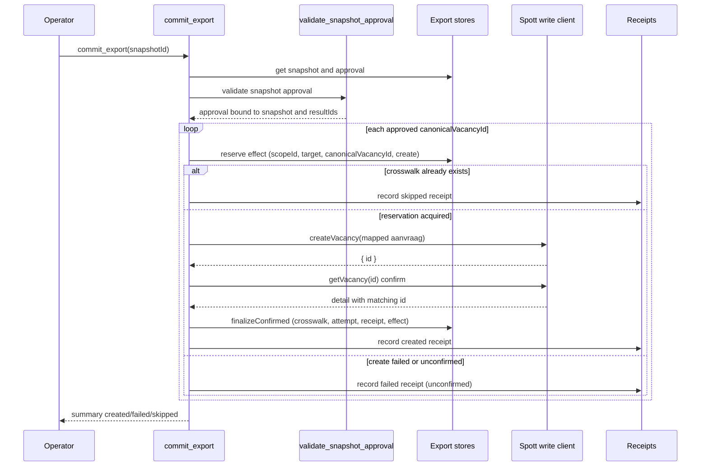
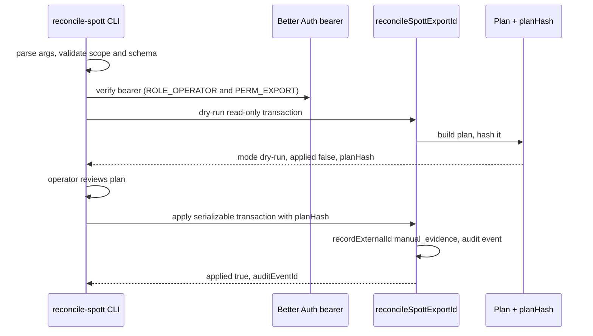

# Export & Approval

Export is the only path that writes job vacancies to Spott.io, and it is
approval-gated. A recruiter query snapshot is first approved; then
`commit_export` writes each approved vacancy to Spott with a stable
idempotency key, records external receipts, and leaves a durable effect
reservation. Reconciliation is a separate, operator-driven command that binds
an externally verified Spott ID to an uncertain reservation when the create
outcome could not be confirmed. Production write wiring is deliberately
disabled; the fixture client stands in until the provider contract and
company/stage mapping are separately verified.

## End-to-end flow

The diagram above traces one approved snapshot through `commit_export`,
showing the snapshot-approval validation gate, per-vacancy idempotent
reservation, Spott create plus readback confirmation, and receipt recording.

## Approval gate

`commit_export` begins by loading the snapshot and its approval, then calls
`validateSnapshotApproval` before any write. The validator enforces:

- The snapshot exists and belongs to the deployment scope.
- An approval exists for that snapshot in the same scope.
- The approval's `snapshotId` matches both the requested and loaded snapshot
  id, and its `resultIds` set matches the snapshot's `resultIds` exactly.
- The approval has not expired (`expiresAt > now`).

A failure returns one of `NOT_FOUND`, `APPROVAL_NOT_FOUND`, `APPROVAL_MISMATCH`,
or `APPROVAL_EXPIRED` and stops the export before any reservation or provider
call. Because the durable effect key is independent of the snapshot, approving a
new snapshot cannot bypass an existing reservation, but every invocation still
re-validates the current snapshot and approval.

## Idempotency key

The export idempotency key is deterministic and stable across snapshots and
retries:

- `target` — always `spott`.
- `canonicalVacancyId` — the approved vacancy's canonical id.
- `actionType` — always `create`.

The key is formed as `spott:<canonicalVacancyId>:create`. It identifies the
durable export effect reservation `(scopeId, target, canonicalVacancyId,
actionType)`, which is independent of the snapshot. Replaying export for the
same approved vacancy does not create a second Spott vacancy; it returns a
`skipped` result reusing the existing crosswalk evidence.

## Per-item export and effect lifecycle

For each `canonicalVacancyId` in the approved snapshot's `resultIds`,
`commit_export` resolves the export effect and decides what to do:

- **Existing crosswalk** — the canonical vacancy already has a Spott external
  id bound. The item is recorded as `skipped` with `confirmedEffect: true`,
  reusing the existing crosswalk's external id.
- **Confirmed reservation** — the effect row is already `confirmed`. The
  crosswalk must exist; the item is recorded as `skipped`.
- **New reservation acquired** — `reserve` inserts the effect row
  (`onConflictDoNothing`). Only the insert winner proceeds to POST; a
  concurrent loser sees `acquired: false` and records a `failed`, unconfirmed
  attempt without calling the provider.
- **Reserved but outcome pending** — a reservation exists but no external id
  is recorded and confirmation is not possible. The item is recorded as
  `failed` with an unconfirmed receipt; the reservation is preserved for
  investigation. No new create is permitted.

### Create and confirm

When the reservation is newly acquired, `commit_export` maps the aanvraag to a
`SpottCreateVacancyRequest` and calls `spottWriteClient.createVacancy`. The
returned id is validated against a schema, then `recordExternalId` persists it
with `provider_response` provenance and transitions the effect to
`external_id_acquired`. `confirmSpottCreateEffect` then performs a `getVacancy`
readback; only a matching detail id counts as confirmed. On match,
`finalizeConfirmed` atomically inserts the external id crosswalk, a `created`
export attempt, a confirmed receipt, and sets the effect to `confirmed` in a
serializable transaction.

### Failure and skip semantics

A failed create (provider error, malformed response, readback mismatch, or
pending reservation) records a `failed` attempt and an **unconfirmed** receipt.
A failed export never proves the provider did nothing — status is per-item
`created`, `failed`, or `skipped`, and an unconfirmed receipt means
confirmation was not established, not that the remote create failed. A
concurrent caller that encounters a reservation with no id records `failed`
even while the winning provider request is still running; the effect itself
stays `reserved` and neither the failed attempt nor its receipt authorizes a
new create.

## Export stores

The persistence layer in `packages/db/src/export-stores.ts` owns four record
families:

- **Export effects** — the durable reservation keyed by
  `(scopeId, target, canonicalVacancyId, actionType)`, with status
  `reserved → external_id_acquired → confirmed`.
- **External id crosswalk** — the durable canonical-to-Spott id mapping,
  inserted with `onConflictDoNothing` on the same key, guarded by reverse
  ownership checks.
- **Export attempts** — per-invocation records with `created`, `failed`, or
  `skipped` status, idempotency key, approval id, and snapshot id.
- **External receipts** — per-attempt receipts recording `confirmedEffect`,
  `responseHash` (SHA-256 of the receipt source), and `spottVacancyId`.

`finalizeConfirmed` is the only path that transitions an effect to
`confirmed`; it inserts the crosswalk, attempt, and receipt, and updates the
effect in one serializable transaction. `recordExternalId` uses a serializable
transaction and a reverse ownership check (`assertExportIdOwnerAvailable`) to
prevent two canonical vacancies from binding the same external id.

## Spott write client

`SpottWriteClient` extends `SpottClient` with `createVacancy`. The client is
injected into `commit_export` via `CommitExportDeps.spottWriteClient`. In
production-stub mode (`liveEnabled: false`, the default and the only wiring in
test fixtures), `createVacancy` returns a synthesized
`spott-fixture-NNNNNN` id and records it in an in-memory registry that
`getVacancy` reads back, so the confirm step succeeds. Live mode requires
`SPOTT_API_KEY` and `SPOTT_LIVE=1`, but setting `SPOTT_LIVE=1` does not wire a
write client into the production registry; the mapper still uses fixture
company/stage ids, and production export stays disabled until the provider
contract and tenant mapping are separately verified.

`confirmSpottCreateEffect` GETs the created id and only returns
`confirmedEffect: true` when `detail.id === createResponse.id`; any mismatch,
error, or non-429 failure yields `confirmedEffect: false` with the error
message, and the effect is not finalized.

## Reconciliation

Reconciliation is an operator-run CLI, not part of `commit_export`, that
recovers a `reserved` effect with no external id when the create outcome is
unknown. It binds an externally verified Spott id to the existing reservation
with `manual_evidence` provenance; it does not create a vacancy, call the
Spott API, or produce a confirmed receipt.

This shows the two-phase reconcile: a reviewed dry-run returns a plan hash, and
a separate apply rechecks authentication, approval, reservation state, and the
plan hash before binding the external id.

### Command

`bun run export:reconcile-spott` (defined in `package.json`) runs
`apps/server/src/export/reconcile-spott-export.ts`. The CLI connects directly
to the database; it does not call a server HTTP endpoint or the Spott API. Its
scope is fixed to the deployment's `catapulze` scope, `spott` target, and
`create` action.

The CLI parses arguments with strict flags and rejects bearer tokens, actor
ids, role arguments, duplicate flags, and foreign scopes. `--apply` requires
the exact 64-character `planHash` returned by a reviewed dry-run; a dry-run
rejects `--plan-hash`. A dry-run runs in a read-only, repeatable-read
transaction and returns one JSON line with `mode: "dry-run"`, `applied: false`,
`plan`, and `planHash`. Apply runs in a serializable transaction, rechecks the
plan hash, records the external id with `manual_evidence` provenance, sets the
effect to `external_id_acquired`, and appends a
`reconcile_spott_export_id` audit event with the authenticated actor and the
evidence/authorization references.

### Authorization

The reconcile CLI authenticates a signed Better Auth bearer via
`SPOTT_EXPORT_RECONCILIATION_BEARER_TOKEN`. The session is verified in the same
transaction, and the principal must hold both `ROLE_OPERATOR` and
`PERM_EXPORT`. Actor identity and permissions come from authenticated records;
the CLI accepts no actor or role arguments. A missing, expired, or
insufficiently-permissioned session refuses with `UNAUTHORIZED`.

### Reconciliation invariants

Reconciliation can only bind an external id to an existing `reserved` effect
with no external id and no crosswalk. It refuses when:

- the reservation is missing (`RESERVATION_NOT_FOUND`);
- the reservation already has provider evidence or is confirmed
  (`RESERVATION_NOT_RECONCILABLE`);
- a crosswalk already exists (`CROSSWALK_EXISTS`);
- the external id is already bound to another canonical vacancy in the same
  scope/target/action (`EXTERNAL_ID_CONFLICT`);
- the snapshot or approval is missing, expired, or mismatched;
- the plan hash is missing (`PLAN_HASH_REQUIRED`) or changed
  (`PLAN_HASH_MISMATCH`).

After reconciliation binds the id, confirmation remains a separate step
through the normal approved export path, which GETs the bound id. Reconciliation
does not itself create a confirmed receipt or enable production export.

## Roles and permissions

Export reconciliation requires `ROLE_OPERATOR` and `PERM_EXPORT`. In the role
model, `admin` and `approver` roles include `PERM_EXPORT`; `operator` includes
`ROLE_OPERATOR` but not `PERM_EXPORT`, so an admin or approver session is
needed to satisfy both checks. The reconcile principal requires both
permissions regardless of role label.

## Operational notes

- There is no reservation expiry, automatic release, or retry-POST policy. A
  crash after reservation but before POST deliberately favors preventing a
  duplicate over automatically recovering availability.
- A database failure after a successful POST may leave only the reservation; if
  the id was committed, readback can resume; otherwise the outcome needs
  investigation.
- Export attempts and receipts are append-only per invocation; the effect and
  crosswalk are the durable source of truth.
- Production write wiring is disabled; the fixture client is the only injected
  `SpottWriteClient` in test and registry fixtures. Enabling live writes
  requires a separate adapter review of company/stage mapping and the provider
  contract.
