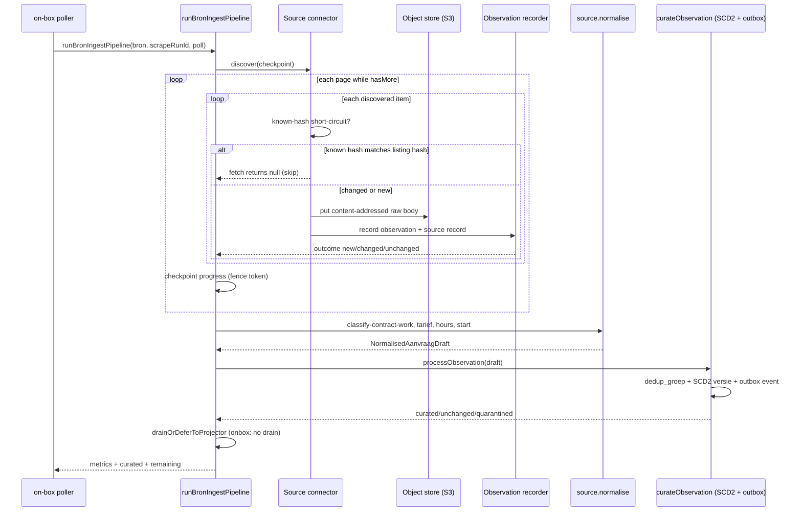

# Ingest Pipeline

Ingest turns a source listing into a curated, searchable aanvraag. The
on-box poller (`apps/worker/src/poller/main.ts`) is the only driver: it
holds a singleton Postgres advisory lock, schedules due bronnen, and for
each one runs `runBronIngestPipeline` — which executes the connector
(discover → fetch → object store → observation), reconciles missed polls,
curates the recorded observations through normalise + SCD2 + outbox, then
defers search projection to the on-box projector. Adding a source means one
`SourceDefinition` file plus one line in the `SOURCES` registry; everything
else in this pipeline is source-agnostic and shared.

## End-to-end flow

The diagram above traces one bron through the pipeline: the connector pages
through its listing, the runner stores each changed body content-addressed
and records an observation, then the same observations are normalised and
curated into SCD2 aanvraag rows with outbox events for the projector.

## The on-box poller

`apps/worker/src/poller/main.ts` replaces the Trigger.dev fan-out and runs
next to the database so a poll cycle is local round trips rather than
transatlantic compute. Its invariants:

- **Singleton lock.** It acquires `pg_advisory_lock` with the literal key
  `613_204_877` (`ADVISORY_LOCK_KEY`), deliberately distinct from the
  projector's `847_732_991`. Any third advisory lock added to the codebase
  needs its own constant so they never collide silently. The lock
  connection can be idle-reaped, so the loop re-asserts it (`lock.reassert`)
  every cycle and throws `LockLostError` if it dropped.
- **Heartbeats.** A heartbeat is written before each cycle, while waiting
  for the lock, and between drain passes (`onPass`), so an operator can see
  the process is alive even when a single pass outlasts the check interval.
- **Scheduling.** `loadPollCandidates` joins pollable bronnen to the newest
  poll run of any status; `dueCandidates` applies each bron's cron
  `interval` in `Europe/Amsterdam`. A source that keeps failing still
  retries on its own cadence rather than every tick. `partitionByLiveFlag`
  skips any source whose `liveEnv` flag is unset **in production only** —
  outside production, fixture-backed connectors are the point, so all
  candidates run.
- **Bounded concurrency.** `POLLER_CONCURRENCY` sources may be polled in
  flight at once (`runWithConcurrency`), each keeping its own
  `crawl_delay_ms` pacing; the concurrency is also the ceiling on
  concurrent `curateScrapeRun` drains against Postgres.
- **Per-source curation budget.** After a poll returns, `drainBacklog`
  keeps curating that source until the backlog is empty, the
  `POLLER_CURATE_BUDGET_MS` budget expires, shutdown is requested, or a
  pass fails to shrink `remaining` (it stops rather than spinning). The
  budget starts when the poll ends so a long poll still gets curation
  passes.
- **Stale-run repair.** Each cycle first calls `abandonStaleRuns` (older
  than `POLLER_ABANDON_RUN_AFTER_MS`) before reading candidates, so a run
  this process abandons is already closed when `loadPollCandidates` reads
  the newest run per source.

## Source registry and definition

`packages/application/src/sources/registry.ts` exports `SOURCES`, a record
keyed by slug. **Adding a source = one file in
`packages/application/src/sources/` plus one line in `SOURCES`.** Each
`SourceDefinition` (`definition.ts`) bundles everything the worker, replay,
smoke seed, and curate path need to know about one bron:

- `bronId` — the stable UUID identifying the bron row.
- `createConnector(input)` — builds the `Connector` from
  `packages/connectors/src/<source>` implementing the discover/fetch
  contract. The runtime forwards `knownHashes` only when
  `listingHashCoversDetail` is true (asserted in `sources.spec.ts`).
- `listingHashCoversDetail` — whether the listing-tier hash demonstrably
  covers every field the normaliser reads. Only when true may the
  known-hash short-circuit skip a fetch; false for any source whose fetch
  reads a detail page the listing hash cannot see, so a skip there would
  freeze detail-only changes (e.g. a moved `sluitingsdatum`) into the
  curated aanvraag.
- `liveEnv` — the env var name that switches the connector from fixtures
  to live HTTP (`process.env[source.liveEnv] === "1"`).
- `normalise(body, contentHash)` — the per-source mapping from raw payload
  to the shared `NormalisedAanvraagDraft`.
- `seed` — bron row defaults (crawl delay, method, voorwaarden status) for
  the smoke seed.

`isSupportedBronSlug`, `SUPPORTED_BRON_SLUGS` (alphabetical), and
`resolveSourceByNaam` derive from the registry. The bron row has no slug
column, so `findSourceByNaam` matches `record.naam` case-insensitively
against each definition's `naam`.

## The connector contract

A `Connector` (`packages/connectors/src/contract.ts`) exposes two methods:

- `discover(checkpoint)` returns a `ConnectorDiscoverResult`:
  `items` (each a `bronReferentie`, `contentHash`, optional
  `listingPayload`), a `checkpoint` for the next page, `hasMore`, and an
  optional `truncated` flag. `truncated` is set when a page cap (such as
  `STRIIVE_MAX_PAGES`) stopped paging while the source still had pages; a
  truncated run must not count unseen records as missed.
- `fetch(item)` returns a `ConnectorFetchResult` (`fetched` with body,
  contentType, contentHash) or `rejected`, or `null` to skip (the
  known-hash short-circuit returns `null` when the listing hash matches
  the stored one).

The stable hand-off to the rest of the pipeline is a
`ConnectorObservation` (`contractVersion: "connector-observation/v1"`,
`bronId`, `bronReferentie`, `contentHash`, `contentType`,
`observedAt`, `rawPayloadRef`, `scrapeRunId`, `sourceRecordId`). A
`ConnectorFixture` (`connector-fixture/v1`) is the source-owned,
serialisable envelope for replay/fixture runs; payloads stay source-specific.

### DEC-008 minimisation

Connectors whitelist fields on the way out. The live record often carries
~120 raw fields (recruiter PII, internal ids, zero-valued tariff fields);
the connector builds a **fresh object naming each field explicitly** so
unlisted upstream fields never reach `listingPayload` or the stored body
(see `projectInhuurdeskAssignment`, `projectStriiveJob`,
`opdrachtoverheid/connector.ts`). This is a boundary invariant, not a
convention: each source has a DEC-008 test asserting the whitelisted shape.

## The connector run lifecycle

`runConnector` (`packages/connectors/src/run.ts`) pages through discovery
and persists each item. Its lifecycle is fenced:

- **Start/resume.** `runLifecycleStore.start` creates the run or resumes
  the existing one identified by `{bronId, scrapeRunId}`. Resume vs reset
  is chosen by whether a checkpoint was supplied. `start` mints a
  monotonically increasing `fenceToken`; every later checkpoint, complete,
  and fail call must present the same token or `RunOwnershipLostError` is
  thrown. A terminal run (succeeded/failed) cannot be reused; a run
  cannot be resumed with a different `runKind`.
- **Per item.** `persistItem` fetches (subject to the per-source
  `RequestLimiter` and `RetryPolicy`), bounds the `bronReferentie`
  (`boundBronReferentie`), computes a content-addressed `rawPayloadRef`
  via `buildContentAddressedRawObjectPath` (so every new raw object is
  digest-verified on readback), writes the body to the `ObjectStore`, and
  records the observation + source record via the `ObservationRecorder`. A
  rejected item counts as `rejected`; a `null` fetch (known-hash skip)
  counts nothing. The discover pass's listing-tier hash is persisted next
  to the payload hash so the next poll's known-hash short-circuit compares
  like with like.
- **Checkpointing.** After each page, cumulative metrics and the
  checkpoint are persisted atomically. `observedBronReferenties` records
  every `bron_referentie` the listing showed this run (including rejected
  and skipped items) for missed-poll reconciliation.
- **Completeness.** `RunCompleteness` is `complete: true` only when the run
  saw the whole listing. It is incomplete when it resumed from a persisted
  checkpoint (`resumed`), when the connector reported `truncated`, or —
  via `guardEmptyListing` in `executeBronRun` — when a complete run saw
  zero items (treated as a likely parser regression, never an emptied
  bron).
- **Failure.** Each phase wraps its operation in a `RunFailureEnvelope`
  (`discover`, `fetch`, `raw-store`, `observation`, `checkpoint`,
  `complete`, `unknown`). On failure the run records a `fail` event and
  rethrows `ConnectorRunFailure`; if failure persistence itself fails the
  error is aggregated. `RunOwnershipLostError` propagates unchanged.

`executeBronRun` (`packages/application/src/bronnen/execute.ts`) wraps
`runConnector`: it loads the durable bron record, enforces pollability /
voorwaarden, acquires a per-bron `CrawlDelayLimiter` (refusing a policy
change mid-run), and — for poll runs with lifecycle ports — runs
`reconcileMissedPolls` after the connector run, writing
`metrics.closed = lifecycle.staled.length`.

## Raw object store

`ObjectStore` (`packages/connectors/src/object-store.ts`) is `put` / `get`
/ `deleteExpired`. New writes go through the content-addressed scheme:
`buildContentAddressedRawObjectPath` validates `bronSlug`
(`[a-z0-9-]+`, no slashes) and `contentHash` (64-char hex SHA-256) and
builds `raw/<slug>/<year>/<month>/<hash>.<contentType>`. The same bytes
always resolve to the same key, so writes are idempotent and readback is
digest-verified (`RawObjectDigestMismatchError` on tamper/corruption;
`RawObjectMetadataMissingError` when a body exists without its
`.ji-meta.json` sidecar — always a torn write). Legacy
`buildRawObjectPath` keys (with day/runId/recordId) stay readable
unverified for pre-sidecar readers.

The poller runtime (`createPollBronRuntime`) selects the same raw object
store factory the server uses, so the worker never silently falls back to
its local filesystem when S3 is configured. In production it refuses to
start if the selected backend is the worker-local filesystem — a raw
payload written to the wrong backend would read back `null` on the
server, the exact failure the durable store exists to prevent.

## Observation recording

`ObservationRecorder.record` (`observation-recorder.ts`) atomically
classifies a source record and appends its immutable observation. It
guards the `fenceToken` (rejecting stale tokens), checks that the
observation's run key matches the payload, and dedupes by replay key
`(scrapeRunId, bronId, bronReferentie, contentHash)`. The outcome is
`new`, `changed`, or `unchanged` based on comparing the incoming
`contentHash` to the existing source record's hash. The durable Postgres
recorder performs this classification under row locks; the in-memory
recorder mirrors the contract for tests.

## Normalisation

Normalisation (`packages/application/src/normalise`) is **per-source**: each
source's `normalise(body, contentHash)` maps its raw payload to the shared
`NormalisedAanvraagDraft` (`types.ts`). The draft is a set of
`NormalisedField<T>` values (each carrying `provenance` —
`parserVersion` + `sourcePath`) plus a `NormalisedTarief` and lifecycle
fields. Shared helpers back every source:

- `classifyContractAndWork` — derives `contracttype` and `werkvorm` from
  title + beschrijving.
- `tarief` (`parseTariefFromText`, `tariefToSnapshot`,
  `unknownTariefSnapshot`) — tariff parsing with `UNKNOWN`/`CLEARED`
  sentinels.
- `hours` (`parseWeeklyHoursRange`, `formatHoursPerWeek`) — uren-per-week.
- `buildDedupKey` / `boundDedupKey` / `validateNormalisedDraft` — the
  dedup_groep key (opdrachtgever + start + titel) and required-field
  validation (`titel`, `beschrijving`, `bron_referentie`).

Each source also has an Effect-typed variant (`normalise*ObservationEffect`,
`runNormalise*Observation`) for the dual-path native + Effect execution
(CTP-468). The normalised draft flows into curate via `processObservation`.

## Curation: SCD2 + dedup + outbox

`curateObservation` (`packages/application/src/identity/curate.ts`) is the
single writer of curated aanvraag state. It looks up the existing
aanvraag by `(bronId, bronReferentie)` and branches:

- **Same content hash** — `curateUnchangedContent` applies a sparse patch
  (`laatstGezienOp`, `status`, `locatieTekst`, `opdrachtgeverNaam`,
  `startDatum`, `publicatiedatum`, `contracttype`, `werkvorm`,
  `sluitingsdatum`) only where the draft actually has a value, so a
  source that stops publishing a deadline never erases an earlier value.
  A status flip opens a new SCD2 versie; a seen-only move does not (the
  snapshot would carry no new information). Either way, an outbox event is
  enqueued (`aanvraag.status_gewijzigd` for a flip, `aanvraag.gewijzigd`
  otherwise), because every field this path can move is part of the
  search projection hash and the projector would otherwise skip a
  same-content event.
- **No existing aanvraag** — inserts the aanvraag, `ensureDedupGroep` on
  the dedup key, links them, inserts versie 1, and enqueues
  `aanvraag.nieuw`.
- **Changed content** — closes the open versie, merges `bron_specifiek`
  (with CLEARED-tombstone / durable `_cleared` marker handling so
  enrichment cannot resurrect post-strip null gaps), coalesces nullable
  commercial fields (sparse null keeps the prior value; `CLEARED` is a
  true clear), inserts the next versie, and enqueues `aanvraag.gewijzigd`.

**Every mutation is one transaction** (`withTransaction`, RJC-399): the
versie, the aanvraag row, and the outbox event commit together with the
outbox insert last, so a crash can never leave Postgres on a new status
while the search index keeps the old. `processObservation`
(`identity/process.ts`) runs the source's `normalise`, validates the
draft (quarantines on validation issues), then calls `curateObservation`.

`curateScrapeRun` (`packages/db/src/curate-scrape-run.ts`) drains the
recorded observations for one bron through this path. It loads candidates
from `staging.aanvraag_observation` in the recoverable statuses
(`awaiting_curation`, `pending`, `blocked_ordering*`,
`deferred_missing_raw*`), orders them fairly oldest-first per identity, and
processes each inside a transaction that takes `FOR KEY SHARE` on the run
and `FOR UPDATE` on the source record and the observation row. Its
disposition logic (`classifyRecoveryCandidate`) decides `process`,
`already_committed`, `superseded`, `blocked_ordering`, or `unchanged`
based on the candidate pointer vs the current applied high-water mark,
keeping curation idempotent and ordered across overlapping runs.

### Failure semantics in curation

Curation distinguishes "this row is bad" from "the infrastructure is
bad":

- A **transient** failure (Postgres SQLSTATE classes `08`, `40`, `53`,
  `57`, or client-side connection codes like `ECONNRESET`) aborts the
  pass and leaves every row in a recoverable status for the next poll.
- An **unreachable object store** (`RawReadError`) aborts the pass rather
  than parking rows on `deferred_missing_raw`, which would strand the
  backlog behind a manual requeue step. A genuinely **absent** object
  (store returns `null`) defers to `deferred_missing_raw`.
- A **row-specific** failure parks the observation on the terminal
  `curation_failed` status (deliberately outside `RECOVERABLE_STATUSES`
  so it is never re-selected) and logs a redacted cause chain. After
  `MAX_PARKED_PER_PASS` (5) parked rows the pass throws
  `TooManyParkedObservationsError` in case the failure is systemic,
  keeping nearly all of the backlog recoverable. Clearing
  `curation_failed` is a deliberate human act: fix the defect, then
  `UPDATE ... SET status = 'awaiting_curation'` to requeue.

The poller's `drainBacklog` uses `curateScrapeRun`'s `remaining` (every
recoverable observation for the bron, including rows nothing can advance
right now) as its stop condition: a pass that fails to shrink it ends the
drain instead of spinning until the budget expires.

## Search projection hand-off

`runBronIngestPipeline` ends with `drainOrDeferToProjector`. In **onbox**
mode (`SEARCH_PROJECTOR` pinned to onbox for this process) it drains
nothing and returns `indexVersion: null` — a separate projector process
next to Manticore drains the outbox. The poller therefore never constructs
a `ManticoreSearchEngine` and never needs `MANTICORE_URL`, so ingest keeps
working even when this process has no route to a private Manticore. The
outbox events emitted by curate (`aanvraag.nieuw`, `aanvraag.gewijzigd`,
`aanvraag.status_gewijzigd`) are the projector's only input; see
[/openwiki/workflows/search-projection.md](/openwiki/workflows/search-projection.md).

## Fixtures

Fixtures are real recordings with `capturedAt` from the file mtime, never
invented markup (see AGENTS.md). A connector whose `liveEnv` flag is unset
reads its listing from a repo fixture and the pipeline commits it into
`curated` as if it were the real source — the basis of replay, smoke seed,
and test-import runs. In production, `partitionByLiveFlag` skips any
source whose flag is unset so a healthy container never silently commits
fixture data as live.

## Extension points

- **Add a source** — create `packages/application/src/sources/<slug>.ts`
  exporting a `SourceDefinition` that references a connector in
  `packages/connectors/src/<source>`, then add one line to `SOURCES`.
  The connector must implement `discover`/`fetch`, apply the DEC-008
  whitelist, and (if `listingHashCoversDetail`) forward `knownHashes`.
- **Change a normaliser** — edit the per-source `normalise*` module; the
  shared draft shape and helpers keep the curate contract stable. Bump
  the source's `parserVersion` so provenance and outbox payloads reflect
  the change.
- **Operate curation** — see `docs/runbooks/onbox-poller.md` and
  `docs/runbooks/curation-recovery.md` for requeuing `curation_failed`
  and `deferred_missing_raw` rows.
