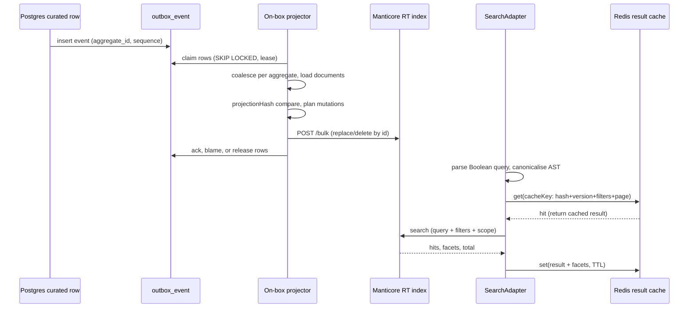

# Search Projection

Curated rows in Postgres become searchable documents in Manticore through an **outbox-driven projection pipeline**. A projector process drains the outbox, coalesces events per aggregate, resolves mutations (insert/replace/delete/close), writes one Manticore `/bulk` per drain, and advances a durable `SearchVersion` checkpoint. On the read side, a `SearchAdapter` parses Boolean queries, canonicalises and hashes the AST, resolves filters/sort/scope, hits the Manticore engine, and caches result sets and facets in Redis (or memory for tests).

## End-to-end flow

The diagram above shows the write path (curated row → outbox → projector drain → Manticore bulk) and the read path (adapter → Boolean parse → cache check → Manticore query → cache write).

## Write path: outbox drain

### Outbox event lifecycle

Each curated-row change inserts a row into `curated.outbox_event` carrying `aggregate_id`, `aggregate_type`, `event_type`, `sequence_number`, and a JSON `payload`. Rows progress through these states:

1. **Unprocessed** — `processed_at IS NULL`, `dead_lettered_at IS NULL`, no live claim.
2. **Claimed** — `claimed_until` set to `now() + lease`; `claim_token` set to a UUID fencing token.
3. **Acked** — `processed_at` set; the row is done.
4. **Dead-lettered** — `dead_lettered_at` set after `max_attempts` (default 5) failures; excluded from future claims until requeued.
5. **Blamed** — `retry_count` incremented, `last_error` set; the row stays unprocessed and is re-claimable after the lease expires.

### Claiming rows

`drainPostgresOutbox` (`packages/db/src/outbox-drain.ts`) claims up to `batchSize` (default 1000) rows per drain. The claim query uses `FOR UPDATE SKIP LOCKED` with a `NOT EXISTS` subquery that ensures no other drain holds a live claim on the same aggregate — this keeps one aggregate's events inside one drain at a time, preventing two drains from applying the same aggregate's events out of order. The claim runs under a transaction-scoped `pg_advisory_xact_lock` so two concurrent claims never scan the same snapshot.

Rows whose lease has expired (a drain that died mid-batch) become re-claimable by any later drain. Writes are idempotent (replace/delete by document id), so re-applying is safe.

### Coalescing and batch planning

`coalesceOutboxEvents` (`packages/search/src/projector.ts`) folds a batch of events into one intent per aggregate: the **last event by sequence wins**. A delete after upserts cancels the upserts; several upserts collapse to one load and one write; an upsert after a delete re-creates the document.

`planOutboxBatch` then:
1. Loads the current document once per aggregate (`loadDocuments`).
2. Compares the loaded document's `projectionHash` against the known hash in `search_projection_state`; a match skips the engine write entirely (unchanged).
3. Skips mutations whose sequence is at or below the aggregate's `applied_sequence` in the projection state (superseded — a late commit against a since-updated aggregate).
4. Emits `upsert` or `delete` mutations, each tagged with its target `partition` and, for upserts, the `previousPartition` so a partition move becomes a replace-then-delete across tables.

### Applying the batch to Manticore

`ManticoreSearchEngine.applyBatch` (`packages/search/src/manticore/engine.ts`) serialises mutations into `/bulk` lines and chunks them under `MANTICORE_BULK_MAX_BYTES` (8 MB). Each chunk is one POST `/bulk` request; a batch above the cap is split into independent requests, each atomic on its own.

When a chunk fails, the engine isolates the failing line: it re-sends the owning mutation alone, then re-sends the rest without it. Isolation is capped (`MANTICORE_BULK_ISOLATION_RESENDS_PER_CHUNK = 1`) so a poison-heavy backlog still drains at least one row per chunk per drain. Whatever cannot be isolated is released unblamed (`unapplied`); later chunks are not sent.

An upsert is a **replace into the target partition table**, followed — only when the previous partition differs — by a **delete from the other table**. Replace comes first: if it fails, the document stays findable in its old table. This guarantees a document is never in neither table during a partition move.

### Acking, blaming, and releasing

After the engine returns a `SearchIndexBatchResult`, `partitionOutcomes` maps each mutation's outcome back to its outbox rows:

- **Applied** → ack: `processed_at = now()`, clear claim.
- **Failed** (in `failures`) → blame: `retry_count + 1`, set `last_error`, dead-letter at `max_attempts`.
- **Unapplied** (not attempted) → release the claim unblamed; the next drain retries.

All post-claim updates are fenced by `claim_token`, so a drain that lost its lease updates nothing. Projection state (hash + applied_sequence) is persisted after the index write and before the ack; a crash in between re-claims and re-derives "unchanged".

## The on-box projector process

The projector runs as a standalone process (`bun run projector`, `apps/server/src/projector/main.ts`) next to Manticore. This co-location is deliberate: ADR-0006 and ADR-0011 keep Manticore off the public network, so the projector writes to a loopback-only Manticore via `ManticoreSearchEngine`.

### Singleton advisory lock

The process holds a `pg_advisory_lock` with key `847_732_991` over a direct `PROJECTOR_DATABASE_URL`. This guarantees only one projector instance drains at a time. On deploy, the replacement container waits for the lock (keeping its heartbeat file fresh so it reports healthy but idle), while the outgoing container's SIGTERM path releases it.

Each drain cycle re-asserts the lock (`lock.reassert()`): the lock connection can drop silently (Neon autosuspend, idle reaping), so re-asserting every cycle is what makes "never runs concurrently" actually true.

### Drain loop

`runProjectorLoop` (`apps/server/src/projector/loop.ts`) drives the cycle:

- If the drain returned `drained > 0`, loop immediately (more rows may remain).
- Otherwise, sleep `pollIntervalMs` (1 second).
- On a transient error, double the backoff up to `maxBackoffMs` (30 seconds) and retry.
- `SearchIndexSchemaMismatchError` or `LockLostError` are **fatal** — they reject the loop instead of being retried, because they require operator/supervisor action.
- `signal` (SIGINT/SIGTERM) is checked between cycles; an in-flight drain always finishes before the loop returns.

## Index versioning

A `SearchVersion` checkpoint (`packages/search/src/version.ts`) lives in `curated.search_projection_checkpoint` and is anchored per logical index name (default `aanvragen`). It carries:

- `appliedSequence` — highest outbox sequence applied to the index (monotonic; `GREATEST` prevents backwards moves).
- `generation` — bumps on a new index, schema change, or full rebuild.
- `schemaHash` — identifies the exact document-to-Manticore column mapping and table layout.

`PostgresSearchVersionStore` (`packages/db/src/search-version-store.ts`) is the durable implementation; `InMemorySearchVersionStore` serves tests and the in-memory engine.

### Schema hash mismatch

`SEARCH_SCHEMA_HASH` is a hand-maintained constant that encodes the exact set of Manticore columns, their nullable-omission rules, and the table layout. When the checkpoint's `schemaHash` does not match the running code's expected hash, `drainPostgresOutbox` throws `SearchIndexSchemaMismatchError`. This is a **hard stop**: a mismatched schema means the index was built for another document mapping and requires a full rebuild (new generation), never a silent reindex.

The drain loop treats `SearchIndexSchemaMismatchError` as fatal — it does not retry.

### Full rebuild and reindex

`runSearchReindex` (`packages/db/src/search-reindex.ts`) starts or resumes a rebuild generation. It pages through curated `aanvraag` rows in bounded keyset pages, enqueuing one durable `aanvraag.search_reindex` event per document. The final schema hash is not published until all replay events are enqueued, so a process crash cannot leave the projector consuming a partial generation. Dead-lettered replay events block publication until resolved.

### Projection repair

`reconcileProjection` (`packages/db/src/projection-repair.ts`) detects divergence between Postgres source state and Manticore physical inventory. It compares per-document projection hashes, partition placement, and physical row integrity, then emits synthetic `aanvraag.projection_repair` events to close the gap. Physical corruption (non-canonical document ids, duplicate numeric ids, same-partition duplicates) blocks repair and requires a scoped physical cleanup before reconciliation can proceed.

## Partitioning

The search index is physically split into two RT tables (`packages/search/src/partition.ts`):

- **`active`** — the placeable stock (open/recruiting documents). This is the default search scope.
- **`archive`** — closed, stale, or expired documents.

A document is in exactly one partition at any time, determined by `documentPartition`: `closed`/`stale` status or a passed `sluitingsdatum` always archives; `active`/`unknown` stay active unless a recency window (`ACTIVE_RECENT_DAYS`, currently `null`/disabled) has elapsed.

The `projectionHash` is prefixed with the partition, so a status transition that moves a document between tables changes the hash and is never skipped as "unchanged".

`SearchScope` controls which partitions a query reads: `active` (default, reads only `<index>_active`) or `all` (reads both tables via `index: "active_table,archive_table"`).

## The read path: SearchAdapter

`SearchAdapter` (`packages/search/src/adapter.ts`) is the read-side entrypoint. Its `search()` method:

1. **Parses the Boolean query** via `@ji/domain`'s `parseBooleanQuery`, cached in a process-local LRU (`ParserLruCache`) keyed by the raw query string — a parse doesn't change when the index does.
2. **Normalises filters** — publication date bounds are validated as ISO strings; scope defaults to `title` (titel + opdrachtgeverNaam), not full description.
3. **Computes the AST hash** (`hashSearchAst`): canonicalises the AST (sorts commutative AND/OR operands, deduplicates siblings, lowercases plain terms) using **codepoint-order** comparison (not `localeCompare`, which varies by ICU locale and would hash the same query differently across processes — a silent cache miss on a shared Redis key). A browse request (empty query) hashes to a fixed `["match_all"]` sentinel.
4. **Reads the applied version** from the engine to build the cache key.
5. **Checks the result cache** — keyed on `astHash + version + filters + page params`. A hit returns the cached result set.
6. **Singleflights** concurrent identical uncached requests so they share one in-flight engine call.
7. **Executes the engine search** — the Manticore engine builds the query string, filter clauses, and sort; for hybrid mode it also builds a kNN query. The search runs alongside a version read and an optional archive count (scope `active` only).
8. **Caches the result** — both the result set (Redis or memory, TTL 120s) and facets (separate facet cache key, TTL 120s). Incomplete results (e.g. query timeout) are never cached.

### Hybrid search

When `SEARCH_HYBRID=1` and the AST is eligible, the engine uses `hybrid` mode: it writes documents to a third synchronised logical table (`<indexName>`) alongside the partition tables, and the search uses kNN vector search blended with lexical matching. The schema hash differs for hybrid (`SEARCH_SCHEMA_HASH_HYBRID`).

### Fallback engines

For tests and evaluation, `InMemorySearchEngine` and `PostgresFtsFallbackEngine` implement the same `SearchEngine` interface. The in-memory engine mirrors Manticore's partitioned layout (one map, entries tagged by partition) and uses `hashDocumentId` for stable tiebreaks. The Postgres FTS fallback evaluates the Boolean AST in-process against loaded documents. Neither is the production query path.

### Result cache backends

`createResultCache` (`packages/search/src/cache/result-cache.ts`) resolves the backend once at construction:

- **Redis** (`RedisResultCache`) — the production backend; a shared cache across the fleet. If `REDIS_URL` is set but Redis is unreachable in production, startup **fails loudly** rather than silently downgrading to an unshared memory cache.
- **Memory** (`MemoryResultCache`) — the test/development backend; also the fallback when `REDIS_URL` is unset.

## Key invariants

- **Idempotent writes**: all Manticore mutations are replace/delete by document id; a crash mid-batch re-applies with identical results.
- **Monotonic checkpoint**: `appliedSequence` uses `GREATEST` and can never move backwards.
- **One aggregate per drain**: the `NOT EXISTS` claim guard and transaction-scoped advisory lock ensure two drains never split one aggregate's events.
- **Generation-scoped state**: projection hashes and `applied_sequence` are only comparable within one generation; a rebuild starts from an empty index.
- **Codepoint-deterministic caching**: all cache keys use codepoint-order string comparison, not locale-dependent `localeCompare`, so the same query hashes to the same key regardless of process locale.
- **Schema mismatch is fatal**: a mismatched `schemaHash` stops the drain loop; the index must be rebuilt via the reindex protocol, never silently reindexed.
